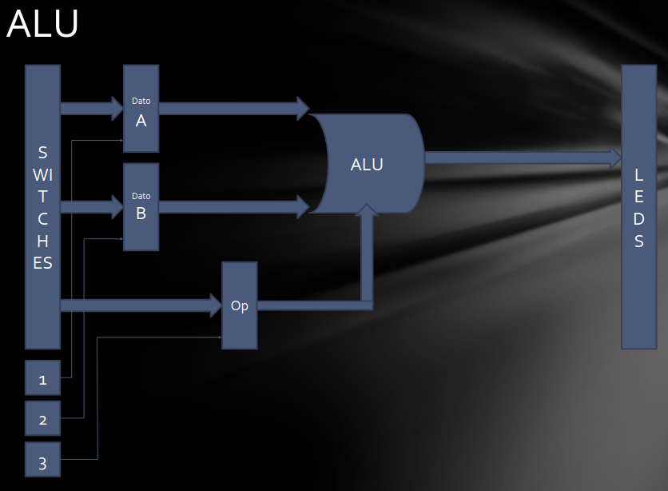

# Arquitectura de Computadoras

## Trabajo Práctico 1 - ALU

- Cabrera, Augusto
- Gil Cernich, Manuel

---

### Objetivo

El objetivo de este trabajo práctico es implementar una Unidad Aritmético Lógica (ALU) de 8 bits parametrizable en Verilog. La ALU debe ser capaz de realizar las siguientes operaciones:

| Operacion | Codigo |
|-----------|-----------|
| ADD | 100000 |
| SUB | 100010 |
| AND | 100100 |
| OR | 100101 |
| XOR | 100110 |
| SRA | 000011 |
| SRL | 000010 |
| NOR| 100111 |

Tambien se debe validar el desarrollo de la ALU mediante un testbench que permita verificar el funcionamiento con entradas aleatorias.

Como parte final se debe simular su funcionamiento en vivado incluyendo el analisis de tiempo.

     
    <em>Fig 1. Diagrama del modulo.</em>

---

### ...
