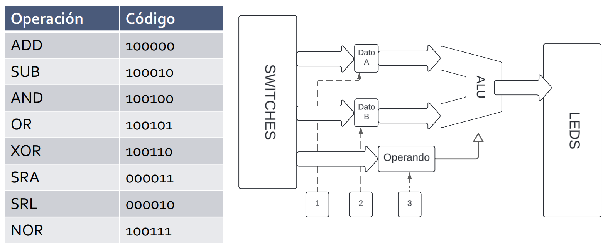
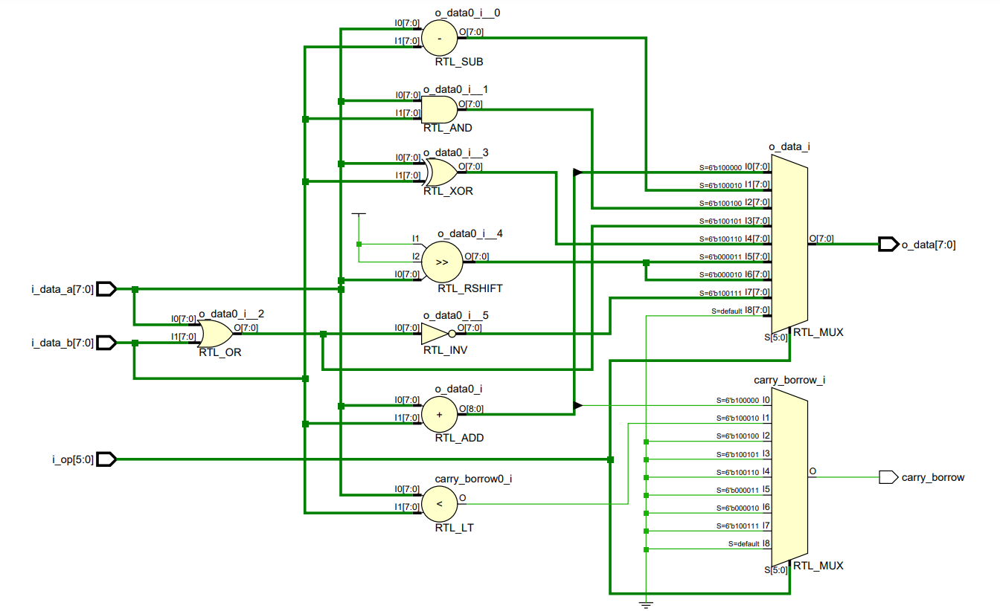
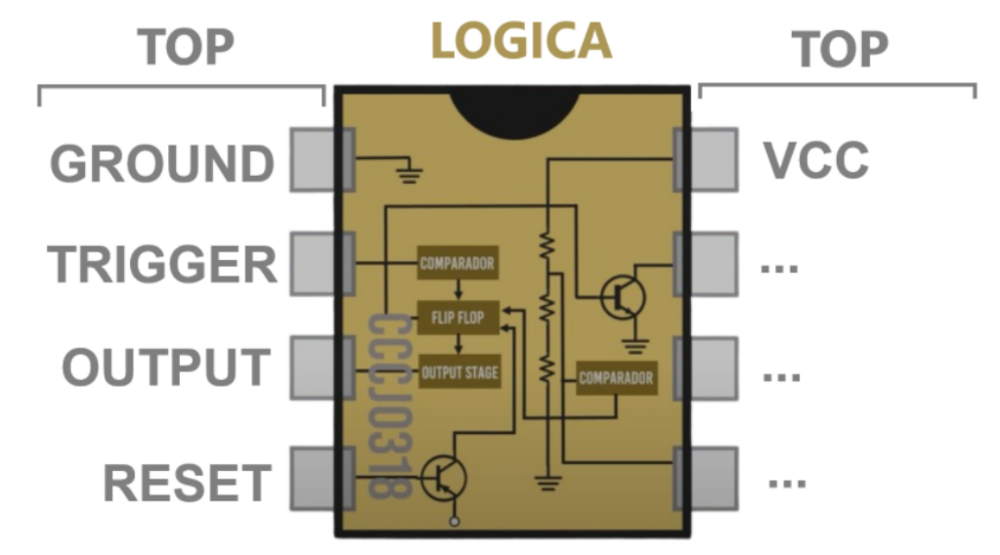
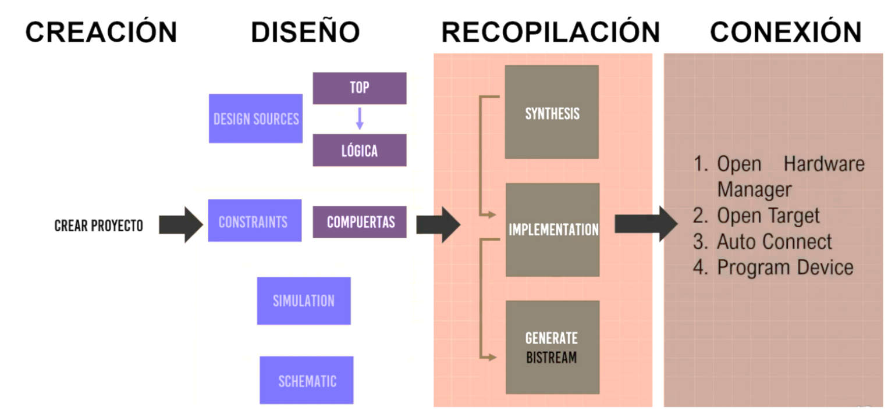
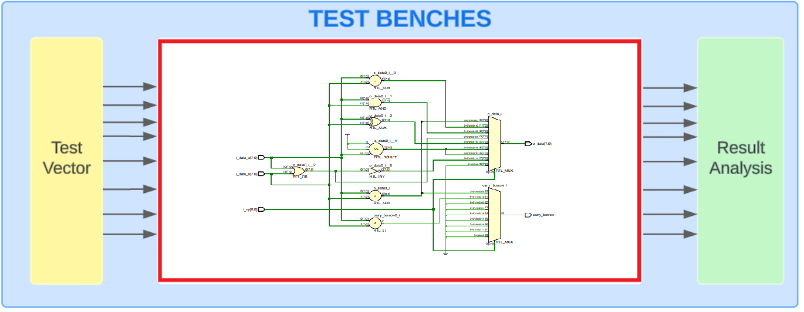
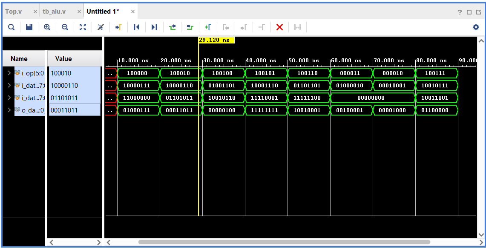
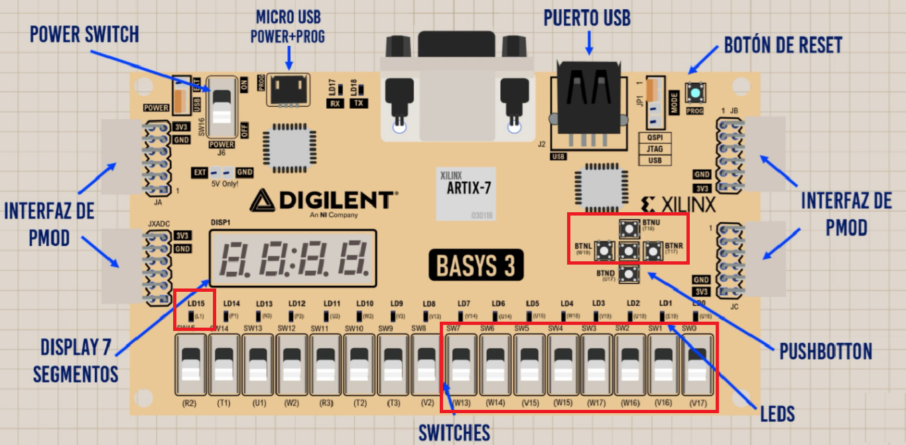
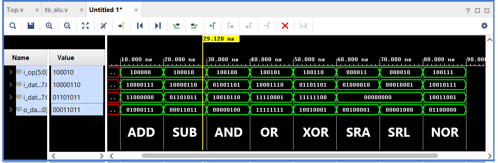

  

***TRABAJO PRACTICO 1***

**Titulo:** Construyamos una ALU

**Asignatura:** Arquitectura de Computadoras

**Integrantes:**
   - Gil Cernich, Manuel 
   - Cabrera, Augusto Gabriel 

---------------
## Enunciado

Desarrollar una Unidad Lógica Aritmética (ALU) parametrizable en lenguaje Verilog, capaz de operar sobre un bus de datos configurable. La ALU debe ser implementada en una FPGA, validada mediante un banco de pruebas (testbench), y simulada utilizando herramientas de simulación de Vivado.

### Requerimientos

1. **ALU parametrizable:**
    - La ALU deberá ser diseñada de manera que permita cambiar el ancho del bus de datos de forma paramétrica, para que pueda ser utilizada en otros proyectos, incluyendo el trabajo final.
    - Deberá soportar las siguientes operaciones aritméticas y lógicas: `Suma, Resta, AND, OR, XOR, Desplazamientos (shift) a la izquierda y derecha, Comparación (igualdad y mayor que).`

2. **Banco de pruebas (Test Bench):**
    - Implementar un banco de pruebas en Verilog que valide el correcto funcionamiento de la ALU.
    - El testbench deberá incluir generación de entradas aleatorias para probar diferentes casos.
    - Incorporar un sistema de chequeo automático para comparar los resultados esperados con los obtenidos, generando un log de errores en caso de inconsistencias.

3. **Simulación y análisis de tiempo:**
    - Simular el diseño utilizando las herramientas de simulación de Vivado.
    - Realizar un análisis de temporización para verificar el comportamiento de la ALU con diferentes configuraciones del bus de datos, identificando posibles problemas de sincronización o timing.

  

<em>Figura 1: Diagrama</em>

### Esquematico

El siguiente código Verilog define un módulo `ALU` (Unidad Lógica Aritmética) que realiza diversas operaciones aritméticas y lógicas de 8 bits. 

  

<em>Figura 2: Esquema Obtenido</em>

### Lógica y TOP

  

<em>Figura 3: Esquema Lógica y TOP</em>

#### Top
El término **Top** hace referencia a las **compuertas de entrada o salida** que contiene nuestro circuito, como:
- **GROUND**: Conexión a tierra.
- **TRIGGER**: Señal de activación.
- **OUTPUT**: Salida del circuito.
- **RESET**: Señal de reinicio.
- **VCC**: Fuente de alimentación.

Estas conexiones son fáciles de identificar al principio, ya que permiten que el circuito interactúe con el mundo exterior. El módulo **Top** relaciona los **periféricos** (como botones, switches, LEDs, etc.) con nuestro **código**.

En este trabajo práctico:
- Los archivos **`TOP.v`** y **`constraints.xdc`** forman parte del "Top", ya que gestionan las conexiones y el mapeo de los pines a los periféricos del sistema.

#### Lógica
La **lógica** es la parte del diseño que desarrollamos como **diseñadores** y es una parte fundamental del código. Aquí es donde implementamos el comportamiento y las operaciones que queremos que realice el circuito.

En este trabajo práctico:
- El archivo **`ALU.v`** forma parte de la "Lógica", ya que contiene las operaciones que la ALU (Unidad Lógica Aritmética) ejecuta, como suma, resta, desplazamiento y operaciones lógicas.

  

<em>Figura 4: Etapas </em>

---

A continuación se describe cada parte del código:

## Código Verilog: ALU.v

Este módulo describe una **Unidad Lógica Aritmética (ALU)** en Verilog, la cual realiza operaciones aritméticas y lógicas en dos números de 8 bits de entrada (`A` y `B`).

### 1. `module alu`
Define el inicio del módulo **`alu`**, el cual es parametrizado. Se utilizan dos parámetros:
- **`NB_DATA`**: Representa el ancho del bus de datos (el número de bits para los operandos A y B). Aquí, está configurado para ser de 8 bits.
- **`NB_OP`**: Indica el número de bits del código de operación (**`i_op`**), configurado en 6 bits.

### 2. Puertos de entrada y salida:
- **`i_data_a` e `i_data_b`**: Son las entradas de datos, de tipo **signed**, con 8 bits cada una. Esto permite trabajar con números con signo en complemento a dos.
- **`i_op`**: Es un código de operación de **6 bits sin signo**. Controla qué operación realiza la ALU.
- **`o_data`**: Es la salida de la ALU, de tipo **signed** y 8 bits, donde se almacena el resultado de la operación.

### 3. Parámetros locales (`localparam`)
Define las constantes que representan las operaciones aritméticas y lógicas que puede realizar la ALU. Cada operación tiene asignado un código binario de 6 bits:
- **`OP_ADD`**: 6'b100000, para la suma.
- **`OP_SUB`**: 6'b100010, para la resta.
- **`OP_AND`**: 6'b100100, para la operación lógica AND.
- **`OP_OR`**: 6'b100101, para la operación lógica OR.
- **`OP_XOR`**: 6'b100110, para la operación lógica XOR.
- **`OP_SRA`**: 6'b000011, para el desplazamiento aritmético a la derecha (SRA).
- **`OP_SRL`**: 6'b000010, para el desplazamiento lógico a la derecha (SRL).
- **`OP_NOR`**: 6'b100111, para la operación lógica NOR.

### 4. Bloque combinacional `always @(*)`
Este bloque define el comportamiento de la ALU. Se ejecuta cada vez que una de las señales de entrada cambia (bloque **combinacional**):
- **`case (i_op)`**: Según el valor de **`i_op`**, se selecciona la operación a realizar. Algunas de las operaciones implementadas son:
  - **`OP_ADD`**: Realiza la suma de **`i_data_a`** y **`i_data_b`**.
  - **`OP_SUB`**: Realiza la resta de **`i_data_a`** menos **`i_data_b`**.
  - **`OP_AND`**: Ejecuta la operación **AND** bit a bit entre **`i_data_a`** y **`i_data_b`**.
  - **`OP_OR`**: Ejecuta la operación **OR** bit a bit.
  - **`OP_XOR`**: Ejecuta la operación **XOR** bit a bit.
  - **`OP_SRA`**: Realiza un **desplazamiento aritmético a la derecha** (manteniendo el bit de signo).
  - **`OP_SRL`**: Realiza un **desplazamiento lógico a la derecha** (rellena con ceros a la izquierda).
  - **`OP_NOR`**: Realiza la operación **NOR** (la negación del OR entre los dos operandos).
  - **`default`**: Si el valor de **`i_op`** no coincide con ninguna operación, se asigna un valor de **0** a la salida **`o_data`**.

### 5. Operadores de desplazamiento:
- **`>>>`**: Operador de **desplazamiento aritmético** a la derecha en Verilog. Mantiene el bit de signo en el desplazamiento.
- **`>>`**: Operador de **desplazamiento lógico** a la derecha. No conserva el signo y llena con ceros.

---

## Test Bench

Este *testbench* es un archivo en Verilog que se utiliza para verificar el comportamiento de un módulo de ALU (Unidad Lógica Aritmética). 

  

<em>Figura 5: Test Bench</em>

A continuación se explican las partes clave:
### 1. `module tb_alu`
Este módulo es una **testbench** para probar la ALU. No tiene entradas ni salidas externas, ya que está diseñado para simular el funcionamiento de la ALU dentro de un entorno de pruebas.

### 2. Parámetros de la ALU
- **`NB_DATA`**: Define el número de bits de los operandos, que es 8.
- **`NB_OP`**: Define el número de bits del código de operación, que es 6.

### 3. Registros (`reg`) y cables (`wire`)
- **`i_op`**: Es un registro de 6 bits que representa el código de operación que se enviará a la ALU.
- **`i_data_a` y `i_data_b`**: Son registros de 8 bits con signo que representan los operandos de entrada de la ALU.
- **`o_data`**: Es un cable (wire) de 8 bits con signo que recibe la salida de la ALU tras realizar la operación.

### 4. `integer seed`
Define una variable entera **`seed`** para generar números aleatorios. Se utilizará para crear entradas aleatorias en las pruebas.

### 5. Instanciación del módulo ALU
Se crea una instancia del módulo ALU utilizando los parámetros definidos:
- **`uut`**: Es el nombre de la instancia del módulo ALU.
- Se conectan las señales **`i_data_a`**, **`i_data_b`**, **`i_op`**, y **`o_data`** con las entradas y salidas del módulo ALU.

### 6. `task perform_test`
Se define una tarea **`perform_test`** para realizar una operación en la ALU y mostrar los resultados en la consola:
- **`op`**: Es el código de operación (6 bits) que se usará.
- **`data_a` y `data_b`**: Son los operandos de 8 bits que se enviarán a la ALU.
- El bloque **`begin`/`end`** asigna los valores de los operandos y el código de operación a las entradas de la ALU, espera 10 unidades de tiempo (`#10`) y luego utiliza **`$display`** para imprimir el tiempo actual, los valores de entrada y el resultado de la operación.

### 7. Bloque `initial`
Este bloque se ejecuta al inicio de la simulación. Aquí se define el flujo de la prueba:

1. **Generación del archivo VCD**: 
   - **`$dumpfile("dump.vcd")`**: Crea un archivo VCD llamado `dump.vcd` para almacenar las formas de onda de la simulación.
   - **`$dumpvars(0, tb_alu)`**: Inicia el volcado de variables desde el nivel superior del módulo `tb_alu` al archivo VCD.

2. **Inicialización del `seed`**: 
   - Asigna un valor aleatorio a **`seed`** utilizando la función **`$random`**.

3. **Inicio de la simulación**:
   - **`$display`** imprime el encabezado que mostrará el tiempo, los operandos, el código de operación y el resultado.

4. **Casos de prueba**:
   - Se llaman a varias instancias de la tarea **`perform_test`** con diferentes operaciones y operandos generados aleatoriamente usando **`$random(seed)`**. Se prueban las siguientes operaciones:
     - **Suma (`6'b100000`)**.
     - **Resta (`6'b100010`)**.
     - **AND (`6'b100100`)**.
     - **OR (`6'b100101`)**.
     - **XOR (`6'b100110`)**.
     - **SRA (desplazamiento aritmético a la derecha, `6'b000011`)**.
     - **SRL (desplazamiento lógico a la derecha, `6'b000010`)**.
     - **NOR (`6'b100111`)**.

5. **Fin de la simulación**:
   - **`$finish`** detiene la simulación.

  

<em>Figura 6: Simulación</em>

---

## TOP.v

### 1. Módulo `Top`
Este módulo es el diseño principal que incluye la **ALU** y la lógica para controlar la operación basada en entradas de switches y botones.

### 2. Parámetros del módulo
- **`NB_SW`**: El número de switches, aquí definido como 8.
- **`NB_BTN`**: El número de botones, definido como 3.
- **`NB_LEDS`**: El número de LEDs, también 8.
- **`NB_DATA`**: El tamaño de los operandos que maneja la ALU (8 bits).
- **`NB_OP`**: El tamaño de la señal de operación (6 bits), que indica qué operación debe realizar la ALU.

### 3. Puertos del módulo
- **`i_sw`**: Un bus de entrada de 8 bits que representa los switches.
- **`i_btn`**: Un bus de entrada de 3 bits que representa los botones.
- **`i_clk`**: Señal de reloj para la sincronización.
- **`i_reset`**: Señal de reinicio.
- **`o_test_led`**: Un LED de salida que refleja el estado del reinicio.
- **`o_led`**: Un bus de 8 bits de salida que muestra el resultado de la ALU.

### 4. Registros y cables internos
- **`store_operation`**: Un registro de 6 bits que almacena la operación que debe realizar la ALU, seleccionada mediante los switches.
- **`operand_A` y `operand_B`**: Registros de 8 bits que almacenan los operandos A y B.
- **`wire_result_output`**: Cable de 8 bits que conecta la salida de la ALU con el resto del módulo (no se usa directamente, ya que la salida de la ALU se asigna a `o_led`).

### 5. Instanciación de la ALU
Se crea una instancia del módulo **ALU** con los parámetros **`NB_OP`** (6 bits) y **`NB_DATA`** (8 bits). La ALU recibe como entradas:
- **`store_operation`**: El código de operación a ejecutar.
- **`operand_A` y `operand_B`**: Los operandos para la operación.
- La salida de la ALU (**`o_data`**) se conecta directamente a los LEDs (**`o_led`**).

### 6. Control del registro de operación (`store_operation`)
Este bloque siempre se ejecuta en el flanco de subida del reloj (**`posedge i_clk`**):
- Si **`i_reset`** está activo (reinicio), el registro **`store_operation`** se pone en 0.
- Si el botón **`i_btn[2]`** está presionado, el valor de los switches (**`i_sw`**) se almacena en **`store_operation`**, que selecciona la operación que la ALU debe realizar.

### 7. Carga de operandos (`operand_A` y `operand_B`)
Otro bloque que se ejecuta en el flanco de subida del reloj:
- Si **`i_reset`** está activo, los operandos **`operand_A`** y **`operand_B`** se ponen en 0.
- Si el botón **`i_btn[0]`** está presionado, el valor de los switches se carga en **`operand_A`**.
- Si el botón **`i_btn[1]`** está presionado, el valor de los switches se carga en **`operand_B`**.

### 8. Asignación de `o_test_led`
El **LED de prueba** (**`o_test_led`**) se enciende si el reset está activo. Este LED sirve para verificar visualmente el estado del reset.

---

## constraints.xdc

Este archivo define cómo se asignan las señales lógicas del diseño a los pines físicos de la FPGA en la tarjeta Basys 3, así como otras propiedades, como la frecuencia del reloj y los estándares de entrada/salida.

  

<em>Figura 7:  Periféricos en uso BASYS 3</em>

### 1. Reloj (`i_clk`)
- **`set_property -dict { PACKAGE_PIN W5 IOSTANDARD LVCMOS33 } [get_ports { i_clk }];`**  
  Asigna la señal de entrada de reloj (`i_clk`) al pin **W5** de la FPGA, utilizando el estándar lógico **LVCMOS33** (3.3V).
  
- **`create_clock -add -name sys_clk_pin -period 10.00 -waveform {0 5} [get_ports { i_clk }];`**  
  Define el reloj del sistema con un período de **10 ns**, que equivale a una frecuencia de **100 MHz**. También establece la forma de onda del reloj, con un ciclo de trabajo 50% (5 ns en alto y 5 ns en bajo).

### 2. Reinicio (`i_reset`)
- **`set_property -dict { PACKAGE_PIN T18 IOSTANDARD LVCMOS33 } [get_ports { i_reset }];`**  
  Asigna la señal de reinicio (`i_reset`) al pin **T18** de la FPGA, usando el estándar **LVCMOS33**.

### 3. LEDs (`o_led`)
- Cada línea siguiente asigna un bit del bus de salida de LEDs (`o_led`) a un pin de la FPGA, usando el estándar **LVCMOS33**:
  - **`o_led[0]`** al pin **U16**.
  - **`o_led[1]`** al pin **E19**.
  - **`o_led[2]`** al pin **U19**.
  - **`o_led[3]`** al pin **V19**.
  - **`o_led[4]`** al pin **W18**.
  - **`o_led[5]`** al pin **U15**.
  - **`o_led[6]`** al pin **U14**.
  - **`o_led[7]`** al pin **V14**.

- **`set_property -dict { PACKAGE_PIN L1 IOSTANDARD LVCMOS33 } [get_ports { o_test_led }];`**  
  Asigna el LED de prueba (`o_test_led`) al pin **L1** de la FPGA.

### 4. Botones (`i_btn`)
- Asigna los botones de entrada (`i_btn`) a pines específicos de la FPGA con el estándar **LVCMOS33**:
  - **`i_btn[0]`** al pin **W19**.
  - **`i_btn[1]`** al pin **U18**.
  - **`i_btn[2]`** al pin **T17**.

### 5. Switches (`i_sw`)
- Asigna los switches de entrada (`i_sw`) a pines de la FPGA, usando también el estándar **LVCMOS33**:
  - **`i_sw[0]`** al pin **V17**.
  - **`i_sw[1]`** al pin **V16**.
  - **`i_sw[2]`** al pin **W16**.
  - **`i_sw[3]`** al pin **W17**.
  - **`i_sw[4]`** al pin **W15**.
  - **`i_sw[5]`** al pin **V15**.
  - **`i_sw[6]`** al pin **W14**.
  - **`i_sw[7]`** al pin **W13**.

----
## Anexo

En el siguiente enlace se presenta la prueba física implementada en la FPGA para las siguientes operaciones: https://drive.google.com/file/d/1y1pOZlfDWtyy2c2WjPMaGEe4uv_ALwu_/view?usp=sharing

  

<em>Figura 8:  Simulación a ejecutar</em>
