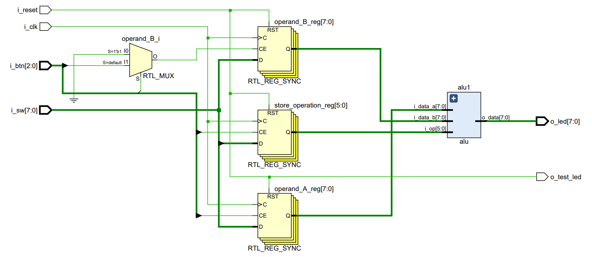

  

***TRABAJO PRACTICO 1***

**Titulo:** Construyamos una ALU

**Asignatura:** Arquitectura de Computadoras

**Integrantes:**
   - Gil Cernich, Manuel 
   - Cabrera, Augusto Gabriel 

**Fecha:** 7/9/2024
   

---------------
## Enunciado

Desarrollar una Unidad Lógica Aritmética (ALU) parametrizable en lenguaje Verilog, capaz de operar sobre un bus de datos configurable. La ALU debe ser implementada en una FPGA, validada mediante un banco de pruebas (testbench), y simulada utilizando herramientas de simulación de Vivado.

### Requerimientos

1. **ALU parametrizable:**
    - La ALU deberá ser diseñada de manera que permita cambiar el ancho del bus de datos de forma paramétrica, para que pueda ser utilizada en otros proyectos, incluyendo el trabajo final.
    - Deberá soportar las siguientes operaciones aritméticas y lógicas: `Suma, Resta, AND, OR, XOR, Desplazamientos (shift) a la izquierda y derecha, Comparación (igualdad y mayor que).`

2. **Banco de pruebas (Test Bench):**
    - Implementar un banco de pruebas en Verilog que valide el correcto funcionamiento de la ALU.
    - El testbench deberá incluir generación de entradas aleatorias para probar diferentes casos.
    - Incorporar un sistema de chequeo automático para comparar los resultados esperados con los obtenidos, generando un log de errores en caso de inconsistencias.

3. **Simulación y análisis de tiempo:**
    - Simular el diseño utilizando las herramientas de simulación de Vivado.
    - Realizar un análisis de temporización para verificar el comportamiento de la ALU con diferentes configuraciones del bus de datos, identificando posibles problemas de sincronización o timing.

  

<em>Figura 1: Diagrama</em>

### Primeras Aproximaciones

El siguiente código Verilog define un módulo `ALU` (Unidad Lógica Aritmética) que realiza diversas operaciones aritméticas y lógicas de 8 bits. 

  

<em>Figura 2: Esquema Obtenido</em>

A continuación se describe cada parte del código:

## Código Verilog: ALU.v

Este módulo describe una **Unidad Lógica Aritmética (ALU)** en Verilog, la cual realiza operaciones aritméticas y lógicas en dos números de 8 bits de entrada (`A` y `B`).

### 1. Parámetros y entradas/salidas

- **Parámetros:**
  - `NB_DATA = 8`: Define el tamaño del bus de datos, es decir, los números A y B tienen 8 bits.
  - `NB_OP = 6`: Define el tamaño del código de operación, que es de 6 bits.

- **Entradas:**
  - `i_data_a` e `i_data_b`: Son los dos números de entrada de 8 bits.
  - `i_op`: Es el código de operación (6 bits) que indica qué operación debe realizar la ALU.

- **Salidas:**
  - `o_data`: Es el resultado de la operación (8 bits).
  - `carry_borrow`: Es una señal de 1 bit que indica si ocurrió un acarreo o un borrow (dependiendo de la operación).

### 2. Bloque `always`

Este bloque es **combinacional**, es decir, se ejecuta cuando cambian las entradas. Aquí se definen las operaciones de la ALU.

- **Reset de la señal `carry_borrow`:** 
  Al inicio del bloque, se pone en 0 el bit de acarreo/préstamo (`carry_borrow = 0`).

### 3. Operaciones dentro del bloque `case`

El código ejecuta una operación dependiendo del valor de `i_op`, que se compara con las siguientes instrucciones:

- **`6'b100000` (ADD):** 
  - Se suma `i_data_a` e `i_data_b`, y el bit más significativo se almacena en `carry_borrow` si hay un acarreo.
  - `{carry_borrow, o_data} = i_data_a + i_data_b;`: Usa un registro de 9 bits para almacenar el acarreo en el bit más significativo.

  

<em>Figura 3: Ej Operando ADD (con Carry)</em>

- **`6'b100010` (SUB):**
  - Resta `i_data_a - i_data_b`.
  - Si `i_data_a < i_data_b`, se activa `carry_borrow` para indicar un préstamo.
  - `carry_borrow = 1;` y `o_data = i_data_a - i_data_b;`.

  

<em>Figura 4: Ej Operando SUB (con Borrow)</em>

  

<em>Figura 5: Ej Operando SUB (sin Borrow)</em>

- `Borrow = 1` Resultado NEGATIVO
- `Borrow = 0` Resultado POSITIVO

- **Operaciones lógicas:**
  - `6'b100100`: **AND** bit a bit entre `i_data_a` e `i_data_b`.
  - `6'b100101`: **OR** bit a bit entre `i_data_a` e `i_data_b`.
  - `6'b100110`: **XOR** bit a bit entre `i_data_a` e `i_data_b`.
  - `6'b100111`: **NOR** bit a bit (es decir, primero realiza un OR y luego una negación).

- **Desplazamientos:**
  - `6'b000011`: **SRA** (desplazamiento aritmético a la derecha). Mantiene el bit de signo.
  - `6'b000010`: **SRL** (desplazamiento lógico a la derecha). Desplaza los bits e inserta ceros desde la izquierda.

- **Caso por defecto:**
  - Si `i_op` no coincide con ningún valor predefinido, `o_data` se pone a 0.

Este código es un diseño típico de una ALU que soporta operaciones básicas como suma, resta, operaciones lógicas y desplazamientos, útiles en la implementación de procesadores o sistemas digitales.

  

<em>Figura 6: Ej Operando AND, OR , XOR , NOR , SRA , SRL</em>

## Test Bench

Este *testbench* es un archivo en Verilog que se utiliza para verificar el comportamiento de un módulo de ALU (Unidad Lógica Aritmética). 

  

<em>Figura 7: Test Bench</em>

A continuación se explican las partes clave:

### 1. Parámetros:
- **NB_DATA = 8**: Define que los datos de entrada y salida son de 8 bits.
- **NB_OP = 6**: Define que el código de operación (`op`) tiene 6 bits.

### 2. Entradas y salidas:
- **i_data_a** y **i_data_b**: Registros de 8 bits que representan los operandos de entrada A y B.
- **i_op**: Registro de 6 bits que especifica el código de operación que la ALU ejecutará (ejemplo: ADD, SUB, AND, etc.).
- **o_data**: Es una señal *wire* de 8 bits que representa el resultado de la operación.
- **carry_borrow**: Es una señal *wire* que indica si hubo un acarreo (en una suma) o un préstamo (en una resta).

### 3. Instanciación de la ALU:
La ALU es instanciada usando los parámetros definidos (`NB_DATA` y `NB_OP`). El módulo `uut` (unit under test) conecta las entradas y salidas del *testbench* con las de la ALU.

### 4. Bloque `initial`:
Este bloque es el núcleo de la simulación y contiene las pruebas que se realizan sobre la ALU.

- **$dumpfile** y **$dumpvars**: Estos comandos se usan para generar un archivo VCD (Value Change Dump) que se puede visualizar con herramientas como GTKWave para analizar las señales de la simulación.
  
- **$display**: Muestra los resultados de cada prueba en la consola, incluyendo el tiempo (`$time`), los valores de las entradas A y B, la operación realizada, el resultado y el valor de `carry_borrow`.

### 5. Pruebas:
Cada prueba se ejecuta con un retraso de 10 nanosegundos (`#10`) entre cada operación. Se genera un número aleatorio para los operandos A y B utilizando `$random(seed)` para asegurar que las pruebas sean variadas. Las operaciones probadas son:

- **ADD** (`i_op = 6'b100000`): Suma los valores de A y B.
- **SUB** (`i_op = 6'b100010`): Resta el valor de B a A.
- **AND** (`i_op = 6'b100100`): Realiza una operación AND bit a bit entre A y B.
- **OR** (`i_op = 6'b100101`): Realiza una operación OR bit a bit entre A y B.
- **XOR** (`i_op = 6'b100110`): Realiza una operación XOR bit a bit entre A y B.
- **SRA** (`i_op = 6'b000011`): Desplazamiento aritmético a la derecha sobre A.
- **SRL** (`i_op = 6'b000010`): Desplazamiento lógico a la derecha sobre A.
- **NOR** (`i_op = 6'b100111`): Realiza una operación NOR bit a bit entre A y B.

Al final de cada prueba, se imprimen los valores de entrada, la operación realizada, el resultado y si hubo acarreo o préstamo.
Después de todas las pruebas, el simulador termina la ejecución con el comando `$finish`.

