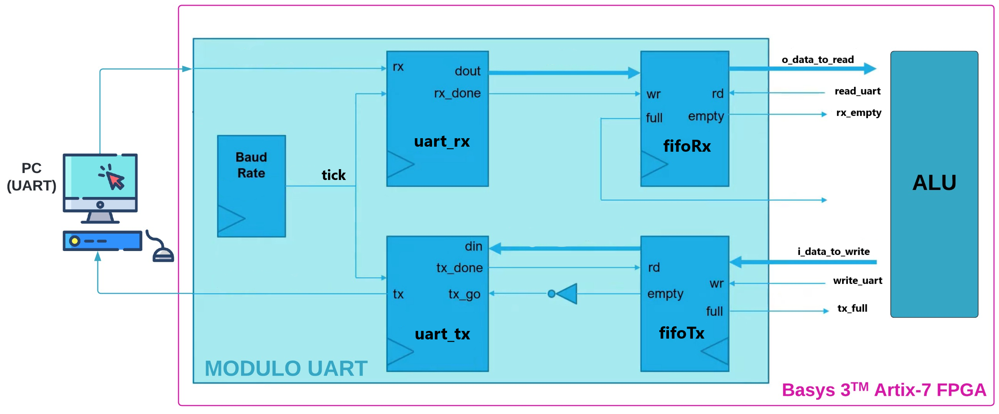
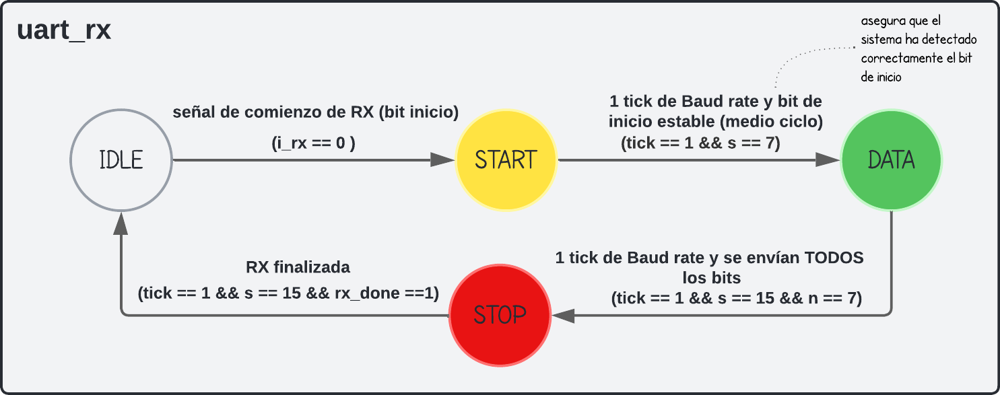

  

***TRABAJO PRACTICO 2***

**Titulo:** Maquinas de Estado Finitas - UART

**Asignatura:** Arquitectura de Computadoras

**Integrantes:**
   - Gil Cernich, Manuel 
   - Cabrera, Augusto Gabriel 

---------------
## Enunciado

Implementar una interfaz de comunicación UART para la unidad
aritmético-lógica (ALU) previamente desarrollada (Trabajo Práctico N°1). Esta comunicación serie permitirá proporcionar a la ALU
los operandos y el operador a través del puerto serie (RX), y transmitir el resultado por la misma vía (TX).

  

## Marco Teorico

### UART (Transmisor-Receptor Asíncrono Universal)

Es un protocolo simple de dos cables utilizado para intercambiar datos en serie.

- **Asíncrono** significa que no hay un reloj compartido entre los dispositivos. Para que el UART funcione correctamente, es necesario que ambos lados de la conexión estén configurados con la misma velocidad de baudios o bits por segundo.
  
- **Bits de inicio y parada**: Se utilizan para indicar dónde comienzan y terminan los datos del usuario, permitiendo «tramar» los datos.

- **Bit de paridad**: Opcionalmente, se puede emplear un bit de paridad para detectar errores en un solo bit.

Aunque el **UART** sigue siendo ampliamente utilizado, en los últimos años ha sido reemplazado en algunas aplicaciones por tecnologías como **SPI**, **I2C**, **USB** y **Ethernet**.

#### Funcionamiento

  

El protocolo UART funciona de la siguiente manera, tanto para transmitir como para recibir datos:

1. **Detección de transición**: Inicialmente, la línea se encuentra en 1, lo que indica que no hay comunicación. Cuando se desea transmitir, la línea baja a 0 para comenzar la transmisión.

2. **Muestreo de los datos entrantes**: Tras finalizar el tiempo del bit de inicio, se empieza a transmitir el byte completo, comenzando por el **bit de menor peso (LSB)**. Al final, se envía el bit de paridad, que permite verificar si la información transmitida y recibida es correcta.

3. **Muestreo del bit de parada**: Este bit es necesario para indicar que se ha completado la transmisión o recepción de los datos.

El truco de este protocolo es muestrear cada bit justo en la mitad de su período. Esto asegura que no haya ambigüedades en la información. En una **FPGA**, se debe tener cuidado al muestrear, asegurándose de hacerlo justo en el flanco de subida de la señal de muestreo.

### Generación de Ticks

**Baud Rate:** Es la velocidad de transmisión de datos, medida en símbolos por segundo. Por ejemplo, un Baud Rate de 19,200 significa que se transmiten 19,200 símbolos por segundo.

- Para un Baud Rate de 19,200 bps, se necesitan **16 muestras** _(TICKS)_ por cada bit transmitido. Esto se hace para asegurar que se captura la señal en diferentes momentos a lo largo de cada bit, lo que permite una mejor detección de los estados de la señal.

- La frecuencia de muestreo se calcula como:
  - Frecuencia de muestreo = Baud Rate × 16
  - Frecuencia de muestreo = 19,200 bps × 16 = 307,200 ticks por segundo

#### Relación con el Clock de la Placa

- Si el reloj de la placa es de **50 MHz**, significa que el reloj genera **50,000,000 ciclos** por segundo. Para determinar cuántos ciclos de reloj se necesitan para generar un tick, se puede hacer el siguiente cálculo:
  - Ciclos de reloj por tick = Frecuencia del reloj / Frecuencia de muestreo
  - Ciclos de reloj por tick = 50,000,000 Hz / 307,200 ticks por segundo ≈ 163 ciclos de reloj

#### Generador de Baud Rate

- El **Baud Rate Generator** es un contador que cuenta hasta **163** (el número de ciclos de reloj necesarios para generar un tick) y se reinicia. Cuando el contador alcanza este valor, genera un tick (señal de muestreo).

- Este contador puede ser implementado en Verilog o en hardware de otras formas. Cada vez que el contador se reinicia, indica que ha pasado el tiempo necesario para muestrear un bit de datos.

#### RESUMEN:

1. **Baud Rate** de 19,200 bps requiere 16 muestras por bit, lo que resulta en una frecuencia de muestreo de 307,200 ticks por segundo.
2. Con un reloj de 50 MHz, cada tick se genera cada 163 ciclos de reloj.
3. El Baud Rate Generator cuenta hasta 163 para generar los ticks necesarios para la transmisión UART.

Esto asegura que el sistema UART sea capaz de leer y transmitir datos de manera precisa y confiable.

## Implementación

La función principal del módulo de comunicación serie de la PC es TX individualmente los bits de cada byte, y el módulo UART desarrollado se encarga de recibirlos en una cola FIFO de RX , reensamblar los bits para formar nuevamente los bytes completos, y enviar esta información a la ALU. 

Una vez que la ALU realiza la operación, el resultado es enviado a la cola de TX y luego transmitido por el puerto serie a la PC que estará esperando estos datos.

  

La máquina de estados está representada por un módulo de interfaz entre la ALU y el módulo UART propiamente dicho. El grafo en cuestion es:

  

  Se podrían agregar los estados **_verify_** y **_error_** (en futuras versiones) para mejorar la gestión del sistema:

 **Estado de Error**:
En algunos sistemas, cuando se detectan errores de paridad o se excede el tiempo de espera (_timeout_) sin recibir datos, es posible definir un estado de error o _timeout_. Este estado se utiliza para gestionar la corrección del error o iniciar un nuevo intento de transmisión.

 **Estado de Verificación (Parity Bit)**:
Si se utiliza paridad, se transmite un bit adicional para verificar la corrección de los datos enviados. Este bit de paridad puede ser par o impar, dependiendo de la configuración establecida, y permite detectar errores en los datos recibidos.
