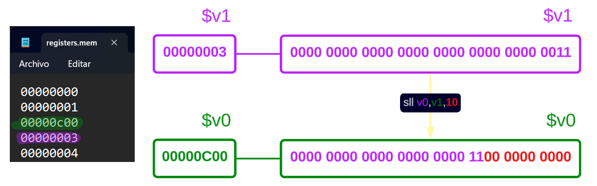
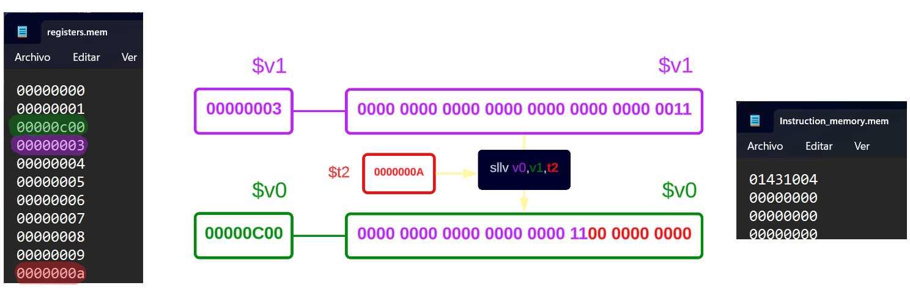
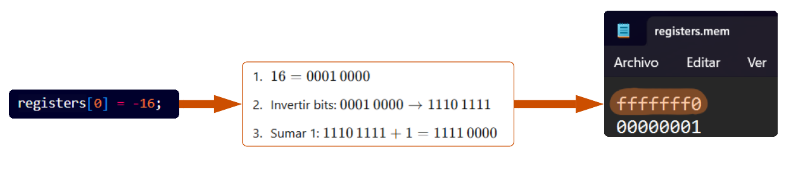
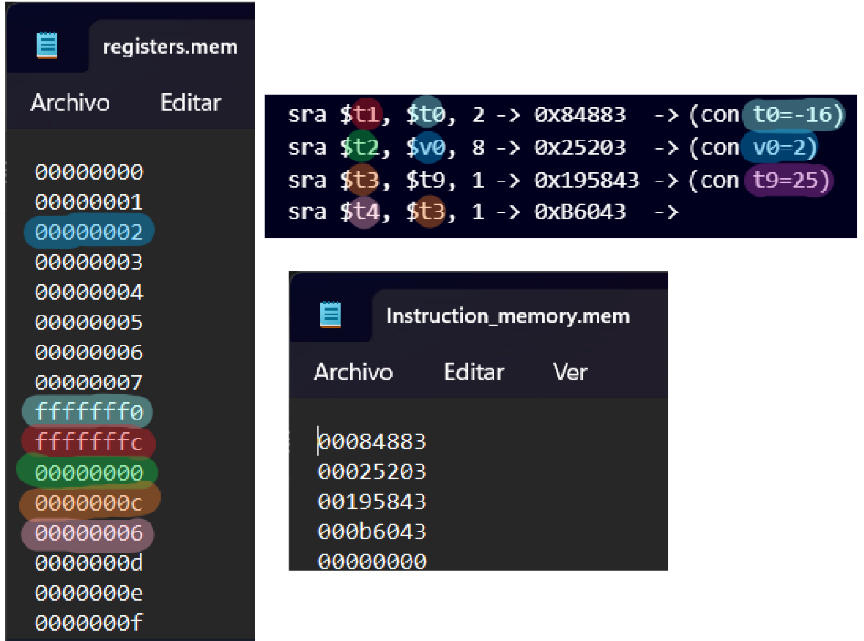
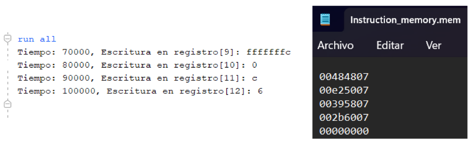
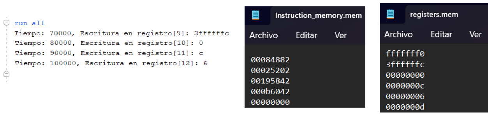
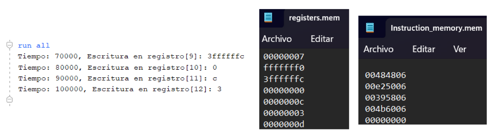
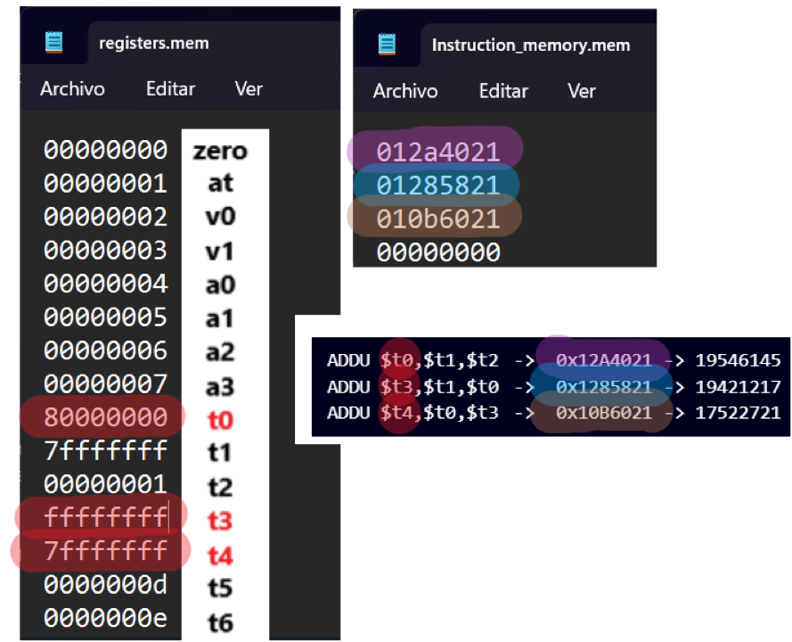

# R-Type
Las instrucciones del tipo `R` operan exclusivamente con registros. Realizan operaciones aritméticas, lógicas o de control de flujo usando valores almacenados en los registros. No requieren acceder a la memoria ni incluyen direcciones explícitas.

- **SLL,SLLV,SRA,SRAV,SRL,SRLV** (Instrucciones de Desplazamiento)
    Cada instrucción desplaza el contenido de `Rs1` a la izquierda o derecha según la distancia indicada por `Rs2`, y coloca el resultado en `Rd`.

| Instrucción      | Descripción                                    | Explicación |
|------------------|----------------------------------------------|-------------|
| `sll $s1,$s2,10`    | Desplazamiento lógico a la izquierda         | `$s1 = $s2 << 10` (Se llenan los bits vacíos con 0) |
| `sllv Rd, Rs1, Rs2` | Desplazamiento lógico a la izquierda variable | `Rd = Rs1 << (Rs2 % 32)` (El desplazamiento es variable) |
| `sra Rd, Rs1, imm`  | Desplazamiento lógico a la derecha aritmético | `Rd = Rs1 >> imm` (Se llenan los bits vacíos con el bit de signo) |
| `srav Rd, Rs1, Rs2` | Desplazamiento lógico a la derecha variable  | `Rd = Rs1 >> (Rs2 % 32)` (Conserva el signo) |
| `srl $s1,$s2,10`  | Desplazamiento lógico a la derecha           | `$s1 = $s2 >> 10` (Se llenan los bits vacíos con 0) |
| `srlv Rd, Rs1, Rs2` | Desplazamiento lógico a la derecha variable  | `Rd = Rs1 >>> (Rs2 % 32)` (El desplazamiento es variable) |


**Ejemplo SLL**

```assembly 
  sll v0,v1,10 -> 000000 00000 00011 00010 01010 000000 -> 0x00031280 -> 201344
```
<p align="center">  </p>

```assembly 
  sll v0,v1,10 -> 000000 00000 00011 00010 01010 000000 -> 0x00031280 -> 201344
```
##### Conclusión

- **Usa SLL** cuando la cantidad de desplazamiento es fija y conocida en tiempo de compilación.
- **Usa SLLV** cuando la cantidad de desplazamiento es variable y depende de un valor en un registro.

Ambas instrucciones son útiles para multiplicaciones por potencias de 2 sin usar `mul`, pero **SLLV** es más flexible al permitir un desplazamiento dinámico.

**Ejemplo SLLV**

```assembly 
  sllv v0,v1,t2 -> 000000 01010 00011 00010 00000 000100 -> 0x1431004 -> 21172228
```

<p align="center">  </p>

**Ejemplo SRA**

📝 NOTA: Recuerde que los valores negativos se almacenan en el registro utilizando la representación en complemento a 2. EJ:

<p align="center">  </p>

```assembly 
   sra $t1, $t0, 2 -> 000000 00000 01000 01001 00010 000011 -> 0x84883  -> 542851 (con t0=-16)
   sra $t2, $v0, 8 -> 000000 00000 00010 01010 01000 000011 -> 0x25203  -> 152067 (con v0=2)
   sra $t3, $t9, 1 -> 000000 00000 11001 01011 00001 000011 -> 0x195843 -> 1660995 (con t9=25)
   sra $t4, $t3, 1 -> 000000 00000 01011 01100 00001 000011 -> 0xB6043  -> 745539 
```
##### **Interpretación SRA para sra $t1, $t0, 2**
```assembly 
  Relleno con signo   Bits originales desplazados
      1 1           11111111 11111111 11111111 11110000  → Desplazar 2 a la derecha
      └─────────────────────────────────────────────────────────┘
                 ↓
Resultado:   11111111 11111111 11111111 11111100 = 0xFFFFFFFC
```

<p align="center">  </p>

**Ejemplo SRAV**

```assembly 
   srav $t1, $t0, $v0 -> 000000 00010 01000 01001 00000 000111 -> 0x484807  -> 4737031 (con t0=-16, V0=2)
   srav $t2, $v0, $a3 -> 000000 00111 00010 01010 00000 000111 -> 0xE25007  -> 14831623  (con v0=2 , a3=7 )
   srav $t3, $t9, $at -> 000000 00001 11001 01011 00000 000111 -> 0x395807  -> 3758087 (con t9=25)
   srav $t4, $t3, $at -> 000000 00001 01011 01100 00000 000111 -> 0x2B6007  -> 2842631 
```

<p align="center">  </p>


**Ejemplo SRL**

```assembly 
   srl $t1, $t0, 2 -> 000000 00000 01000 01001 00010 000010 -> 0x84882  -> 542850 (con t0=-16)
   srl $t2, $v0, 8 -> 000000 00000 00010 01010 01000 000010 -> 0x25202  -> 152066 (con v0=2)
   srl $t3, $t9, 1 -> 000000 00000 11001 01011 00001 000010 -> 0x195842 -> 1660994 (con t9=25)
   srl $t4, $t3, 1 -> 000000 00000 01011 01100 00001 000010 -> 0xB6042  -> 745538 
```
<p align="center">  </p>

**Ejemplo SRLV**

```assembly 
   srlv $t1, $t0, $v0 -> 000000 00010 01000 01001 00000 000110 -> 0x484806  -> 4737030 (con t0=-16, V0=2)
   srlv $t2, $v0, $a3 -> 000000 00111 00010 01010 00000 000110 -> 0xE25006  -> 14831622  (con v0=2 , a3=7 )
   srlv $t3, $t9, $at -> 000000 00001 11001 01011 00000 000110 -> 0x395806  -> 3758086 (con t9=25)
   srlv $t4, $t3, $v0 -> 000000 00010 01011 01100 00000 000110 -> 0x4B6006  -> 4939782
```

<p align="center">  </p>


- **ADDU (Add Unsigned)**  

Suma dos registros sin considerar desbordamientos. Si la suma excediera el rango de 32 bits, el resultado simplemente se truncaría.  
Ejemplo: **ADDU R1, [0x7FFFFFFF], [0x00000001]** , **ADDU R2, R1, [0x7FFFFFFF]**  y **ADDU R3, R1, R2** 

```assembly 
    0111 1111 1111 1111 1111 1111 1111 1111   (0x7FFFFFFF)  
  + 0000 0000 0000 0000 0000 0000 0000 0001   (0x00000001)  
  -------------------------------------------------------  
    1000 0000 0000 0000 0000 0000 0000 0000   (0x80000000, en complemento a dos)  


      0111 1111 1111 1111 1111 1111 1111 1111   (0x7FFFFFFF)
    + 1000 0000 0000 0000 0000 0000 0000 0000   (0x80000000)
    -------------------------------------------------------
      1111 1111 1111 1111 1111 1111 1111 1111   (0xFFFFFFFF)

       1000 0000 0000 0000 0000 0000 0000 0000   
    + 1111 1111 1111 1111 1111 1111 1111 1111   
    ------------------------------------------------
      0111 1111 1111 1111 1111 1111 1111 1111
```

Aquí, el resultado es *negativo* cuando se interpreta como complemento a dos.  
Esto causaría una excepción en **ADD**, ya que la suma de dos números positivos no debería dar un negativo.  

Sin embargo, **ADDU** simplemente guarda el resultado (0x80000000) sin verificar si hay desbordamiento, almacenando este valor en **Rd** sin errores.

```assembly 
ADDU $t0,$t1,$t2 -> 000000 01001 01010 01000 00000 100001 ->  0x12A4021 -> 19546145
ADDU $t3,$t1,$t0 -> 000000 01001 01000 01011 00000 100001 ->  0x1285821 -> 19421217
ADDU $t4,$t0,$t3 -> 000000 01000 01011 01100 00000 100001 ->  0x10B6021 -> 17522721
```
**RESULTADO:**

<p align="center">  </p>


- **SUBU (Subtract Unsigned)**  
Resta dos registros sin considerar desbordamientos.  
Ejemplo: `SUBU R1, R2, R3`

- **AND**  
Realiza una operación lógica AND entre dos registros.  
Ejemplo: `AND R1, R2, R3`

- **OR**  
Realiza una operación lógica OR entre dos registros.  
Ejemplo: `OR R1, R2, R3`

- **XOR**  
Realiza una operación lógica XOR entre dos registros.  
Ejemplo: `XOR R1, R2, R3`

- **NOR**  
Realiza una operación lógica NOR entre dos registros.  
Ejemplo: `NOR R1, R2, R3`

- **SLT (Set on Less Than)**  
Establece un registro a 1 si un registro es menor que otro; de lo contrario, lo establece a 0.  
Ejemplo: `SLT R1, R2, R3`

- **SLTU (Set on Less Than Unsigned)**  
Similar a SLT pero para números sin signo.  
Ejemplo: `SLTU R1, R2, R3`

---

# I-Type  

MIPS es una máquina de arquitectura **carga-almacenamiento**: para usar un dato almacenado en memoria, primero hay que pasarlo a un registro.


Las instrucciones del tipo `I` trabajan con un registro y un valor inmediato (constante) o utilizan una dirección base para acceder a la memoria. Son comunes en operaciones aritméticas, lógicas y en el acceso a datos en memoria.

## LOAD

Las operaciones aritméticas se producen sólo
entre registros en las instrucciones MIPS. Así, MIPS debe incluir instrucciones que
transfieran datos entre la memoria y los registros. Tales instrucciones son llamadas
instrucciones de transferencia de datos. Para acceder a una palabra en memoria, la
instrucción debe proporcionar la dirección de memoria. **La memoria es simplemente
una gran tabla unidimensional**, y la dirección actúa como índice de esa tabla y
empieza por 0.

En MIPS, las palabras deben comenzar en direcciones múltiplos de 4. Este
requisito se llama **restricción de la alineación**, y muchas arquitecturas la tienen.

MIPS usa el extremo mayor (es un Big Endian). 
El direccionamiento de byte también afecta al índice de la tabla (array).
Para conseguir la dirección apropiada del byte en el código anterior, el desplazamiento que se añadirá al registro base $s3 debe ser 4 × 8, ó 32, de modo que la
dirección cargada sea A[8] y no A[8/4]. 


- **LB (Load Byte)**  
Carga un byte desde la memoria a un registro, con signo.  
Ejemplo: `LB R1, 0(R2)`

- **LH (Load Halfword)**  
Carga un medio palabra (16 bits) desde la memoria a un registro, con signo.  
Ejemplo: `LH R1, 0(R2)`

- **LW (Load Word)**  
Carga una palabra (32 bits) desde la memoria a un registro.  
Ejemplo: `LW R1, 0(R2)`

<p align="center">  </p>

- **LWU (Load Word Unsigned)**  
Carga una palabra desde la memoria a un registro, tratándola como sin signo.  
Ejemplo: `LWU R1, 0(R2)`

- **LBU (Load Byte Unsigned)**  
Carga un byte desde la memoria a un registro, tratándolo como sin signo.  
Ejemplo: `LBU R1, 0(R2)`

- **LHU (Load Halfword Unsigned)**  
Carga un medio palabra desde la memoria a un registro, tratándolo como sin signo.  
Ejemplo: `LHU R1, 0(R2)`

- **SB (Store Byte)**  
Almacena un byte desde un registro en la memoria.  
Ejemplo: `SB R1, 0(R2)`

- **SH (Store Halfword)**  
Almacena un medio palabra desde un registro en la memoria.  
Ejemplo: `SH R1, 0(R2)`

- **SW (Store Word)**  
Almacena una palabra desde un registro en la memoria.  
Ejemplo: `SW R1, 0(R2)`

<p align="center">  </p>

- **ADDI (Add Immediate)**  
Suma un valor inmediato a un registro y almacena el resultado en otro registro.  
Ejemplo: `ADDI R1, R2, 10`

- **ADDIU (Add Immediate Unsigned)**  
Suma un valor inmediato sin signo a un registro y almacena el resultado en otro registro.  
Ejemplo: `ADDIU R1, R2, 10`

- **ANDI (AND Immediate)**  
Realiza una operación lógica AND entre un registro y un valor inmediato.  
Ejemplo: `ANDI R1, R2, 0xFF`

- **ORI (OR Immediate)**  
Realiza una operación lógica OR entre un registro y un valor inmediato.  
Ejemplo: `ORI R1, R2, 0xFF`

- **XORI (XOR Immediate)**  
Realiza una operación lógica XOR entre un registro y un valor inmediato.  
Ejemplo: `XORI R1, R2, 0xFF`

- **LUI (Load Upper Immediate)**  
Carga un valor inmediato en los 16 bits superiores de un registro.  
Ejemplo: `LUI R1, 0x1234`

- **SLTI (Set on Less Than Immediate)**  
Establece un registro a 1 si un registro es menor que un valor inmediato; de lo contrario, lo establece a 0.  
Ejemplo: `SLTI R1, R2, 10`

- **SLTIU (Set on Less Than Immediate Unsigned)**  
Similar a SLTI pero para números sin signo.  
Ejemplo: `SLTIU R1, R2, 10`

- **BEQ (Branch if Equal)**  
Realiza un salto condicional si dos registros son iguales.  
Ejemplo: `BEQ R1, R2, Label`

- **BNE (Branch if Not Equal)**  
Realiza un salto condicional si dos registros no son iguales.  
Ejemplo: `BNE R1, R2, Label`  

---

### J-Type  
Las instrucciones del tipo `J` se utilizan para saltos en el flujo de ejecución del programa. Incluyen una dirección en la instrucción para especificar a dónde saltar.

- **J (Jump)**  
Realiza un salto a una dirección especificada en la instrucción.  
Ejemplo: `J 0x00400000`

- **JAL (Jump and Link)**  
Realiza un salto a una dirección especificada y guarda la dirección de retorno en el registro `RA`.  
Ejemplo: `JAL 0x00400000`

- **JR (Jump Register)**  
Realiza un salto a la dirección almacenada en un registro específico.  
Ejemplo: `JR R1`

- **JALR (Jump and Link Register)**  
Realiza un salto a la dirección almacenada en un registro y guarda la dirección de retorno en otro registro.  
Ejemplo: `JALR R1, R2`
