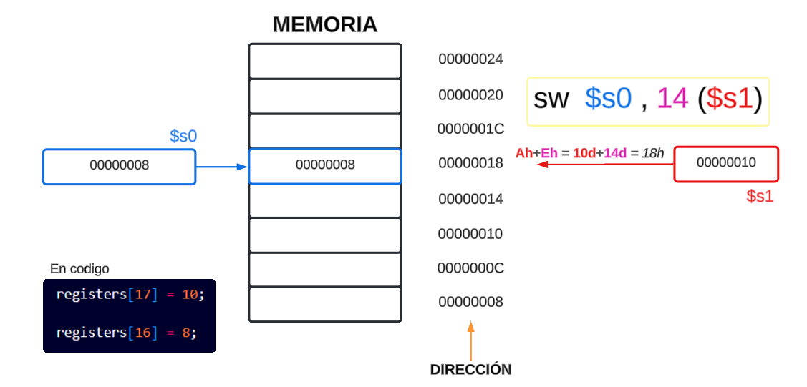

# R-Type
Las instrucciones del tipo `R` operan exclusivamente con registros. Realizan operaciones aritméticas, lógicas o de control de flujo usando valores almacenados en los registros. No requieren acceder a la memoria ni incluyen direcciones explícitas.

- **SLL (Shift Left Logical)**  
Desplaza los bits de un registro a la izquierda, llenando con ceros los bits menos significativos.  
Ejemplo: `SLL R1, R2, 2`

- **SRL (Shift Right Logical)**  
Desplaza los bits de un registro a la derecha, llenando con ceros los bits más significativos.  
Ejemplo: `SRL R1, R2, 2`

- **SRA (Shift Right Arithmetic)**  
Desplaza los bits de un registro a la derecha, preservando el bit de signo (el bit más significativo).  
Ejemplo: `SRA R1, R2, 2`

- **SLLV (Shift Left Logical Variable)**  
Desplaza los bits de un registro a la izquierda por un número de posiciones especificado en otro registro.  
Ejemplo: `SLLV R1, R2, R3`

- **SRLV (Shift Right Logical Variable)**  
Desplaza los bits de un registro a la derecha por un número de posiciones especificado en otro registro.  
Ejemplo: `SRLV R1, R2, R3`

- **SRAV (Shift Right Arithmetic Variable)**  
Desplaza los bits de un registro a la derecha preservando el signo por un número de posiciones especificado en otro registro.  
Ejemplo: `SRAV R1, R2, R3`

- **ADDU (Add Unsigned)**  
Suma dos registros sin considerar desbordamientos.  
Ejemplo: `ADDU R1, R2, R3`

- **SUBU (Subtract Unsigned)**  
Resta dos registros sin considerar desbordamientos.  
Ejemplo: `SUBU R1, R2, R3`

- **AND**  
Realiza una operación lógica AND entre dos registros.  
Ejemplo: `AND R1, R2, R3`

- **OR**  
Realiza una operación lógica OR entre dos registros.  
Ejemplo: `OR R1, R2, R3`

- **XOR**  
Realiza una operación lógica XOR entre dos registros.  
Ejemplo: `XOR R1, R2, R3`

- **NOR**  
Realiza una operación lógica NOR entre dos registros.  
Ejemplo: `NOR R1, R2, R3`

- **SLT (Set on Less Than)**  
Establece un registro a 1 si un registro es menor que otro; de lo contrario, lo establece a 0.  
Ejemplo: `SLT R1, R2, R3`

- **SLTU (Set on Less Than Unsigned)**  
Similar a SLT pero para números sin signo.  
Ejemplo: `SLTU R1, R2, R3`

---

# I-Type  

MIPS es una máquina de arquitectura **carga-almacenamiento**: para usar un dato almacenado en memoria, primero hay que pasarlo a un registro.

Las instrucciones del tipo `I` trabajan con un registro y un valor inmediato (constante) o utilizan una dirección base para acceder a la memoria. Son comunes en operaciones aritméticas, lógicas y en el acceso a datos en memoria.

## LOAD

Las operaciones aritméticas se producen sólo
entre registros en las instrucciones MIPS. Así, MIPS debe incluir instrucciones que
transfieran datos entre la memoria y los registros. Tales instrucciones son llamadas
instrucciones de transferencia de datos. Para acceder a una palabra en memoria, la
instrucción debe proporcionar la dirección de memoria. **La memoria es simplemente
una gran tabla unidimensional**, y la dirección actúa como índice de esa tabla y
empieza por 0.

En MIPS, las palabras deben comenzar en direcciones múltiplos de 4. Este
requisito se llama **restricción de la alineación**, y muchas arquitecturas la tienen.

MIPS usa el extremo mayor (es un Big Endian). 
El direccionamiento de byte también afecta al índice de la tabla (array).
Para conseguir la dirección apropiada del byte en el código anterior, el desplazamiento que se añadirá al registro base $s3 debe ser 4 × 8, ó 32, de modo que la
dirección cargada sea A[8] y no A[8/4]. 

- **LB (Load Byte)**  
Carga un byte desde la memoria a un registro, con signo.  
Ejemplo: `LB R1, 0(R2)`

- **LH (Load Halfword)**  
Carga un medio palabra (16 bits) desde la memoria a un registro, con signo.  
Ejemplo: `LH R1, 0(R2)`

- **LW (Load Word)**  
Carga una palabra (32 bits) desde la memoria a un registro.  
Ejemplo: `LW R1, 0(R2)`

  

- **LWU (Load Word Unsigned)**  
Carga una palabra desde la memoria a un registro, tratándola como sin signo.  
Ejemplo: `LWU R1, 0(R2)`

- **LBU (Load Byte Unsigned)**  
Carga un byte desde la memoria a un registro, tratándolo como sin signo.  
Ejemplo: `LBU R1, 0(R2)`

- **LHU (Load Halfword Unsigned)**  
Carga un medio palabra desde la memoria a un registro, tratándolo como sin signo.  
Ejemplo: `LHU R1, 0(R2)`

- **SB (Store Byte)**  
Almacena un byte desde un registro en la memoria.  
Ejemplo: `SB R1, 0(R2)`

- **SH (Store Halfword)**  
Almacena un medio palabra desde un registro en la memoria.  
Ejemplo: `SH R1, 0(R2)`

- **SW (Store Word)**  
Almacena una palabra desde un registro en la memoria.  
Ejemplo: `SW R1, 0(R2)`

  

- **ADDI (Add Immediate)**  
Suma un valor inmediato a un registro y almacena el resultado en otro registro.  
Ejemplo: `ADDI R1, R2, 10`

- **ADDIU (Add Immediate Unsigned)**  
Suma un valor inmediato sin signo a un registro y almacena el resultado en otro registro.  
Ejemplo: `ADDIU R1, R2, 10`

- **ANDI (AND Immediate)**  
Realiza una operación lógica AND entre un registro y un valor inmediato.  
Ejemplo: `ANDI R1, R2, 0xFF`

- **ORI (OR Immediate)**  
Realiza una operación lógica OR entre un registro y un valor inmediato.  
Ejemplo: `ORI R1, R2, 0xFF`

- **XORI (XOR Immediate)**  
Realiza una operación lógica XOR entre un registro y un valor inmediato.  
Ejemplo: `XORI R1, R2, 0xFF`

- **LUI (Load Upper Immediate)**  
Carga un valor inmediato en los 16 bits superiores de un registro.  
Ejemplo: `LUI R1, 0x1234`

- **SLTI (Set on Less Than Immediate)**  
Establece un registro a 1 si un registro es menor que un valor inmediato; de lo contrario, lo establece a 0.  
Ejemplo: `SLTI R1, R2, 10`

- **SLTIU (Set on Less Than Immediate Unsigned)**  
Similar a SLTI pero para números sin signo.  
Ejemplo: `SLTIU R1, R2, 10`

- **BEQ (Branch if Equal)**  
Realiza un salto condicional si dos registros son iguales.  
Ejemplo: `BEQ R1, R2, Label`

- **BNE (Branch if Not Equal)**  
Realiza un salto condicional si dos registros no son iguales.  
Ejemplo: `BNE R1, R2, Label`  

---

### J-Type  
Las instrucciones del tipo `J` se utilizan para saltos en el flujo de ejecución del programa. Incluyen una dirección en la instrucción para especificar a dónde saltar.

- **J (Jump)**  
Realiza un salto a una dirección especificada en la instrucción.  
Ejemplo: `J 0x00400000`

- **JAL (Jump and Link)**  
Realiza un salto a una dirección especificada y guarda la dirección de retorno en el registro `RA`.  
Ejemplo: `JAL 0x00400000`

- **JR (Jump Register)**  
Realiza un salto a la dirección almacenada en un registro específico.  
Ejemplo: `JR R1`

- **JALR (Jump and Link Register)**  
Realiza un salto a la dirección almacenada en un registro y guarda la dirección de retorno en otro registro.  
Ejemplo: `JALR R1, R2`
