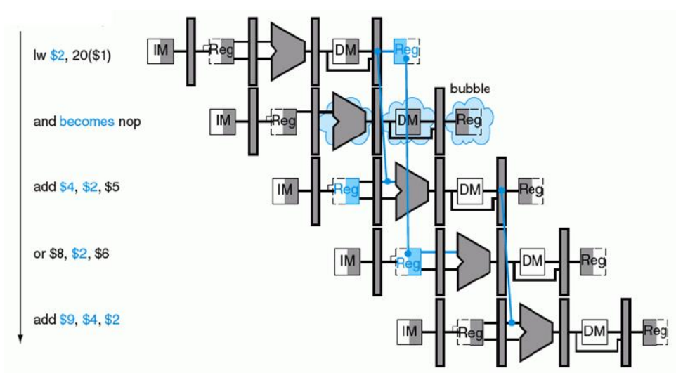

    

***TRABAJO PRACTICO 3***

**Titulo:** PIPELINE - PROCESADOR DLX - (Familia MIPS)

**Asignatura:** Arquitectura de Computadoras

**Integrantes:**
   - Gil Cernich, Manuel 
   - Cabrera, Augusto Gabriel 

---

# Enunciado

**Implementar el pipeline del procesador MIPS.**

## Instrucciones de Implementación

### Instrucciones tipo R (R-type):
- **Operaciones de desplazamiento:** `SLL`, `SRL`, `SRA`, `SLLV`, `SRLV`, `SRAV`
- **Operaciones aritméticas:** `ADDU`, `SUBU`
- **Operaciones lógicas:** `AND`, `OR`, `XOR`, `NOR`
- **Operaciones de comparación:** `SLT`, `SLTU`

### Instrucciones tipo I (I-type):
- **Carga y almacenamiento de datos:** `LB`, `LH`, `LW`, `LWU`, `LBU`, `LHU`, `SB`, `SH`, `SW`
- **Operaciones aritméticas y lógicas:** `ADDI`, `ADDIU`, `ANDI`, `ORI`, `XORI`, `LUI`
- **Comparación y saltos condicionales:** `SLTI`, `SLTIU`, `BEQ`, `BNE`

### Instrucciones tipo J (J-type):
- **Saltos:** `J`, `JAL`, `JR`, `JALR`

## Otros Requerimientos

| Requerimiento                    | Descripción                                                                                                                                                       |
|----------------------------------|-------------------------------------------------------------------------------------------------------------------------------------------------------------------|
| **Memoria de datos e instrucciones** | La memoria de datos debe estar separada de la memoria de instrucciones; ambas deben implementarse mediante IP Cores.                                          |
| **Carga del programa**           | El programa a ejecutar debe cargarse en la memoria de instrucciones mediante un archivo `.coe`.                                                                   |
| **Unidad de depuración**         | Debe incluirse una unidad de debug para enviar información a la PC a través de UART.                                                                              |
| **Segmentación**                 | Hacer en un mismo ciclo escritura y lectura (1 con cada flanco)                                                                                                   |

### Información de Depuración a Enviar por UART

- Contenido de los 32 registros.
- Contenido de los latches intermedios.
- Contenido de la memoria de datos utilizada.

## Modos de Operación

- **Modo Continuo:** En este modo, al enviar un comando a la FPGA a través de UART, se inicia la ejecución del programa hasta completarlo, mostrando todos los valores requeridos al final.
- **Modo Paso a Paso:** Cada comando enviado por UART ejecuta un ciclo de reloj, y se muestran los valores requeridos en cada paso.

## Pipeline Final

    

## Bibliografía

- **Instrucciones:**
  - *MIPS IV Instruction Set*

- **Pipeline:**
  - *Computer Organization and Design*, 3rd Edition. Capítulo 6. Hennessy y Patterson

---

# Marco Teorico

## Etapas

- **IF (Instruction Fetch)**: Búsqueda de la instrucción en la memoria de programa.
- **ID (Instruction Decode)**: Decodificación de la instrucción y lectura de registros.
- **EX (Execute)**: Ejecución de la instrucción propiamente dicha.
- **MEM (Memory Access)**: Lectura o escritura desde/hacia la memoria de datos.
- **WB (Write Back)**: Escritura de resultados en los registros.

## DATAPATH

    

## SEGMENTACIÓN

    

## Unidad de control

    

    

## Riesgos

### Tipos:
- **Estructurales**: Se producen cuando dos instrucciones tratan de utilizar el mismo recurso en el mismo ciclo.
- **De datos**: Se intenta utilizar un dato antes de que esté preparado. Mantenimiento del orden estricto de lecturas y escrituras.
- **De control**: Intentar tomar una decisión sobre una condición todavía no evaluada.

## Riesgos de datos
### Dependencias de registros

    

#### Solución

    

### Unidad de cortocircuito

    

---

## Riesgos de datos
### Dependencias de datos

    

#### Solución

    

### Unidad de detección de riesgos

    

---

## Riesgos de control

    

    

## Tipo de Instrucciones

### Tipo R
- Son operaciones aritméticas y lógicas.
- **OP Code**: `000000`
- La operación se indica en los 6 bits menos significativos.

    

### Tipo I
- Operaciones con un registro y un valor inmediato.
- En operaciones lógicas y aritméticas, se opera con `rs` y se almacena el resultado en `rt`.
- En operaciones de **load** y **store**, `rs` es la base y el inmediato es el desplazamiento (offset).

    

### Tipo J
- Operaciones de salto incondicional.
- La dirección de salto se almacena en el registro `rs`.

    

## 

---

# Constraints

---

# Test Bench Baud Rate

---

# ANEXO: Video
