<p align="center">
    
</p>

***TRABAJO PRACTICO 3***

**Titulo:** PIPELINE - PROCESADOR DLX - (Familia MIPS)

**Asignatura:** Arquitectura de Computadoras

**Integrantes:**
   - Gil Cernich, Manuel 
   - Cabrera, Augusto Gabriel 

---

# Enunciado

**Implementar el pipeline del procesador MIPS.**

## Instrucciones de Implementación

### Instrucciones tipo R (R-type):
- **Operaciones de desplazamiento:** `SLL`, `SRL`, `SRA`, `SLLV`, `SRLV`, `SRAV`
- **Operaciones aritméticas:** `ADDU`, `SUBU`
- **Operaciones lógicas:** `AND`, `OR`, `XOR`, `NOR`
- **Operaciones de comparación:** `SLT`, `SLTU`

### Instrucciones tipo I (I-type):
- **Carga y almacenamiento de datos:** `LB`, `LH`, `LW`, `LWU`, `LBU`, `LHU`, `SB`, `SH`, `SW`
- **Operaciones aritméticas y lógicas:** `ADDI`, `ADDIU`, `ANDI`, `ORI`, `XORI`, `LUI`
- **Comparación y saltos condicionales:** `SLTI`, `SLTIU`, `BEQ`, `BNE`

### Instrucciones tipo J (J-type):
- **Saltos:** `J`, `JAL`, `JR`, `JALR`


## Otros Requerimientos

| Requerimiento                    | Descripción                                                                                                                                                       |
|----------------------------------|-------------------------------------------------------------------------------------------------------------------------------------------------------------------|
| **Memoria de datos e instrucciones** | La memoria de datos debe estar separada de la memoria de instrucciones; ambas deben implementarse mediante IP Cores.                                          |
| **Carga del programa**           | El programa a ejecutar debe cargarse en la memoria de instrucciones mediante un archivo `.coe`.                                                                   |
| **Unidad de depuración**         | Debe incluirse una unidad de debug para enviar información a la PC a través de UART.                                                                              |
| **Segmentación**                 | Hacer en un mismo ciclo escritura y lectura (1 con cada flanco)                                                                                                   |


### Información de Depuración a Enviar por UART

- Contenido de los 32 registros.
- Contenido de los latches intermedios.
- Contenido de la memoria de datos utilizada.


## Modos de Operación

- **Modo Continuo:** En este modo, al enviar un comando a la FPGA a través de UART, se inicia la ejecución del programa hasta completarlo, mostrando todos los valores requeridos al final.
- **Modo Paso a Paso:** Cada comando enviado por UART ejecuta un ciclo de reloj, y se muestran los valores requeridos en cada paso.


## Pipeline Final

<p align="center">
    
</p>


## Bibliografía

- **Instrucciones:**
  - *MIPS IV Instruction Set*

- **Pipeline:**
  - *Computer Organization and Design*, 3rd Edition. Capítulo 6. Hennessy y Patterson


---

# Marco Teorico

## Etapas

- **IF (Instruction Fetch)**: Búsqueda de la instrucción en la memoria de programa.
- **ID (Instruction Decode)**: Decodificación de la instrucción y lectura de registros.
- **EX (Execute)**: Ejecución de la instrucción propiamente dicha.
- **MEM (Memory Access)**: Lectura o escritura desde/hacia la memoria de datos.
- **WB (Write Back)**: Escritura de resultados en los registros.


## DATAPATH

<p align="center">
    
</p>

## SEGMENTACIÓN


<p align="center">
    
</p>

## Unidad de control

<p align="center">
    
</p>


<p align="center">
    
</p>

## Riesgos

### Tipos:
- **Estructurales**: Se producen cuando dos instrucciones tratan de utilizar el mismo recurso en el mismo ciclo.
- **De datos**: Se intenta utilizar un dato antes de que esté preparado. Mantenimiento del orden estricto de lecturas y escrituras.
- **De control**: Intentar tomar una decisión sobre una condición todavía no evaluada.

## Riesgos de datos
### Dependencias de registros
<p align="center">
    
</p>

#### Solución
<p align="center">
    
</p>

### Unidad de cortocircuito
<p align="center">
    
</p>

---

## Riesgos de datos
### Dependencias de datos
<p align="center">
    
</p>

#### Solución
<p align="center">
    
</p>

### Unidad de detección de riesgos
<p align="center">
    
</p>

---

## Riesgos de control
<p align="center">
    
</p>

<p align="center">
    
</p>

## Tipo de Instrucciones

### Tipo R
- Son operaciones aritméticas y lógicas.
- **OP Code**: `000000`
- La operación se indica en los 6 bits menos significativos.

<p align="center">
    
</p>

### Tipo I
- Operaciones con un registro y un valor inmediato.
- En operaciones lógicas y aritméticas, se opera con `rs` y se almacena el resultado en `rt`.
- En operaciones de **load** y **store**, `rs` es la base y el inmediato es el desplazamiento (offset).

<p align="center">
    
</p>

### Tipo J
- Operaciones de salto incondicional.
- La dirección de salto se almacena en el registro `rs`.

<p align="center">
    
</p>

# Implementación

El diseño principal de este desarrollo sigue un enfoque incremental. Cada avance significativo se traduce en una rama (branch) que depende de una rama anterior y contribuye de manera progresiva al desarrollo del MIPS hasta su finalización.

## Avance I: MIPS Only Adder

El objetivo principal del Avance I es desarrollar un MIPS extremadamente básico con las siguientes características:

- Capacidad para procesar únicamente una instrucción de suma: `add $t1, $t2, $t3`.
- Sin manejo de *hazards*.
- Sin soporte para saltos de ningún tipo.

La finalidad de este avance es establecer los módulos fundamentales que conformarán laestructura base (esqueleto) del MIPS, sirviendo como punto de partida y facilitando la integración de funcionalidades en los avances posteriores.

### Resultados


<p align="center">
    
</p>


Se observa cómo el MIPS realiza la operación `add $t1, $t2, $t3`, que consiste en sumar los valores almacenados en los registros 10 (`$t2`) y 11 (`$t3`) y guardar el resultado en el registro 9 (`$t1`).


---

## Avance II: Hazard without jumps

El objetivo principal del Avance II es integrar y mejorar el Avance I, incorporando la capacidad de resolver los riesgos. Esto permitirá procesar las instrucciones de manera adecuada, evitando resultados indeseados debido a condiciones de carrera u otros problemas relacionados.

Teniendo en cuenta los registros como estan distribuidos en el MIPS (ver `Doc\REGISTERS.md`). Planteamos los siguientes casos:


### Caso A: Sin riesgos, multiples instrucciones


```assembly 
add $t0, $t1, $t2 # 000000 01001 01010 01000 00000 100000  -> 0x012A4020 -> 19546144, Registro 08h (08d) = 13h
add $s1, $s2, $s3 # 000000 10010 10011 10001 00000 100000  -> 0x2538820  -> 39028768, Registro 11h (17d) = 25h
add $a0, $a1, $a2 # 000000 00101 00110 00100 00000 100000  -> 0xA62020   -> 10887200, Registro 04h (04d) = 0bh
```

En este caso específico, las tres instrucciones add no presentan riesgos de datos, control ni estructurales directos.

El estado inicial de los registros es el siguiente:

<p align="center">  </p>
Los registros están alineados de la siguiente manera: el primer valor hexadecimal corresponde a $zero, el segundo a $at, y así sucesivamente.

Al realizar las pruebas con el archivo `tb_MIPS_II.v`, se obtienen los siguientes resultados:


<p align="center">  </p>


### Caso B: STORE

**NOTA:** Consulta `OPERATIONS.md` para entender cómo funcionan las instrucciones.

<p align="center">  </p>


```assembly 
sw  $s0 , 14($s1) -> 101011  10001 10000 0000 0000 0000 1110 = 2922381326d

      Address: 18H = 24d = 10d + 14d (offset) = 000110   00 (Descartado)
```

Este valor se encuentra almacenado en el elemento 6 (6x4) de la memoria, como se observa a continuación:

<p align="center">  </p> 


### Caso C: LOAD


<p align="center">  </p> 

```assembly 
lw  $s2 , 16 ($s3) -> 100011   10011  10010  0000 0000 0001 0000 -> 2389835792
```

<p align="center">  </p> 

### Caso D: Riesgos de Datos

Los **riesgos de datos** ocurren cuando, debido a la segmentación, el orden de lectura de los operandos y la escritura de resultados se modifica respecto al especificado por el programa. 

Se produce un riesgo si existe **dependencia entre instrucciones** que se ejecutan concurrentemente. Dependiendo del tipo de segmentación, el riesgo puede ocurrir o no. Existen tres tipos diferentes de riesgos de datos:

- **Lectura después de escritura (LDE):**  
  Se produce un riesgo si un registro se lee antes de que se complete la escritura de dicho registro por una instrucción anterior.

- **Escritura después de lectura (EDL):**  
  Se produce un riesgo si un registro se escribe antes de que se complete la lectura de dicho registro por una instrucción anterior.

- **Escritura después de escritura (EDE):**  
  Se produce un riesgo si un registro se escribe antes de que se complete la escritura de dicho registro por una instrucción anterior.

---

#### Ejemplos de Riesgos de Datos

| Tipo | Código                 | Descripción                               |
|------|------------------------|-------------------------------------------|
| LDE  | `ADD $t1, $t2, $t3`       | $t1 se lee antes de que lo escriba         |
|      | `ADD $t4, $t1, $t2`       |                                           |
| EDL  | `ADD $t1, $t4, $t3`       | $t4 se escribe antes de que lo lea         |
|      | `ADD $t4, $t1, $t2`       |                                           |
| EDE  | `ADD $t4, $t2, $t3`       | Si la 2ª instrucción ocurre primero       |
|      | `ADD $t4, $t1, $t2`       |                                           |

<p align="center">  </p> 


### Análisis del problema

#### Primera instrucción: `ADD $t1, $t2, $t3`
- Escribe el resultado en `$t1` al final de la etapa WB (C5).

#### Segunda instrucción: `ADD $t4, $t1, $t2`
- Intenta leer `$t1` durante la etapa ID (C3), pero `$t1` aún no está disponible porque no se ha escrito en el registro.

---

### Soluciones para evitar este riesgo

#### Técnica de forwarding (reenvío)
1. **Descripción**:  
   Utilizar bypass o forwarding en el hardware para reenviar el resultado de la etapa EX de la primera instrucción directamente a la etapa ID o EX de la segunda, sin esperar a que el resultado sea escrito en el registro.

2. **Implementación en este caso**:  
   - El resultado de la etapa EX de la primera instrucción (C3) puede ser enviado directamente como entrada para la etapa EX de la segunda instrucción (C4).

#### Ventajas
- La técnica de forwarding es la más eficiente, ya que evita la pérdida de ciclos de reloj innecesarios.
- Sin embargo, **requiere soporte en el hardware de la segmentación**.

### Implementación

NOTA: Cada registro tiene su valor igual al index: 

```assembly 
add $s1, $s2, $s3 -> 000000 10010 10011 10001 00000 100000  -> 0x02538820 -> 39028768
add $a0, $a1, $a2 -> 000000 00101 00110 00100 00000 100000  -> 0x00A62020 -> 10887200
add $t1, $t2, $t3 -> 000000 01010 01011 01001 00000 100000  -> 0X014B4820 -> 21710880
add $t4, $t1, $t2 -> 000000 01001 01010 01100 00000 100000  -> 0X012A6020 -> 19554336 
add $t0, $t1, $t2 -> 000000 01001 01010 01000 00000 100000  -> 0x012A4020 -> 19546144
add $t0, $t1, $t2 -> 000000 01001 01010 01000 00000 100000  -> 0x012A4020 -> 19546144
add $t0, $t1, $t2 -> 000000 01001 01010 01000 00000 100000  -> 0x012A4020 -> 19546144
add $t0, $t1, $t2 -> 000000 01001 01010 01000 00000 100000  -> 0x012A4020 -> 19546144
add $t1, $t2, $t3 -> 000000 01010 01011 01001 00000 100000  -> 0X014B4820 -> 21710880
add $t2, $t0, $t3 -> 000000 01000 01011 01010 00000 100000  -> 0x010B5020 -> 17518624
add $t4, $t1, $t2 -> 000000 01001 01010 01100 00000 100000  -> 0X012A6020 -> 19554336 
```

#### Desglose


| Instrucción           | Registro final (Decimal) | Calculo                              |
|------------------------|-------|------------------------------------------|
| add $s1, $s2, $s3     | (08)  | s1 = 18d + 19d = 37d = 25h              |
| add $a0, $a1, $a2     | (04)  | a0 = 05d + 06d = 11d = 0bh              |
| add $t1, $t2, $t3     | (09)  | t1 = 10d + 11d = 21d = 15h              |
| add $t4, $t1, $t2     | (12)  | t4 = 21d + 10d = 31d = 1Fh              |
| add $t0, $t1, $t2     | (08)  | t0 = 21d + 10d = 31d = 1Fh              |
| add $t0, $t1, $t2     | (08)  | t0 = 21d + 10d = 31d = 1Fh              |
| add $t0, $t1, $t2     | (08)  | t0 = 21d + 10d = 31d = 1Fh              |
| add $t0, $t1, $t2     | (08)  | t0 = 21d + 10d = 31d = 1Fh              |
| add $t1, $t2, $t3     | (09)  | t1 = 10d + 11d = 21d = 15h              |
| add $t2, $t0, $t3     | (10)  | t2 = 31d + 11d = 42d = 2Ah              |
| add $t4, $t1, $t2     | (12)  | t4 = 21d + 42d = 63d = 3Fh              |

<p align="center">  </p>

#### Interpretación temporal del hazard

<p align="center">  </p>


### Caso E: Load-Use Hazard

Cuando una instrucción `LW` es seguida por una instrucción de tipo `R`, es necesario cortocircuitar la salida de la memoria (de la instrucción `LW`) con la entrada de la ALU (de la segunda instrucción).

Para realizar este control, la Unidad de Cortocircuito (FORWARD) necesita la siguiente información, que se almacena en los registros de segmento hasta la etapa `EX`:

- El registro que se escribe en la instrucción anterior (`rd` en el tipo `R`, y `rt` en el tipo `I`).
- Los registros que se leen en la nueva instrucción (`rs` y `rt`).
- La señal de control `Write_Reg`, que indica si la instrucción va a escribir en un registro (es decir, si es de tipo `R` o tipo `I` como `LW`).

Como se puede observar, incluso adelantando el resultado mediante la anticipación de resultados (*forwarding*), existe una dependencia hacia atrás en el tiempo entre la primera y la segunda instrucción.

En el caso de la instrucción `LW r1, 0(r2)`, el valor de `r1` no estará disponible hasta la cuarta etapa (`MEM`), ya que el dato se obtiene de la memoria. Sin embargo, la segunda instrucción, que depende de ese dato, lo necesitará en su segunda etapa (`EX`).

Este tipo de dependencia no puede ser resuelto por la Unidad de Cortocircuito, ya que el dato aún no ha sido recuperado de la memoria cuando la segunda instrucción lo requiere. Como resultado, la segunda instrucción deberá *ESPERAR* un ciclo de reloj antes de poder continuar su ejecución. Esta espera se conoce como **stall** o **burbuja**, y es necesaria para evitar la lectura de datos incorrectos.

### Solución

Además de una unidad de anticipación de datos (*FORWARD*), es necesaria una **Unidad de Detección de Riesgos** (*HAZARD*). 

Esta unidad debe operar durante la etapa `ID`, de manera que pueda insertar un bloqueo entre una instrucción de tipo `load` y la instrucción que dependa de su resultado.

El control para la detección de riesgos en el caso de una instrucción `load` se realiza evaluando las siguientes condiciones:

1. La señal de control `memRead` de la instrucción anterior.
2. El registro `rt` de la instrucción anterior, que indica dónde se almacena el resultado de la instrucción `load`.
3. Los registros `rs` y `rt` de la instrucción actual (en la etapa `ID`).


             


### Implementación


```assembly 
lw s2, 16(s3)  -> 0x8E520010 -> 10001110011100100000000000010000 -> 2389835792  -> s2 = 10d (16d nivel 5)
add v1,s2,v0   -> 0x02421820 -> 00100100001000011000001000000000 -> 37885984    -> v1 = 12d (v0 = 2h)
```

<p align="center">  </p>


<p align="center"> 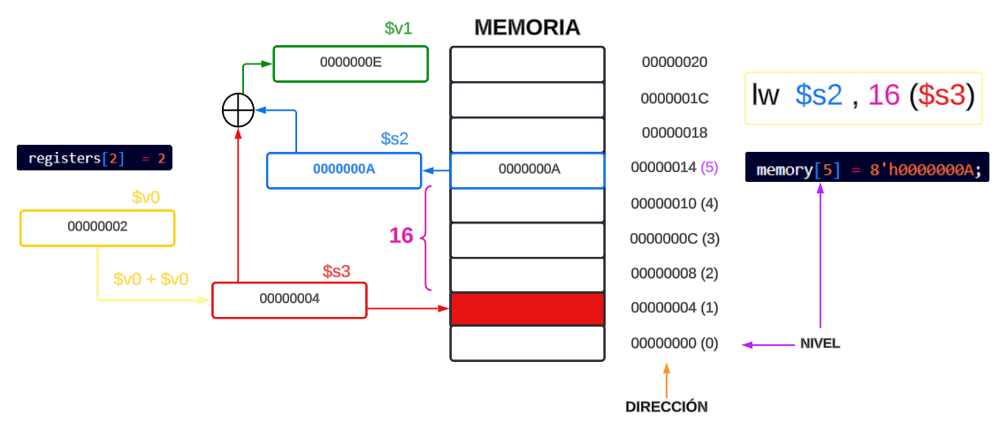 </p>


<p align="center">  </p>


### Caso F: Riesgos, LOAD y STORE

Con $v0=2d y $t0=8d (inicial)

```assembly 
add s3 , v0 , v0    -> 0x00429820 -> 00000000010000101001100000100000 -> 4364320     -> s3 = 2d + 2d = 4d
lw  s2 , 16(s3)     -> 0x8E520010 -> 10001110011100100000000000010000 -> 2389835792  -> s2 = 10d (16d nivel 5)
sw  s3 , 14(s2)     -> 0xAE53000E -> 10101110010100110000000000001110 -> 2924675086  -> nivel 6 = 4d 
lw  $t1 , 16($t0)   -> 0x8D090010 -> 10001101000010010000000000010000 -> 2366177296  -> t1 = 8d 
add $v0 , $s3 , $s2 -> 0x02721020 -> 00000010011100100001000000100000 -> 41029664    -> v0 = 14d
add $t2 , $t1 , $v0 -> 0x1225020  -> 00000001001000100101000000100000 -> 19025952    -> t2 = 22d = 16h
```
#### Interpretación

<p align="center">  </p>

#### Resultado

<p align="center">  </p>

## Avance III: Jumps

Lo que diferencia a un computador de una calculadora simple es su capacidad para tomar decisiones. En este avance, el objetivo es implementar un procesador MIPS que dé continuidad al avance II, incorporando la capacidad de realizar operaciones que afecten al contador de programa (PC) y gestionando los riesgos de control asociados.

### Caso G: J


Las instrucciones de tipo **J (jump)** en MIPS tienen el siguiente formato binario de **32 bits**:  

📌 **Reglas importantes sobre la dirección de salto (`target address`)**:  
1. La CPU de MIPS **trunca** los **2 bits menos significativos** de la dirección (`PC`), ya que las instrucciones en MIPS **siempre están alineadas a 4 bytes**.  
2. El `target address` en la instrucción `j` **no es la dirección absoluta**, sino que representa los **26 bits superiores** de la dirección **dividida por 4**.  
3. La dirección real de salto se reconstruye en la ejecución así:  

   `Jump Address = (PC[31:28] << 28) | (target address << 2)`

Como en este caso el salto es dentro del mismo segmento, no nos preocupamos por `PC[31:28]`.


#### 🔹 Cálculo de la dirección de salto para `j 00011000` (PC = 24)

| Paso | Descripción | Resultado |
|------|------------|-----------|
| 1️⃣  | Dirección objetivo en decimal | `PC = 24 (decimal)` |
| 2️⃣  | Dividimos por 4 | `24 / 4 = 6` |
| 3️⃣  | Convertimos `6` a binario en 26 bits | `00000000000000000000000110` |
| 4️⃣  | Juntamos con el opcode de `j` (`000010`) | `000010 00000000000000000000000110` |
| 5️⃣  | Convertimos a hexadecimal | **`0x08000006`** |


#### 🔹 **Conclusión**  
- **La razón por la que usamos `110` (6 en binario) es porque MIPS almacena la dirección de salto divida entre 4 en la instrucción J**.
- **Esto se debe a que las direcciones en MIPS están alineadas a 4 bytes, por lo que los dos bits menos significativos son siempre `00` y no se almacenan en la instrucción**.
- **El procesador reconstruye la dirección real multiplicando el `target address` por 4 durante la ejecución**.

Ahora, la cuestión es la siguiente: cuando la instrucción *jump* llega a la etapa **ID**,  
en ese instante se carga la siguiente instrucción secuencial (**PC + 4**).  

Sin embargo, esta **NO** es la instrucción correcta,  
ya que la ejecución debería continuar con la instrucción ubicada en la dirección de destino del salto.  

Esto introduce un nuevo tipo de *hazard*: el **riesgo de control**.


#### Manejo de los Riesgos de Control

El **riesgo de control** ocurre cuando la instrucción en curso no puede ejecutarse en el ciclo de reloj adecuado  
porque la instrucción que ha sido buscada no es la que se requería.  

En otras palabras, el flujo de direcciones de instrucciones no es el que el *pipeline* esperaba.  

La opción para manejar los riesgos de control (solo para *JUMP*) es **bloquear o detener el pipeline** (*stall*)  
hasta que se determine cuál será la siguiente instrucción que debe leerse en la memoria durante la etapa **IF**.  


Supongamos el siguiente Set de instrucciones:


```assembly 
PC                 |   Instrucción   
00000000                add $s1, $s2, $s3 -> 000000 10010 10011 10001 00000 100000  -> 0x02538820 -> 39028768
00000100                add $a0, $a1, $a2 -> 000000 00101 00110 00100 00000 100000  -> 0x00A62020 -> 10887200
00001000                j 00011000        -> 000010 00000 00000 00000 00000 000110  -> 0x08000006 -> 134217752
00001100                add $t1, $t2, $t3 -> 000000 01010 01011 01001 00000 100000  -> 0X014B4820 -> 21710880
00010000                add $t2, $t3, $t4 -> 000000 01011 01100 01010 00000 100000  -> 0X016C5020 -> 23875616 
00010100                add $t3, $t4, $t5 -> 000000 01100 01101 01011 00000 100000  -> 0X018D5820 -> 26040352
00011000                add $t4, $t5, $t6 -> 000000 01101 01110 01100 00000 100000  -> 0x01AE6020 -> 28205088
00100000                add $t5, $t1, $t2 -> 000000 01001 01010 01101 00000 100000  -> 0X012A6820 -> 19556384 
```

#### Interpretación

<p align="center">  </p>


##### PROBLEMA ⚠️

Claramente, el inconveniente surge en el momento en que se ejecuta la instrucción:  
`IF_instruction = j 00011000`. Cuando esta instrucción avanza a la etapa **ID**, se continúa con la ejecución de la siguiente instrucción como si el salto (*JUMP*) no existiera. Por ejemplo, la instrucción `add $t1, $t2, $t3` se ejecutaría inmediatamente después del salto, ya que el control no detecta el cambio de flujo hasta la etapa **ID**. Este comportamiento puede representarse de la siguiente manera:

<p align="center">  </p>


##### SOLUCIÓN 👍  

Incorporar en `Hazard.v` la señal **Flush** para limpiar los registros de segmento **IFID**,  
permitiendo así introducir un *stall* de un solo ciclo.

<p align="center">  </p>

#### Resultado

<p align="center">  </p>


### Caso H: Jal

#### `jal dir`: Jump and Link

Salta a ejecutar la instrucción cuya dirección está etiquetada por `dir`, y enlaza (guarda la dirección de la siguiente instrucción en el registro `$ra`).

<p align="center">  </p>


Al ejecutar la instrucción `jal dir`, en el registro `$ra` se guarda la dirección de la siguiente instrucción y luego salta a ejecutar las instrucciones en la dirección etiquetada como `dir`. 

Si al final de ese bloque se encuentra la instrucción `jr $ra`, el programa retornará a la dirección almacenada en `$ra`, continuando la ejecución desde la instrucción siguiente a `jal`.

Supongamos el siguiente Set de instrucciones:

```assembly 
PC                 |   Instrucción   
00000000                add $s1, $s2, $s3 -> 000000 10010 10011 10001 00000 100000  -> 0x02538820 -> 39028768
00000100                add $a0, $a1, $a2 -> 000000 00101 00110 00100 00000 100000  -> 0x00A62020 -> 10887200
00001000                jal 00011000      -> 000011 00000 00000 00000 00000 000110  -> 0x0C000006 -> 201326598
00001100                add $t1, $t2, $t3 -> 000000 01010 01011 01001 00000 100000  -> 0X014B4820 -> 21710880
00010000                add $t2, $t3, $t4 -> 000000 01011 01100 01010 00000 100000  -> 0X016C5020 -> 23875616 
00010100                add $t3, $t4, $t5 -> 000000 01100 01101 01011 00000 100000  -> 0X018D5820 -> 26040352
00011000                add $t4, $t5, $t6 -> 000000 01101 01110 01100 00000 100000  -> 0x01AE6020 -> 28205088
00100000                add $t5, $t1, $t2 -> 000000 01001 01010 01101 00000 100000  -> 0X012A6820 -> 19556384
```

#### Interpretación

<p align="center">  </p>

#### Resultado

<p align="center">  </p>

### Caso I: JR


La instrucción `jr $t0` (Jump Register) salta a la dirección almacenada en el registro `$t0` ($t0 = b11000 = 18h). Es decir, la ejecución del programa continuará desde la dirección contenida en `$t0`.


A continuación, se muestra un código de ejemplo con las direcciones de memoria correspondientes:

```assembly
0x00000000  li $t0, 0x00000018  # Cargar en $t0 la dirección 0x00000018
0x00000004  instrucción1
0x00000008  instrucción2
0x0000000c  jr $t0             # Saltar a la dirección en $t0 (0x00000018)
0x00000010  instrucción3       # No se ejecuta
0x00000014  instrucción4       # No se ejecuta
0x00000018  instrucción5       # Se ejecuta después del salto
0x0000001c  instrucción6
0x00000020  instrucción7
```


Durante la ejecución de este código:
- Se ejecutan todas las instrucciones hasta la instrucción `jr $t0`.
- La instrucción `jr $t0` hace que el programa salte a la dirección contenida en `$t0` (0x00000018).
- Las instrucciones en 0x00000000 y 0x00000014 no se ejecutan.
- La ejecución continúa desde 0x00000018 en adelante.


```assembly 
PC                 |   Instrucción   
00000000                add $s1, $s2, $s3 -> 000000 10010 10011 10001 00000 100000  -> 0x02538820 -> 39028768
00000100                add $a0, $a1, $a2 -> 000000 00101 00110 00100 00000 100000  -> 0x00A62020 -> 10887200
00001000                jr  $t8           -> 000000 11000 00000 00000 00000 001000  -> 0x3000008  -> 50331656
00001100                add $t1, $t2, $t3 -> 000000 01010 01011 01001 00000 100000  -> 0X014B4820 -> 21710880
00010000                add $t2, $t3, $t4 -> 000000 01011 01100 01010 00000 100000  -> 0X016C5020 -> 23875616 
00010100                add $t3, $t4, $t5 -> 000000 01100 01101 01011 00000 100000  -> 0X018D5820 -> 26040352
00011000                add $t4, $t5, $t6 -> 000000 01101 01110 01100 00000 100000  -> 0x01AE6020 -> 28205088
00100000                add $t5, $t1, $t2 -> 000000 01001 01010 01101 00000 100000  -> 0X012A6820 -> 19556384 
```
#### Interpretación

<p align="center">  </p>


#### Resultado

<p align="center">  </p>


### Caso J: JALR

📖 VER **Patterson, D. A., & Hennessy, J. L.**  
*Estructura y Diseño: La Interfaz Hardware/Software* (4ª ed.). Consultar página **866**.

<p align="center">  </p>

🔹 Si no se especifica **`rd`**, por defecto se usa **`$31`** (**`$ra`**, registro de retorno).  


**NOTA:** JR y JALR son operaciones de formato R. Pero JAL no lo es.

```assembly 
PC                 |   Instrucción   
00000000                add $s1, $s2, $s3 -> 000000 10010 10011 10001 00000 100000  -> 0x02538820 -> 39028768
00000100                add $a0, $a1, $a2 -> 000000 00101 00110 00100 00000 100000  -> 0x00A62020 -> 10887200
00001000                jalr $t8          -> 000000 11000 00000 11111 00000 001001  -> 0x300F809  -> 50395145
   //                   jalr $t8,$s0      -> 000000 11000 00000 10000 00000 001001  -> 0x3008009  -> 50364425
   //                   jalr $t8,$a1      -> 000000 11000 00000 00101 00000 001001  -> 0x3002809  -> 50341897
00001100                add $t1, $t2, $t3 -> 000000 01010 01011 01001 00000 100000  -> 0X014B4820 -> 21710880
00010000                add $t2, $t3, $t4 -> 000000 01011 01100 01010 00000 100000  -> 0X016C5020 -> 23875616 
00010100                add $t3, $t4, $t5 -> 000000 01100 01101 01011 00000 100000  -> 0X018D5820 -> 26040352
00011000                add $t4, $t5, $t6 -> 000000 01101 01110 01100 00000 100000  -> 0x01AE6020 -> 28205088
00100000                add $t5, $t1, $t2 -> 000000 01001 01010 01101 00000 100000  -> 0X012A6820 -> 19556384 
```

<p align="center">  </p>


### Caso K: JR con Riesgo de Datos

En este caso, el **JR** está intentando leer un registro que está siendo modificado por una instrucción que se ejecuta en las etapas **EX** (Execution) o **MEM** (Memory), como las instrucciones **JAL** o **LW**. Esto genera una dependencia de control o de datos que debe resolverse mediante el control de **stall** (retraso) y **flush** (descartar) para asegurar que las instrucciones se ejecuten correctamente, evitando la lectura o escritura de datos incorrectos.

La solución a este problema consiste en colocar la nueva condición de dependencia en el módulo `hazard.v`, lo que permite controlar el flujo y la ejecución de las instrucciones de manera adecuada.


```assembly 
PC                 |   Instrucción   
00000000                add $s1, $s2, $s3 -> 000000 10010 10011 10001 00000 100000  -> 0x02538820 -> 39028768
00000100                add $v0, $t2, $t6 -> 000000 01010 01110 00010 00000 100000  -> 0x00A62020 -> 21893152
00001000                jr  $v0           -> 000000 00010 00000 00000 00000 001000  -> 0x3000008  -> 4194312
00001100                add $t1, $t2, $t3 -> 000000 01010 01011 01001 00000 100000  -> 0X014B4820 -> 21710880
00010000                add $t2, $t3, $t4 -> 000000 01011 01100 01010 00000 100000  -> 0X016C5020 -> 23875616 
00010100                add $t3, $t4, $t5 -> 000000 01100 01101 01011 00000 100000  -> 0X018D5820 -> 26040352
00011000                add $t4, $t5, $t6 -> 000000 01101 01110 01100 00000 100000  -> 0x01AE6020 -> 28205088
00100000                add $t5, $t1, $t2 -> 000000 01001 01010 01101 00000 100000  -> 0X012A6820 -> 19556384 
```


#### Interpretación

<p align="center">  </p>


#### Resultado

<p align="center">  </p>


## Avance IV: Branch

En la arquitectura **MIPS**, las instrucciones de tipo *branch* (saltos condicionales) permiten modificar el flujo de ejecución del programa en función de una condición. Estas instrucciones se clasifican en diferentes categorías según el tipo de comparación que realizan.

Para este avance, nos enfocaremos en las instrucciones de *comparación de igualdad y desigualdad*, que son:

- **BEQ** (*Branch if Equal*): Realiza un salto si dos registros contienen el mismo valor.
- **BNE** (*Branch if Not Equal*): Realiza un salto si dos registros contienen valores diferentes.

El objetivo es implementar el funcionamiento de estas instrucciones dentro de **MIPS**, continuando con el **Avance III** y solucionando los riesgos de control respectivos a los *branch*.


### Riesgo de Control y su Mitigación


El **riesgo de control** surge de la necesidad de tomar una decisión basada en los resultados de una instrucción mientras otras aún se están ejecutando.

### ¿Mitigar el Riesgo de Control ?

#### Suponer salto NO TOMADO 
Para evitar bloqueos en los saltos, se suele implementar la estrategia de **suponer que el salto no será tomado** y continuar con la ejecución secuencial de instrucciones.  

- Si el salto es tomado, las instrucciones que se estaban buscando y decodificando **DEBEN DESCARTARSE**🚮.  
- Si aproximadamente la mitad de los saltos no se toman y descartar instrucciones cuesta poco, esta optimización **reduce el costo del riesgo de control a la mitad**.  

#### Descarte de Instrucciones 🚮 
Para descartar instrucciones, se cambian las señales de control a **cero**, similar a cómo se bloquean instrucciones para evitar riesgos de datos tipo **load-use**.  

- En el registro **IF/ID**, se dispone del valor del **PC** y del campo inmediato.  
 
 ### 🚀 Mejora de Performance: Adelantar una Etapa el Cortocircuito (MEM -> ID)
**Optimización:** Mover la verificación de saltos a la etapa **ID**.  

- ✅ Ventajas: Mayor optimización del rendimiento.

- ⚠️ Desventajas: Aumento en el costo de hardware.  

Esto requiere nueva circuitería para **detectar riesgos** y **anticipar resultados**, asegurando que las instrucciones *branch* que dependen de resultados previos funcionen correctamente.  

- Si los valores de una comparación de salto se producen en etapas posteriores a **ID**, puede ocurrir un **riesgo de datos**, generando bloqueos.  
- Ejemplo:  
  - Si una instrucción **ALU** produce un operando requerido por un **salto inmediato posterior**, se genera un bloqueo.
    - CASO: `Add $v0,$v1,$v2 -> BEQ $v0,$t1,JUMP`  
  - Si una **carga** es seguida por un **salto condicional** que chequea su resultado, se produce un bloqueo de **dos ciclos** (*Control Stall*).  

#### Eliminación de Instrucciones en IF  🚮
Para eliminar instrucciones en la etapa **IF**, se introduce una señal de control llamada **IF.Flush** (Usado en el avance anterior), que pone a **cero** el campo de instrucción del registro de segmentación **IF/ID**.  

- Esto convierte la instrucción leída en un **NOP** (*No Operation*), asegurando que no afecte el estado del procesador.  

#### Beneficio de esta Optimización  
Si aproximadamente el **50% de los saltos no se toman**, y si descartar instrucciones es un proceso eficiente, entonces:  
✅ **Se reduce el costo del riesgo de control a la mitad**.  


### Caso L: BEQ sin HAZARD

```assembly 
PC                 |   Instrucción   
00000000                add $s1, $t2, $t6 -> 000000 01010 01110 10001 00000 100000  -> 0x14E8820  -> 21923872
00000100                add $v0, $t2, $t6 -> 000000 01010 01110 00010 00000 100000  -> 0x14E1020  -> 21893152
00001000                BEQ t8,t8, 00011000  -> 000100 11000 11000 0000000000011000 -> 0x13180018 -> 320339992  -> SALTAR a add $t4, $t5, $t6
00001100                add $t1, $t2, $t3 -> 000000 01010 01011 01001 00000 100000  -> 0X014B4820 -> 21710880
00010000                add $t2, $t3, $t4 -> 000000 01011 01100 01010 00000 100000  -> 0X016C5020 -> 23875616 
00010100                add $t3, $t4, $t5 -> 000000 01100 01101 01011 00000 100000  -> 0X018D5820 -> 26040352
00011000                add $t4, $t5, $t6 -> 000000 01101 01110 01100 00000 100000  -> 0x01AE6020 -> 28205088
00100000                add $t5, $t1, $t2 -> 000000 01001 01010 01101 00000 100000  -> 0X012A6820 -> 19556384 
``` 

Considerando que `$t8=24d=18h` NO se produce hazard en la instruccion de salto ya que este solo necesita t8 el cual ya fue cargado con anterioridad


#### Interpretación

<p align="center"> 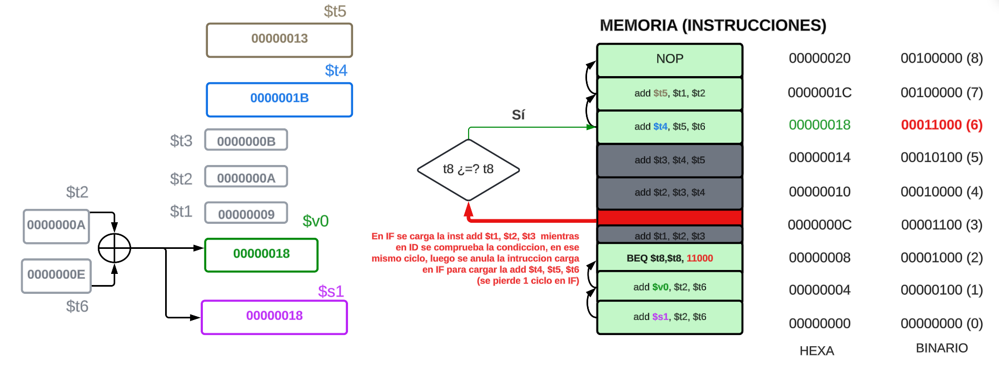 </p>

Cuando `BEQ` entra en la etapa de **Instruction Fetch (IF)**, el procesador todavía no sabe si el salto será tomado o no.  
Por lo tanto, en el siguiente ciclo, ya ha comenzado a cargar la instrucción: `add $t1, $t2, $t3` asumiendo que el salto NO se tomará.  

Sin embargo, en la etapa **Instruction Decode (ID)**, `BEQ` evalúa la condición `$t8 == $t8`, que es verdadera, y decide que el programa DEBE saltar a `0x00011000` en lugar de continuar con `0x00001100`.  

Esto significa que la instrucción: `add $t1, $t2, $t3` que ya estaba en el pipeline es incorrecta y debe eliminarse.  

#### ¿Cómo se soluciona?

Para solucionar esto, el procesador introduce un **bubble** (flush) en ID en el pipeline.  

Un **bubble** es un ciclo vacío donde no se ejecuta ninguna instrucción real, lo que da tiempo al procesador para descartar la instrucción incorrecta (`add $t1, $t2, $t3`) y cargar la correcta: `add $t4, $t5, $t6  # En la dirección 0x00011000`


#### Resultado

<p align="center"> 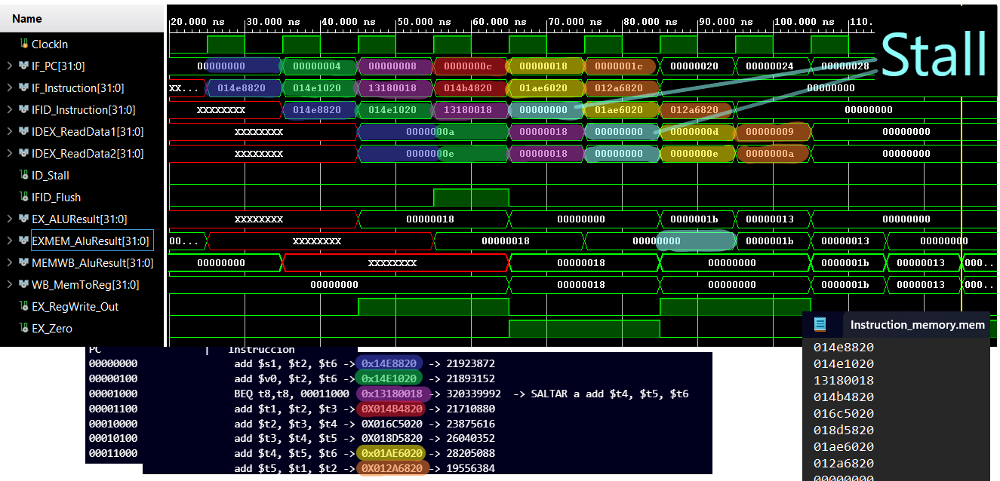 </p>


<p align="center"> 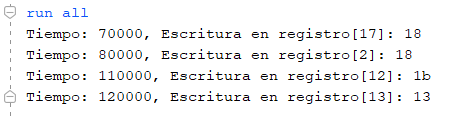 </p>


#### BEQ sin HAZARD (CONDICIÓN ERRONEA)


```assembly 
PC                 |   Instrucción   
00000000                add $s1, $t2, $t6 -> 000000 01010 01110 10001 00000 100000  -> 0x14E8820  -> 21923872
00000100                add $v0, $t2, $t6 -> 000000 01010 01110 00010 00000 100000  -> 0x14E1020  -> 21893152
00001000                BEQ t1,t8, 00011000  -> 000100 01001 11000 0000000000011000 -> 0x11380018 -> 288882712  -> NO SALTAR 
00001100                add $t1, $t2, $t3 -> 000000 01010 01011 01001 00000 100000  -> 0X014B4820 -> 21710880
00010000                add $t2, $t3, $t4 -> 000000 01011 01100 01010 00000 100000  -> 0X016C5020 -> 23875616 
00010100                add $t3, $t4, $t5 -> 000000 01100 01101 01011 00000 100000  -> 0X018D5820 -> 26040352
00011000                add $t4, $t5, $t6 -> 000000 01101 01110 01100 00000 100000  -> 0x01AE6020 -> 28205088
00100000                add $t5, $t1, $t2 -> 000000 01001 01010 01101 00000 100000  -> 0X012A6820 -> 19556384 
``` 


#### Resultado

<p align="center"> 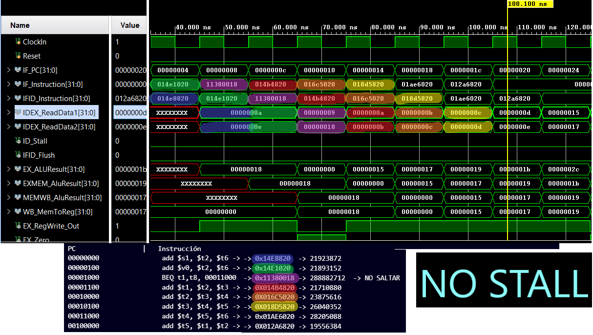 </p>

<p align="center"> 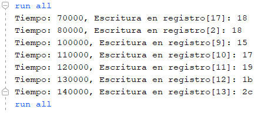 </p>

En este caso, como el salto **NO** se realiza porque `$t1` es diferente de `$t8`, no es necesario insertar una burbuja. La ejecución continuará normalmente con la siguiente instrucción en la secuencia.

Si `$t1` es diferente de `$t8` y el salto no ocurre, **no debería haber una burbuja**, ya que no hay necesidad de esperar por la resolución de una instrucción de salto.


### Branch y Hazard de Datos

#### Fuentes recomendadas  
- [Video: Branch Hazards (YouTube)](https://www.youtube.com/watch?v=cOWxinc5oRk)  
- [Video: Data Hazards (YouTube)](https://www.youtube.com/watch?v=EW9vtuthFJY)  

Hasta ahora, nos hemos limitado a analizar peligros relacionados con operaciones aritméticas y transferencias de datos. Sin embargo, también existen **hazards** en el **pipeline** relacionados con las instrucciones de **branch**.  

Para mantener el flujo del **pipeline**, es necesario buscar una nueva instrucción en cada ciclo de reloj. Sin embargo, las instrucciones de **branch** pueden alterar el flujo de ejecución, generando retrasos y afectando el rendimiento del procesador.  


#### Asumir que la branch No se Toma

Para descartar instrucciones, simplemente cambiamos los valores originales de control a ceros (STALL), de manera similar a como lo hicimos para detener el pipeline en un peligro de datos tipo LOAD-USE (Avance anterior). La diferencia es que, en el caso de los peligros de control, debemos modificar las tres instrucciones en las etapas IF, ID y EX cuando la branch alcanza la etapa MEM. En cambio, para los peligros de carga-uso, solo cambiamos los valores de control en la etapa ID y dejamos que las instrucciones se propaguen por el pipeline. Descartar instrucciones, entonces, implica poder vaciar las etapas IF, ID y EX del pipeline.

Las razones son que los peligros de control son relativamente fáciles de entender, ocurren con **menor** frecuencia que los peligros de datos, y no existe una técnica tan efectiva contra los peligros de control como el reenvío (forwarding) lo es para los peligros de datos. 

#### Ejemplo de Branch + Hazard de datos

Supongamos el siguiente ejemplo  
(Ejemplo inspirado en *"5-Stage Pipeline Processor Execution Example"*)  

🔗 [Ver video en YouTube](https://www.youtube.com/watch?v=EW9vtuthFJY)

##### CASO 1: BRANCH INCORRECTO, NO SE DEBE TOMAR EL SALTO.


<p align="center"> 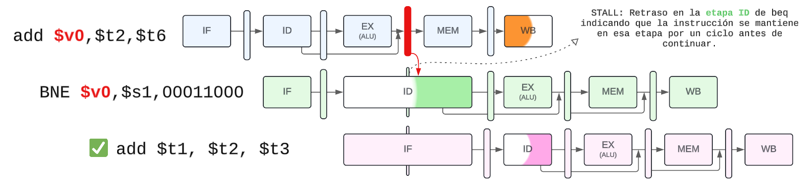 </p>


En la instrucción `add $v0, $t2, $t6`, el valor de `$v0` se actualiza y estará disponible después de la etapa de ejecución (inmediatamente después de la etapa `EX/MEM`). 

Sin embargo, en la instrucción de branch `BNE $v0, $s1, 00011000`, que se encuentra justo después, hay una dependencia de datos con `$v0`. Esta instrucción intenta decodificarse, pero aún no puede obtener el valor correcto de `$v0`, ya que este aún se encuentra en proceso de ejecución en la ALU.

Para resolver este problema, se requiere un mecanismo de **reenvío de datos** y **stall** en el pipeline. En este caso, la instrucción de rama se debe detener un ciclo en la etapa de **decodificación (ID)** hasta que el resultado de `$v0` esté disponible. Esto introduce un retraso en la ejecución de la siguiente instrucción: `add $t1, $t2, $t3`

Esta instrucción deberá esperar en la etapa de **búsqueda de instrucciones (IF)** hasta que la rama pueda continuar.

Una vez que la dependencia se resuelve mediante el reenvío y la burbuja, la instrucción de rama puede continuar su ejecución normalmente, permitiendo que la siguiente instrucción también progrese en el pipeline.


##### CASO 2: BRANCH CORRECTO,  SE DEBE TOMAR EL SALTO.


<p align="center"> 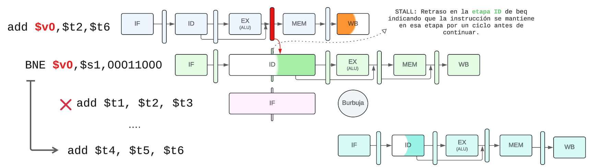 </p>


La primera instrucción (`add $v0, $t2, $t6`) escribe su resultado en `$v0`, pero su valor solo estará disponible en la etapa **EXMEM inmediatamente**. La siguiente instrucción (`BNE $v0, $s1, offset`) necesita leer `$v0` en la etapa **ID**, pero aún no ha sido escrito, lo que genera una dependencia de datos. Para evitar errores, el procesador detiene la ejecución de `BNE` en la etapa **ID**, provocando un **stall** de un ciclo de reloj.  

Este retraso impide que la siguiente instrucción (`add $t1, $t2, $t3`) sea decodificada a tiempo. Sin embargo, el procesador ya ha comenzado a buscar la instrucción `add`, lo que significa que cuando finalmente se resuelve la branch, la instrucción `add` ya ha sido cargada en el pipeline. Cuando el procesador detecta que la branch sí se debe tomar, se da cuenta de que la instrucción `add $t1, $t2, $t3` no es válida y la convierte en un `NOP`, introduciendo una burbuja en el pipeline.  

Finalmente, después de resolver la bifurcación, el procesador comienza a buscar la instrucción correcta (`add $t4, $t5, $t6`) y la ejecución continúa con normalidad. Este retraso y la burbuja en el pipeline son consecuencia de no haber predicho correctamente la bifurcación y de la dependencia de datos con `$v0`.  


### Caso M: BEQ con HAZARD


```assembly 
            PC                 |   Instrucción   
            00000000                add $s1, $t2, $t6 -> 000000 01010 01110 10001 00000 100000  -> 0x14E8820  -> 21923872
            00000100                add $v0, $t2, $t6 -> 000000 01010 01110 00010 00000 100000  -> 0x14E1020  -> 21893152
            00001000                BEQ v0,s1, 00011000  -> 000100 10001 00010 0000000000011000 -> 0x12220018 -> 304218136  -> SALTAR a add $t4, $t5, $t6
            00001100                add $t1, $t2, $t3 -> 000000 01010 01011 01001 00000 100000  -> 0X014B4820 -> 21710880
            00010000                add $t2, $t3, $t4 -> 000000 01011 01100 01010 00000 100000  -> 0X016C5020 -> 23875616 
            00010100                add $t3, $t4, $t5 -> 000000 01100 01101 01011 00000 100000  -> 0X018D5820 -> 26040352
            00011000                add $t4, $t5, $t6 -> 000000 01101 01110 01100 00000 100000  -> 0x01AE6020 -> 28205088
            00100000                add $t5, $t1, $t2 -> 000000 01001 01010 01101 00000 100000  -> 0X012A6820 -> 19556384 

``` 


#### Interpretación

<p align="center"> 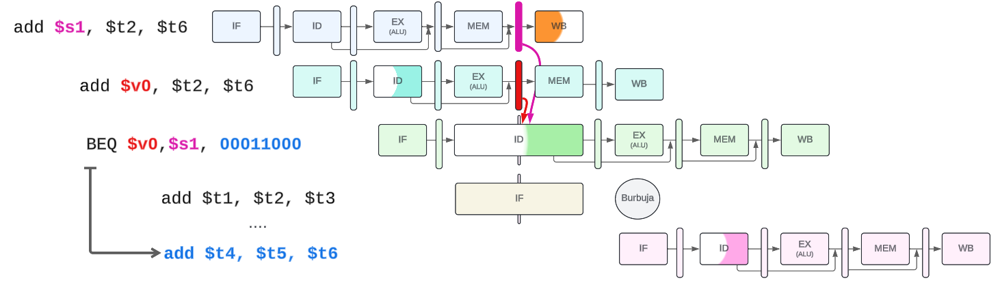 </p>

#### Resultado


<p align="center"> 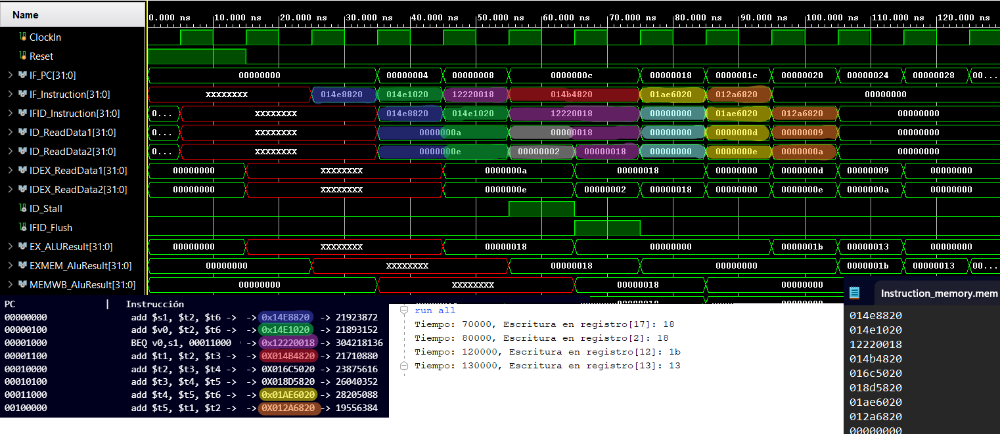 </p>


#### BEQ con HAZARD (CONDICIÓN ERRONEA)


```assembly 
PC                 |   Instrucción   
00000000                add $s1, $t1, $t6 -> 000000 01001 01110 10001 00000 100000  -> 0x12E8820  -> 19826720
00000100                add $v0, $t2, $t6 -> 000000 01010 01110 00010 00000 100000  -> 0x14E1020  -> 21893152
00001000                BEQ v0,s1, 00011000  -> 000100 10001 00010 0000000000011000 -> 0x12220018 -> 304218136  -> NO SALTAR
00001100                add $t1, $t2, $t3 -> 000000 01010 01011 01001 00000 100000  -> 0X014B4820 -> 21710880
00010000                add $t2, $t3, $t4 -> 000000 01011 01100 01010 00000 100000  -> 0X016C5020 -> 23875616 
00010100                add $t3, $t4, $t5 -> 000000 01100 01101 01011 00000 100000  -> 0X018D5820 -> 26040352
00011000                add $t4, $t5, $t6 -> 000000 01101 01110 01100 00000 100000  -> 0x01AE6020 -> 28205088
00100000                add $t5, $t1, $t2 -> 000000 01001 01010 01101 00000 100000  -> 0X012A6820 -> 19556384 
``` 

#### Resultado

<p align="center"> 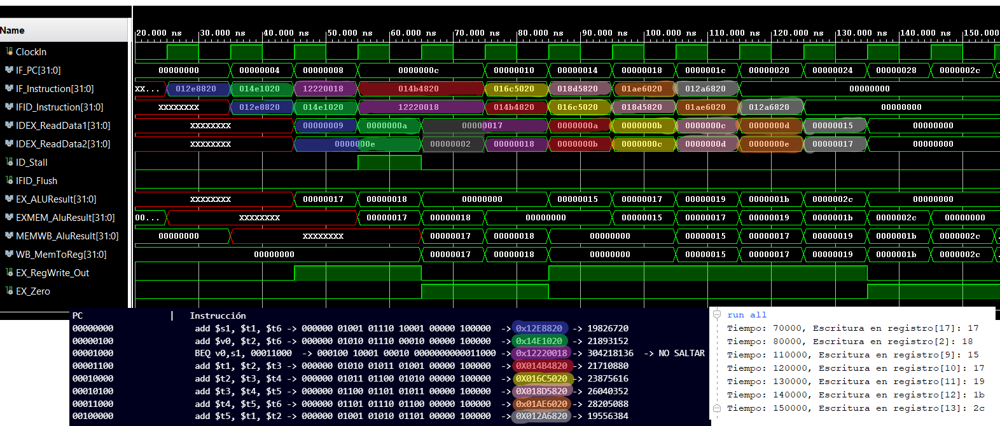 </p>

**COMO EN EL CASO ANTERIOR:** Espero 1 ciclo para obtener el valor actualizado de $v0, ya que recién entra en la etapa de ejecución (EX) cuando se lo solicita en la etapa de decodificación (ID). Por lo tanto, la espera del dato se retrasa un ciclo adicional.


### Caso N: BNE sin HAZARD

**BNE** (*Branch if Not Equal*): Realiza un salto si dos registros contienen valores diferentes.


```assembly 
PC                 |   Instrucción   
00000000                add $s1, $t2, $t6 -> 000000 01010 01110 10001 00000 100000  -> 0x14E8820  -> 21923872
00000100                add $v0, $t2, $t6 -> 000000 01010 01110 00010 00000 100000  -> 0x14E1020  -> 21893152
00001000                BNE t8,t7, 00011000  -> 000101 11000 10111 0000000000011000 -> 0x17170018 -> 387383320  -> SALTAR a add $t4, $t5, $t6
00001100                add $t1, $t2, $t3 -> 000000 01010 01011 01001 00000 100000  -> 0X014B4820 -> 21710880
00010000                add $t2, $t3, $t4 -> 000000 01011 01100 01010 00000 100000  -> 0X016C5020 -> 23875616 
00010100                add $t3, $t4, $t5 -> 000000 01100 01101 01011 00000 100000  -> 0X018D5820 -> 26040352
00011000                add $t4, $t5, $t6 -> 000000 01101 01110 01100 00000 100000  -> 0x01AE6020 -> 28205088
00100000                add $t5, $t1, $t2 -> 000000 01001 01010 01101 00000 100000  -> 0X012A6820 -> 19556384 
``` 

Considerando que `$t8=24d=18h` y `$t7=23d=17h ` NO se produce hazard en la instruccion de salto ya que este solo necesita t8 y t7 el cual ya fue cargado con anterioridad

#### Resultado

<p align="center"> 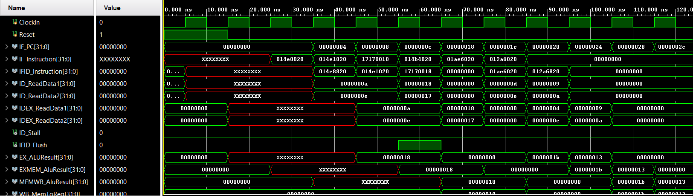 </p>


#### BNE sin HAZARD (CONDICIÓN ERRONEA)

```assembly 
PC                 |   Instrucción   
00000000                add $s1, $t2, $t6 -> 000000 01010 01110 10001 00000 100000  -> 0x14E8820  -> 21923872
00000100                add $v0, $t2, $t6 -> 000000 01010 01110 00010 00000 100000  -> 0x14E1020  -> 21893152
00001000                BNE t8,t8, 00011000  -> 000101 11000 11000  0000000000011000 -> 0x17180018 -> 387448856  -> NO SALTAR 
00001100                add $t1, $t2, $t3 -> 000000 01010 01011 01001 00000 100000  -> 0X014B4820 -> 21710880
00010000                add $t2, $t3, $t4 -> 000000 01011 01100 01010 00000 100000  -> 0X016C5020 -> 23875616 
00010100                add $t3, $t4, $t5 -> 000000 01100 01101 01011 00000 100000  -> 0X018D5820 -> 26040352
00011000                add $t4, $t5, $t6 -> 000000 01101 01110 01100 00000 100000  -> 0x01AE6020 -> 28205088
00100000                add $t5, $t1, $t2 -> 000000 01001 01010 01101 00000 100000  -> 0X012A6820 -> 19556384 
``` 

Considerando que `$t8=24d=18h` NO se produce hazard en la instruccion de salto ya que este solo necesita t8 el cual ya fue cargado con anterioridad.

#### Resultado

<p align="center"> 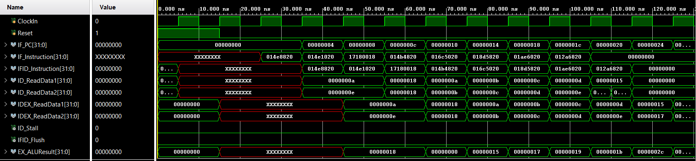 </p>


### Caso O: BNE con HAZARD


```assembly 
PC                 |   Instrucción   
00000000                add $s1, $s2, $s3 -> 000000 10010 10011 10001 00000 100000  -> 0x02538820 -> 39028768
00000100                add $v0, $t2, $t6 -> 000000 01010 01110 00010 00000 100000  -> 0x00A62020 -> 21893152
00001000                BNE v0,s1, 00011000  -> 000101 10001 00010  0000000000011000 -> 0x16220018-> 371327000  -> NO SALTAR 
00001100                add $t1, $t2, $t3 -> 000000 01010 01011 01001 00000 100000  -> 0X014B4820 -> 21710880
00010000                add $t2, $t3, $t4 -> 000000 01011 01100 01010 00000 100000  -> 0X016C5020 -> 23875616 
00010100                add $t3, $t4, $t5 -> 000000 01100 01101 01011 00000 100000  -> 0X018D5820 -> 26040352
00011000                add $t4, $t5, $t6 -> 000000 01101 01110 01100 00000 100000  -> 0x01AE6020 -> 28205088
00100000                add $t5, $t1, $t2 -> 000000 01001 01010 01101 00000 100000  -> 0X012A6820 -> 19556384 
```

#### Resultado

<p align="center"> 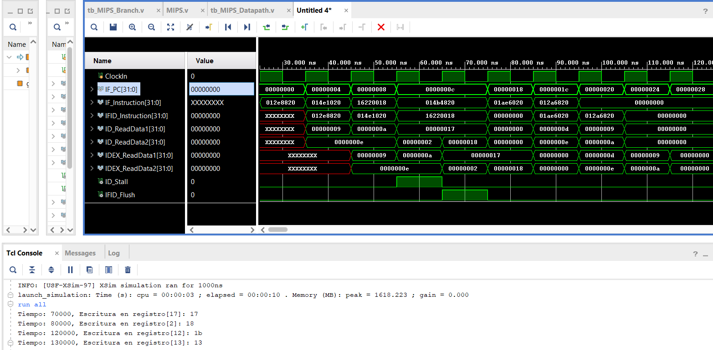 </p>


### Caso J: Branch & LOAD, HAZARD

Recomendacion: https://www.youtube.com/watch?v=cOWxinc5oRk&t=1152s

Si un registro de branch es un destino de la instrucción de carga inmediatamente anterior, **se necesitan 2 ciclos de bloqueo**.

Para este tipo de hazard de dependencia load hazard branch, se utiliza la logica similar a la del caso "Caso E: Load-Use Hazard"


| PC       | Instrucción                    | Código máquina         | Binario                                    | Decimal       | Descripción                  |
|----------|--------------------------------|------------------------|--------------------------------------------|---------------|--------------------------------|
| 00000000 | add s3, v0, v0                 | 0x00429820             | 000000 00010 00010 10011 00000100000       | 4364320       | s3 = 2d + 2d = 4d             |
| 00000100 | lw a0, 20(s3)                  | 0x8E640014             | 100011 10011 00100 0000000000010100       | 2388918292    | a0 = 10d (20d nivel 6)        |
| 00001000 | lw s2, 16(s3)                  | 0x8E520010             | 100011 10011 10010 0000000000010000       | 2389835792    | s2 = 10d (16d nivel 5)        |
| 00001100 | BEQ a0, s2, 00100000           | 0x1092001C             | 000100 00100 10010 0000000000011100       | 278003740     | Salto condicional             |
| 00010000 | add t1, t2, t3                 | 0x014B4820             | 000000 01010 01011 01001 00000 100000     | 21710880      | t1 = t2 + t3                  |
| 00010100 | add t2, t3, t4                 | 0x016C5020             | 000000 01011 01100 01010 00000 100000     | 23875616      | t2 = t3 + t4                  |
| 00011000 | add t3, t4, t5                 | 0x018D5820             | 000000 01100 01101 01011 00000 100000     | 26040352      | t3 = t4 + t5                  |
| 00011100 | add t4, t5, t6                 | 0x01AE6020             | 000000 01101 01110 01100 00000 100000     | 28205088      | t4 = t5 + t6                  |
| 00100000 | add t5, t1, t2                 | 0x012A6820             | 000000 01001 01010 01101 00000 100000     | 19556384      | t5 = t1 + t2                  |

#### Interpretación Pipeline

<p align="center"> 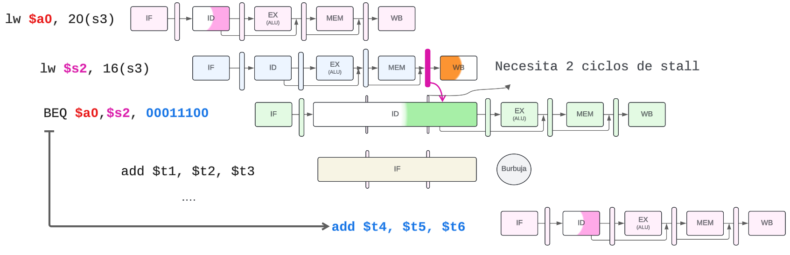 </p>


#### Interpretación 

<p align="center"> 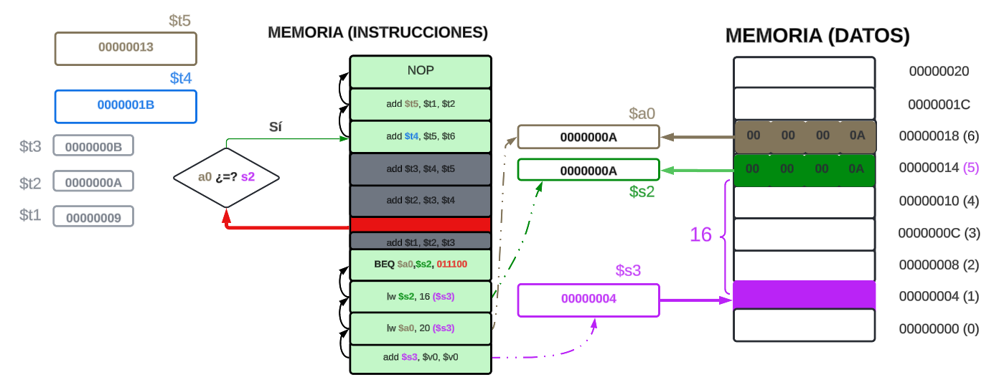 </p>

#### Resultado

<p align="center">  </p>

## Avance V: Ready MIPS

El objetivo principal de este branch es obtener una versión estable del MIPS que sea capaz de sintetizarse en la FPGA Basys 3. Para lograr esto, se procedió a eliminar sintaxis específicas para simulaciones, como los bloques `initial begin`, y a corregir la sintaxis de las asignaciones bloqueantes y no bloqueantes.

El resultado es un MIPS que, al presionar el botón W19, muestra los primeros 16 bits de los registros. Con cada pulsación de dicho botón, se avanza de registro en registro, mostrando los valores de estos en los LEDs de la FPGA. Este comportamiento permite verificar el correcto funcionamiento de la implementación del MIPS **sin UART** hacia la PC.

### Requisitos de Timing

Uno de los principales desafíos al integrar el MIPS en la FPGA fue garantizar el cumplimiento de los requisitos de timing en todos los *paths* críticos. 

Para abordar esto, se utilizó el **Clock Wizard** y se introdujo un reloj de **50 MHz**, lo que permitió que todos los *paths* críticos cumplieran satisfactoriamente con los requisitos de timing. Como resultado, la métrica de **WNS** (*Worst Negative Slack*) es positiva, lo que indica que, incluso para el *path* más crítico del diseño, se ha dejado un margen de tiempo dentro del periodo de la señal de reloj utilizado.

En las siguientes pruebas, se explorarán otras frecuencias para determinar el rango de trabajo que cumpla con este requisito.

<p align="center"> 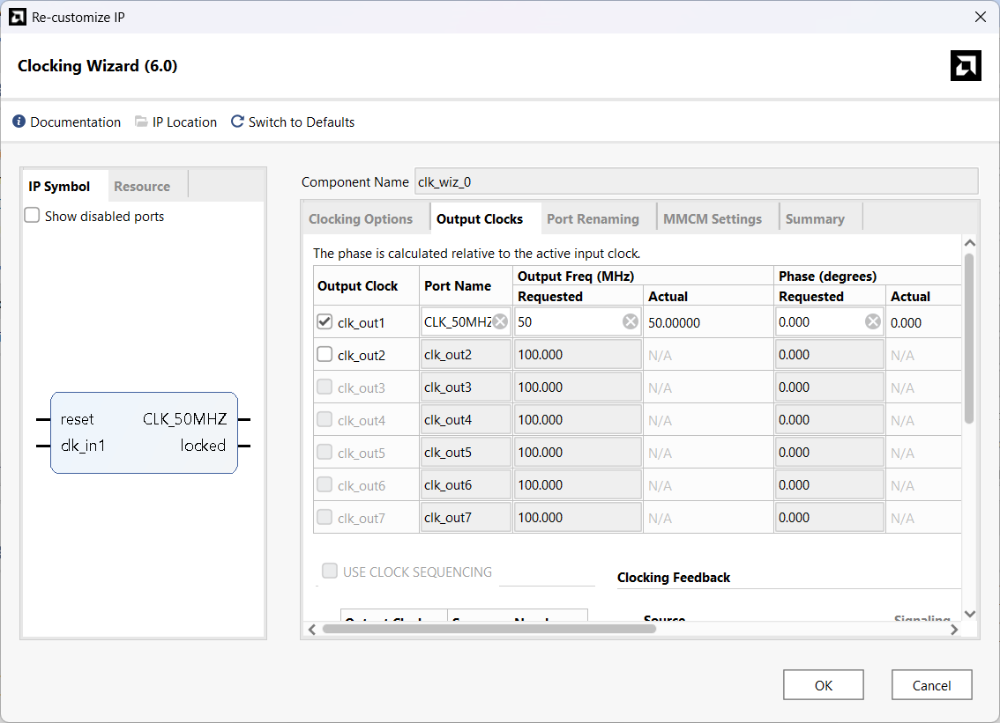 </p>


agrege: OPTIMIZACION DE CODIGO PARA EVITAR COMBINACIONALES CON MUCHO RETRASO!


mover el JumpMux a IF para evitar las condciones de carrera, con 35MHZ no hay condiciones de carrera.
