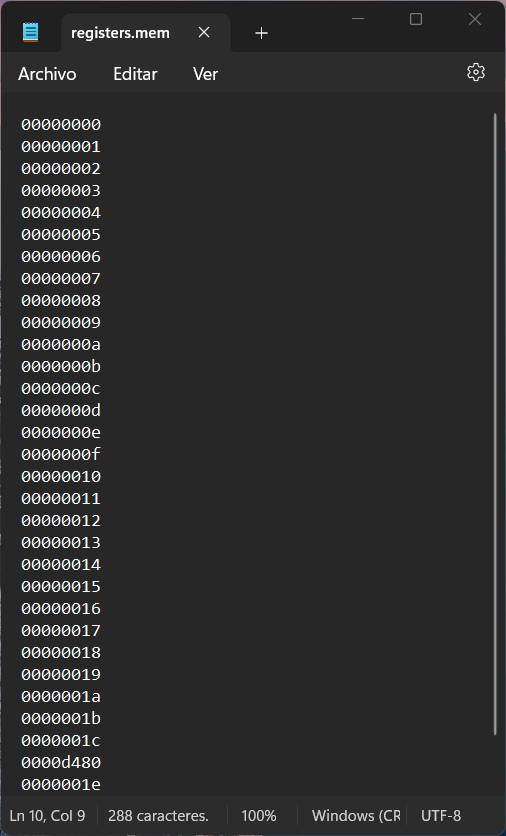
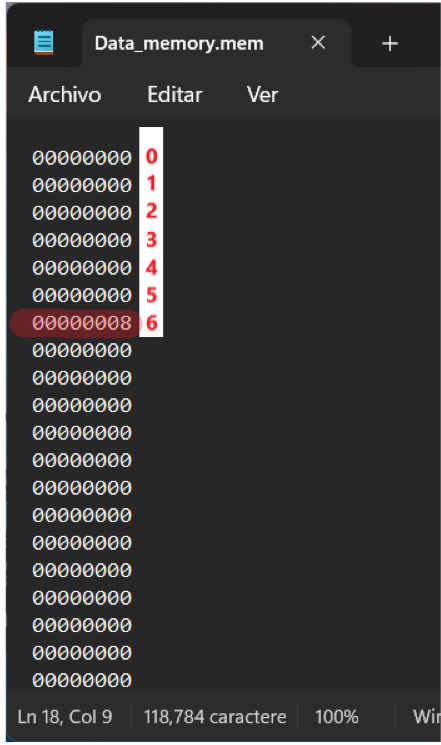
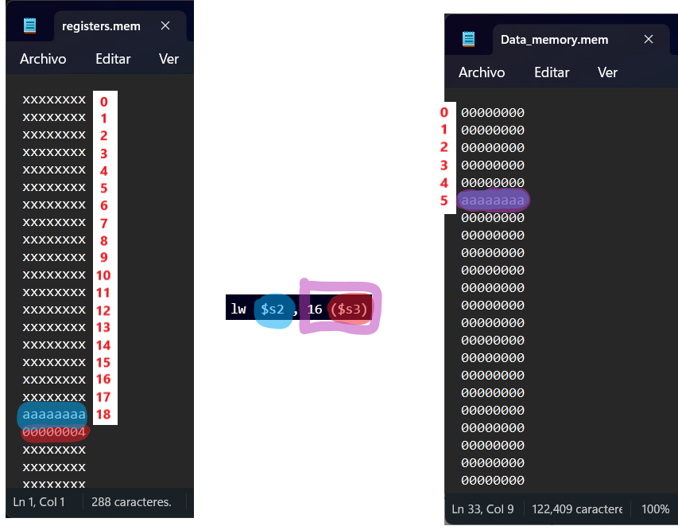
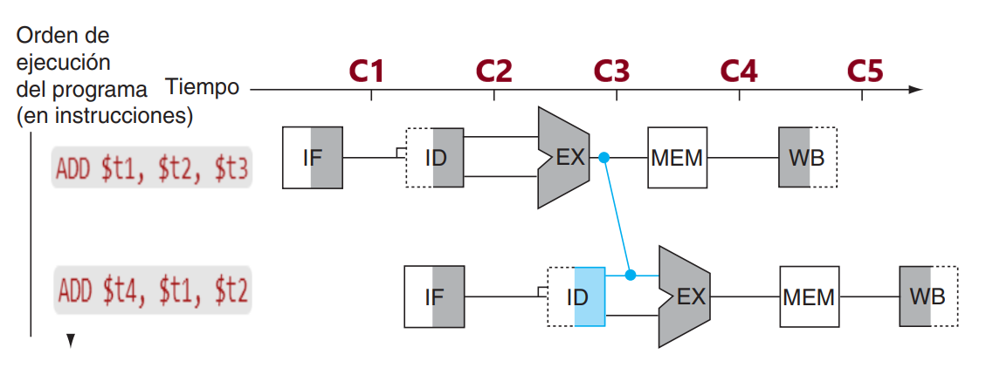
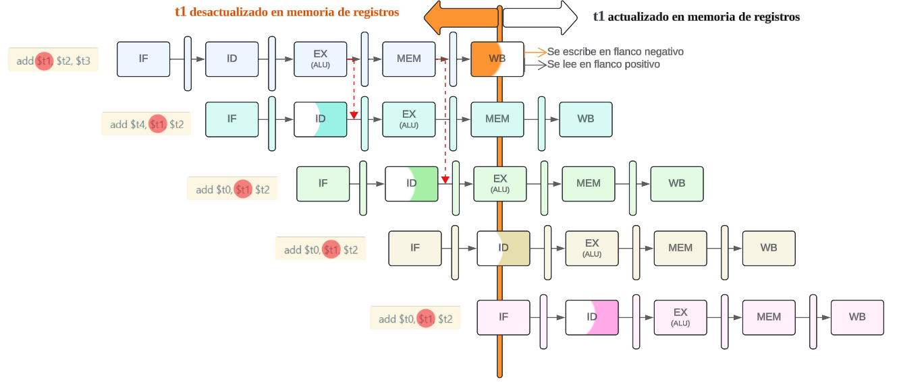
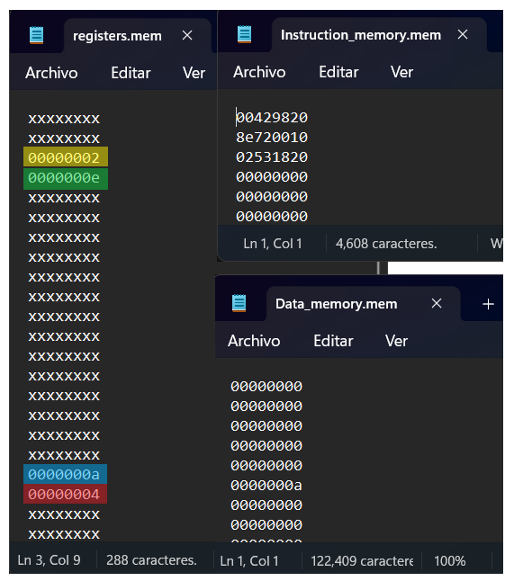

<p align="center">
    
</p>

***TRABAJO PRACTICO 3***

**Titulo:** PIPELINE - PROCESADOR DLX - (Familia MIPS)

**Asignatura:** Arquitectura de Computadoras

**Integrantes:**
   - Gil Cernich, Manuel 
   - Cabrera, Augusto Gabriel 

---

# Enunciado

**Implementar el pipeline del procesador MIPS.**

## Instrucciones de Implementación

### Instrucciones tipo R (R-type):
- **Operaciones de desplazamiento:** `SLL`, `SRL`, `SRA`, `SLLV`, `SRLV`, `SRAV`
- **Operaciones aritméticas:** `ADDU`, `SUBU`
- **Operaciones lógicas:** `AND`, `OR`, `XOR`, `NOR`
- **Operaciones de comparación:** `SLT`, `SLTU`

### Instrucciones tipo I (I-type):
- **Carga y almacenamiento de datos:** `LB`, `LH`, `LW`, `LWU`, `LBU`, `LHU`, `SB`, `SH`, `SW`
- **Operaciones aritméticas y lógicas:** `ADDI`, `ADDIU`, `ANDI`, `ORI`, `XORI`, `LUI`
- **Comparación y saltos condicionales:** `SLTI`, `SLTIU`, `BEQ`, `BNE`

### Instrucciones tipo J (J-type):
- **Saltos:** `J`, `JAL`, `JR`, `JALR`


## Otros Requerimientos

| Requerimiento                    | Descripción                                                                                                                                                       |
|----------------------------------|-------------------------------------------------------------------------------------------------------------------------------------------------------------------|
| **Memoria de datos e instrucciones** | La memoria de datos debe estar separada de la memoria de instrucciones; ambas deben implementarse mediante IP Cores.                                          |
| **Carga del programa**           | El programa a ejecutar debe cargarse en la memoria de instrucciones mediante un archivo `.coe`.                                                                   |
| **Unidad de depuración**         | Debe incluirse una unidad de debug para enviar información a la PC a través de UART.                                                                              |
| **Segmentación**                 | Hacer en un mismo ciclo escritura y lectura (1 con cada flanco)                                                                                                   |


### Información de Depuración a Enviar por UART

- Contenido de los 32 registros.
- Contenido de los latches intermedios.
- Contenido de la memoria de datos utilizada.


## Modos de Operación

- **Modo Continuo:** En este modo, al enviar un comando a la FPGA a través de UART, se inicia la ejecución del programa hasta completarlo, mostrando todos los valores requeridos al final.
- **Modo Paso a Paso:** Cada comando enviado por UART ejecuta un ciclo de reloj, y se muestran los valores requeridos en cada paso.


## Pipeline Final

<p align="center">
    
</p>


## Bibliografía

- **Instrucciones:**
  - *MIPS IV Instruction Set*

- **Pipeline:**
  - *Computer Organization and Design*, 3rd Edition. Capítulo 6. Hennessy y Patterson


---

# Marco Teorico

## Etapas

- **IF (Instruction Fetch)**: Búsqueda de la instrucción en la memoria de programa.
- **ID (Instruction Decode)**: Decodificación de la instrucción y lectura de registros.
- **EX (Execute)**: Ejecución de la instrucción propiamente dicha.
- **MEM (Memory Access)**: Lectura o escritura desde/hacia la memoria de datos.
- **WB (Write Back)**: Escritura de resultados en los registros.


## DATAPATH

<p align="center">
    
</p>

## SEGMENTACIÓN


<p align="center">
    
</p>

## Unidad de control

<p align="center">
    
</p>


<p align="center">
    
</p>

## Riesgos

### Tipos:
- **Estructurales**: Se producen cuando dos instrucciones tratan de utilizar el mismo recurso en el mismo ciclo.
- **De datos**: Se intenta utilizar un dato antes de que esté preparado. Mantenimiento del orden estricto de lecturas y escrituras.
- **De control**: Intentar tomar una decisión sobre una condición todavía no evaluada.

## Riesgos de datos
### Dependencias de registros
<p align="center">
    
</p>

#### Solución
<p align="center">
    
</p>

### Unidad de cortocircuito
<p align="center">
    
</p>

---

## Riesgos de datos
### Dependencias de datos
<p align="center">
    
</p>

#### Solución
<p align="center">
    
</p>

### Unidad de detección de riesgos
<p align="center">
    
</p>

---

## Riesgos de control
<p align="center">
    
</p>

<p align="center">
    
</p>

## Tipo de Instrucciones

### Tipo R
- Son operaciones aritméticas y lógicas.
- **OP Code**: `000000`
- La operación se indica en los 6 bits menos significativos.

<p align="center">
    
</p>

### Tipo I
- Operaciones con un registro y un valor inmediato.
- En operaciones lógicas y aritméticas, se opera con `rs` y se almacena el resultado en `rt`.
- En operaciones de **load** y **store**, `rs` es la base y el inmediato es el desplazamiento (offset).

<p align="center">
    
</p>

### Tipo J
- Operaciones de salto incondicional.
- La dirección de salto se almacena en el registro `rs`.

<p align="center">
    
</p>

# Implementación

El diseño principal de este desarrollo sigue un enfoque incremental. Cada avance significativo se traduce en una rama (branch) que depende de una rama anterior y contribuye de manera progresiva al desarrollo del MIPS hasta su finalización.

## Avance I: MIPS Only Adder

El objetivo principal del Avance I es desarrollar un MIPS extremadamente básico con las siguientes características:

- Capacidad para procesar únicamente una instrucción de suma: `add $t1, $t2, $t3`.
- Sin manejo de *hazards*.
- Sin soporte para saltos de ningún tipo.

La finalidad de este avance es establecer los módulos fundamentales que conformarán laestructura base (esqueleto) del MIPS, sirviendo como punto de partida y facilitando la integración de funcionalidades en los avances posteriores.

### Resultados


<p align="center">
    
</p>


Se observa cómo el MIPS realiza la operación `add $t1, $t2, $t3`, que consiste en sumar los valores almacenados en los registros 10 (`$t2`) y 11 (`$t3`) y guardar el resultado en el registro 9 (`$t1`).


---

## Avance II: Hazard without jumps

El objetivo principal del Avance II es integrar y mejorar el Avance I, incorporando la capacidad de resolver los riesgos. Esto permitirá procesar las instrucciones de manera adecuada, evitando resultados indeseados debido a condiciones de carrera u otros problemas relacionados.

Teniendo en cuenta los registros como estan distribuidos en el MIPS (ver `Doc\REGISTERS.md`). Planteamos los siguientes casos:


### Caso A: Sin riesgos, multiples instrucciones


```assembly 
add $t0, $t1, $t2 # 000000 01001 01010 01000 00000 100000  -> 0x012A4020 -> 19546144, Registro 08h (08d) = 13h
add $s1, $s2, $s3 # 000000 10010 10011 10001 00000 100000  -> 0x2538820  -> 39028768, Registro 11h (17d) = 25h
add $a0, $a1, $a2 # 000000 00101 00110 00100 00000 100000  -> 0xA62020   -> 10887200, Registro 04h (04d) = 0bh
```

En este caso específico, las tres instrucciones add no presentan riesgos de datos, control ni estructurales directos.

El estado inicial de los registros es el siguiente:

<p align="center">  </p>
Los registros están alineados de la siguiente manera: el primer valor hexadecimal corresponde a $zero, el segundo a $at, y así sucesivamente.

Al realizar las pruebas con el archivo `tb_MIPS_II.v`, se obtienen los siguientes resultados:


<p align="center">  </p>


### Caso B: STORE

**NOTA:** Consulta `OPERATIONS.md` para entender cómo funcionan las instrucciones.

<p align="center">  </p>


```assembly 
sw  $s0 , 14($s1) -> 101011  10001 10000 0000 0000 0000 1110 = 2922381326d

      Address: 18H = 24d = 10d + 14d (offset) = 000110   00 (Descartado)
```

Este valor se encuentra almacenado en el elemento 6 (6x4) de la memoria, como se observa a continuación:

<p align="center">  </p> 


### Caso C: LOAD


<p align="center">  </p> 

```assembly 
lw  $s2 , 16 ($s3) -> 100011   10011  10010  0000 0000 0001 0000 -> 2389835792
```

<p align="center">  </p> 

### Caso D: Riesgos de Datos

Los **riesgos de datos** ocurren cuando, debido a la segmentación, el orden de lectura de los operandos y la escritura de resultados se modifica respecto al especificado por el programa. 

Se produce un riesgo si existe **dependencia entre instrucciones** que se ejecutan concurrentemente. Dependiendo del tipo de segmentación, el riesgo puede ocurrir o no. Existen tres tipos diferentes de riesgos de datos:

- **Lectura después de escritura (LDE):**  
  Se produce un riesgo si un registro se lee antes de que se complete la escritura de dicho registro por una instrucción anterior.

- **Escritura después de lectura (EDL):**  
  Se produce un riesgo si un registro se escribe antes de que se complete la lectura de dicho registro por una instrucción anterior.

- **Escritura después de escritura (EDE):**  
  Se produce un riesgo si un registro se escribe antes de que se complete la escritura de dicho registro por una instrucción anterior.

---

#### Ejemplos de Riesgos de Datos

| Tipo | Código                 | Descripción                               |
|------|------------------------|-------------------------------------------|
| LDE  | `ADD $t1, $t2, $t3`       | $t1 se lee antes de que lo escriba         |
|      | `ADD $t4, $t1, $t2`       |                                           |
| EDL  | `ADD $t1, $t4, $t3`       | $t4 se escribe antes de que lo lea         |
|      | `ADD $t4, $t1, $t2`       |                                           |
| EDE  | `ADD $t4, $t2, $t3`       | Si la 2ª instrucción ocurre primero       |
|      | `ADD $t4, $t1, $t2`       |                                           |

<p align="center">  </p> 


### Análisis del problema

#### Primera instrucción: `ADD $t1, $t2, $t3`
- Escribe el resultado en `$t1` al final de la etapa WB (C5).

#### Segunda instrucción: `ADD $t4, $t1, $t2`
- Intenta leer `$t1` durante la etapa ID (C3), pero `$t1` aún no está disponible porque no se ha escrito en el registro.

---

### Soluciones para evitar este riesgo

#### Técnica de forwarding (reenvío)
1. **Descripción**:  
   Utilizar bypass o forwarding en el hardware para reenviar el resultado de la etapa EX de la primera instrucción directamente a la etapa ID o EX de la segunda, sin esperar a que el resultado sea escrito en el registro.

2. **Implementación en este caso**:  
   - El resultado de la etapa EX de la primera instrucción (C3) puede ser enviado directamente como entrada para la etapa EX de la segunda instrucción (C4).

#### Ventajas
- La técnica de forwarding es la más eficiente, ya que evita la pérdida de ciclos de reloj innecesarios.
- Sin embargo, **requiere soporte en el hardware de la segmentación**.

### Implementación

NOTA: Cada registro tiene su valor igual al index: 

```assembly 
add $s1, $s2, $s3 -> 000000 10010 10011 10001 00000 100000  -> 0x02538820 -> 39028768
add $a0, $a1, $a2 -> 000000 00101 00110 00100 00000 100000  -> 0x00A62020 -> 10887200
add $t1, $t2, $t3 -> 000000 01010 01011 01001 00000 100000  -> 0X014B4820 -> 21710880
add $t4, $t1, $t2 -> 000000 01001 01010 01100 00000 100000  -> 0X012A6020 -> 19554336 
add $t0, $t1, $t2 -> 000000 01001 01010 01000 00000 100000  -> 0x012A4020 -> 19546144
add $t0, $t1, $t2 -> 000000 01001 01010 01000 00000 100000  -> 0x012A4020 -> 19546144
add $t0, $t1, $t2 -> 000000 01001 01010 01000 00000 100000  -> 0x012A4020 -> 19546144
add $t0, $t1, $t2 -> 000000 01001 01010 01000 00000 100000  -> 0x012A4020 -> 19546144
add $t1, $t2, $t3 -> 000000 01010 01011 01001 00000 100000  -> 0X014B4820 -> 21710880
add $t2, $t0, $t3 -> 000000 01000 01011 01010 00000 100000  -> 0x010B5020 -> 17518624
add $t4, $t1, $t2 -> 000000 01001 01010 01100 00000 100000  -> 0X012A6020 -> 19554336 
```

#### Desglose


| Instrucción           | Registro final (Decimal) | Calculo                              |
|------------------------|-------|------------------------------------------|
| add $s1, $s2, $s3     | (08)  | s1 = 18d + 19d = 37d = 25h              |
| add $a0, $a1, $a2     | (04)  | a0 = 05d + 06d = 11d = 0bh              |
| add $t1, $t2, $t3     | (09)  | t1 = 10d + 11d = 21d = 15h              |
| add $t4, $t1, $t2     | (12)  | t4 = 21d + 10d = 31d = 1Fh              |
| add $t0, $t1, $t2     | (08)  | t0 = 21d + 10d = 31d = 1Fh              |
| add $t0, $t1, $t2     | (08)  | t0 = 21d + 10d = 31d = 1Fh              |
| add $t0, $t1, $t2     | (08)  | t0 = 21d + 10d = 31d = 1Fh              |
| add $t0, $t1, $t2     | (08)  | t0 = 21d + 10d = 31d = 1Fh              |
| add $t1, $t2, $t3     | (09)  | t1 = 10d + 11d = 21d = 15h              |
| add $t2, $t0, $t3     | (10)  | t2 = 31d + 11d = 42d = 2Ah              |
| add $t4, $t1, $t2     | (12)  | t4 = 21d + 42d = 63d = 3Fh              |

<p align="center">  </p>

#### Interpretación temporal del hazard

<p align="center">  </p>


### Caso E: Load-Use Hazard

Cuando una instrucción `LW` es seguida por una instrucción de tipo `R`, es necesario cortocircuitar la salida de la memoria (de la instrucción `LW`) con la entrada de la ALU (de la segunda instrucción).

Para realizar este control, la Unidad de Cortocircuito (FORWARD) necesita la siguiente información, que se almacena en los registros de segmento hasta la etapa `EX`:

- El registro que se escribe en la instrucción anterior (`rd` en el tipo `R`, y `rt` en el tipo `I`).
- Los registros que se leen en la nueva instrucción (`rs` y `rt`).
- La señal de control `Write_Reg`, que indica si la instrucción va a escribir en un registro (es decir, si es de tipo `R` o tipo `I` como `LW`).

Como se puede observar, incluso adelantando el resultado mediante la anticipación de resultados (*forwarding*), existe una dependencia hacia atrás en el tiempo entre la primera y la segunda instrucción.

En el caso de la instrucción `LW r1, 0(r2)`, el valor de `r1` no estará disponible hasta la cuarta etapa (`MEM`), ya que el dato se obtiene de la memoria. Sin embargo, la segunda instrucción, que depende de ese dato, lo necesitará en su segunda etapa (`EX`).

Este tipo de dependencia no puede ser resuelto por la Unidad de Cortocircuito, ya que el dato aún no ha sido recuperado de la memoria cuando la segunda instrucción lo requiere. Como resultado, la segunda instrucción deberá *ESPERAR* un ciclo de reloj antes de poder continuar su ejecución. Esta espera se conoce como **stall** o **burbuja**, y es necesaria para evitar la lectura de datos incorrectos.

### Solución

Además de una unidad de anticipación de datos (*FORWARD*), es necesaria una **Unidad de Detección de Riesgos** (*HAZARD*). 

Esta unidad debe operar durante la etapa `ID`, de manera que pueda insertar un bloqueo entre una instrucción de tipo `load` y la instrucción que dependa de su resultado.

El control para la detección de riesgos en el caso de una instrucción `load` se realiza evaluando las siguientes condiciones:

1. La señal de control `memRead` de la instrucción anterior.
2. El registro `rt` de la instrucción anterior, que indica dónde se almacena el resultado de la instrucción `load`.
3. Los registros `rs` y `rt` de la instrucción actual (en la etapa `ID`).


             


### Implementación


```assembly 
lw s2, 16(s3)  -> 0x8E520010 -> 10001110011100100000000000010000 -> 2389835792  -> s2 = 10d (16d nivel 5)
add v1,s2,v0   -> 0x02421820 -> 00100100001000011000001000000000 -> 37885984    -> v1 = 12d (v0 = 2h)
```

<p align="center">  </p>


<p align="center">  </p>


<p align="center">  </p>


### Caso F: Riesgos, LOAD y STORE

Con $v0=2d y $t0=8d (inicial)

```assembly 
add s3 , v0 , v0    -> 0x00429820 -> 00000000010000101001100000100000 -> 4364320     -> s3 = 2d + 2d = 4d
lw  s2 , 16(s3)     -> 0x8E520010 -> 10001110011100100000000000010000 -> 2389835792  -> s2 = 10d (16d nivel 5)
sw  s3 , 14(s2)     -> 0xAE53000E -> 10101110010100110000000000001110 -> 2924675086  -> nivel 6 = 4d 
lw  $t1 , 16($t0)   -> 0x8D090010 -> 10001101000010010000000000010000 -> 2366177296  -> t1 = 8d 
add $v0 , $s3 , $s2 -> 0x02721020 -> 00000010011100100001000000100000 -> 41029664    -> v0 = 14d
add $t2 , $t1 , $v0 -> 0x1225020  -> 00000001001000100101000000100000 -> 19025952    -> t2 = 22d = 16h
```
#### Interpretación

<p align="center">  </p>

#### Resultado

<p align="center">  </p>

## Avance III: Jumps

Lo que diferencia a un computador de una calculadora simple es su capacidad para tomar decisiones. En este avance, el objetivo es implementar un procesador MIPS que dé continuidad al avance II, incorporando la capacidad de realizar operaciones que afecten al contador de programa (PC) y gestionando los riesgos de control asociados.

### Caso G: J


Las instrucciones de tipo **J (jump)** en MIPS tienen el siguiente formato binario de **32 bits**:  

 📌 **Reglas importantes sobre la dirección de salto (`target address`)**:  
1. La CPU de MIPS **trunca** los **2 bits menos significativos** de la dirección (`PC`), ya que las instrucciones en MIPS **siempre están alineadas a 4 bytes**.  
2. El `target address` en la instrucción `j` **no es la dirección absoluta**, sino que representa los **26 bits superiores** de la dirección **dividida por 4**.  
3. La dirección real de salto se reconstruye en la ejecución así:  

   `Jump Address = (PC[31:28] << 28) | (target address << 2)`

Como en este caso el salto es dentro del mismo segmento, no nos preocupamos por `PC[31:28]`.


#### 🔹 Cálculo de la dirección de salto para `j 00011000` (PC = 24)

| Paso | Descripción | Resultado |
|------|------------|-----------|
| 1️⃣  | Dirección objetivo en decimal | `PC = 24 (decimal)` |
| 2️⃣  | Dividimos por 4 | `24 / 4 = 6` |
| 3️⃣  | Convertimos `6` a binario en 26 bits | `00000000000000000000000110` |
| 4️⃣  | Juntamos con el opcode de `j` (`000010`) | `000010 00000000000000000000000110` |
| 5️⃣  | Convertimos a hexadecimal | **`0x08000006`** |


#### 🔹 **Conclusión**  
- **La razón por la que usamos `110` (6 en binario) es porque MIPS almacena la dirección de salto divida entre 4 en la instrucción J**.
- **Esto se debe a que las direcciones en MIPS están alineadas a 4 bytes, por lo que los dos bits menos significativos son siempre `00` y no se almacenan en la instrucción**.
- **El procesador reconstruye la dirección real multiplicando el `target address` por 4 durante la ejecución**.

Ahora, la cuestión es la siguiente: cuando la instrucción *jump* llega a la etapa **ID**,  
en ese instante se carga la siguiente instrucción secuencial (**PC + 4**).  

Sin embargo, esta **NO** es la instrucción correcta,  
ya que la ejecución debería continuar con la instrucción ubicada en la dirección de destino del salto.  

Esto introduce un nuevo tipo de *hazard*: el **riesgo de control**.


#### Manejo de los Riesgos de Control

El **riesgo de control** ocurre cuando la instrucción en curso no puede ejecutarse en el ciclo de reloj adecuado  
porque la instrucción que ha sido buscada no es la que se requería.  

En otras palabras, el flujo de direcciones de instrucciones no es el que el *pipeline* esperaba.  

La opción para manejar los riesgos de control (solo para *JUMP*) es **bloquear o detener el pipeline** (*stall*)  
hasta que se determine cuál será la siguiente instrucción que debe leerse en la memoria durante la etapa **IF**.  


Supongamos el siguiente Set de instrucciones:


```assembly 
PC                 |   Instrucción   
00000000                add $s1, $s2, $s3 -> 000000 10010 10011 10001 00000 100000  -> 0x02538820 -> 39028768
00000100                add $a0, $a1, $a2 -> 000000 00101 00110 00100 00000 100000  -> 0x00A62020 -> 10887200
00001000                j 00011000        -> 000010 00000 00000 00000 00000 000110  -> 0x08000006 -> 134217752
00001100                add $t1, $t2, $t3 -> 000000 01010 01011 01001 00000 100000  -> 0X014B4820 -> 21710880
00010000                add $t2, $t3, $t4 -> 000000 01011 01100 01010 00000 100000  -> 0X016C5020 -> 23875616 
00010100                add $t3, $t4, $t5 -> 000000 01100 01101 01011 00000 100000  -> 0X018D5820 -> 26040352
00011000                add $t4, $t5, $t6 -> 000000 01101 01110 01100 00000 100000  -> 0x01AE6020 -> 28205088
00100000                add $t5, $t1, $t2 -> 000000 01001 01010 01101 00000 100000  -> 0X012A6820 -> 19556384 
```

#### Interpretación

<p align="center">  </p>


##### PROBLEMA ⚠️

Claramente, el inconveniente surge en el momento en que se ejecuta la instrucción:  
`IF_instruction = j 00011000`. Cuando esta instrucción avanza a la etapa **ID**, se continúa con la ejecución de la siguiente instrucción como si el salto (*JUMP*) no existiera. Por ejemplo, la instrucción `add $t1, $t2, $t3` se ejecutaría inmediatamente después del salto, ya que el control no detecta el cambio de flujo hasta la etapa **ID**. Este comportamiento puede representarse de la siguiente manera:

<p align="center">  </p>


##### SOLUCIÓN 👍   

Incorporar en `Hazard.v` la señal **Flush** para limpiar los registros de segmento **IFID**,  
permitiendo así introducir un *stall* de un solo ciclo.

<p align="center">  </p>

#### Resultado

<p align="center">  </p>


### Caso H: Jal

#### `jal dir`: Jump and Link

Salta a ejecutar la instrucción cuya dirección está etiquetada por `dir`, y enlaza (guarda la dirección de la siguiente instrucción en el registro `$ra`).

<p align="center">  </p>


Al ejecutar la instrucción `jal dir`, en el registro `$ra` se guarda la dirección de la siguiente instrucción y luego salta a ejecutar las instrucciones en la dirección etiquetada como `dir`. 

Si al final de ese bloque se encuentra la instrucción `jr $ra`, el programa retornará a la dirección almacenada en `$ra`, continuando la ejecución desde la instrucción siguiente a `jal`.

Supongamos el siguiente Set de instrucciones:

```assembly 
PC                 |   Instrucción   
00000000                add $s1, $s2, $s3 -> 000000 10010 10011 10001 00000 100000  -> 0x02538820 -> 39028768
00000100                add $a0, $a1, $a2 -> 000000 00101 00110 00100 00000 100000  -> 0x00A62020 -> 10887200
00001000                jal 00011000      -> 000011 00000 00000 00000 00000 000110  -> 0x0C000006 -> 201326598
00001100                add $t1, $t2, $t3 -> 000000 01010 01011 01001 00000 100000  -> 0X014B4820 -> 21710880
00010000                add $t2, $t3, $t4 -> 000000 01011 01100 01010 00000 100000  -> 0X016C5020 -> 23875616 
00010100                add $t3, $t4, $t5 -> 000000 01100 01101 01011 00000 100000  -> 0X018D5820 -> 26040352
00011000                add $t4, $t5, $t6 -> 000000 01101 01110 01100 00000 100000  -> 0x01AE6020 -> 28205088
00100000                add $t5, $t1, $t2 -> 000000 01001 01010 01101 00000 100000  -> 0X012A6820 -> 19556384
```

#### Interpretación

<p align="center">  </p>

#### Resultado

<p align="center">  </p>

### Caso I: JR


La instrucción `jr $t0` (Jump Register) salta a la dirección almacenada en el registro `$t0` ($t0 = b11000 = 18h). Es decir, la ejecución del programa continuará desde la dirección contenida en `$t0`.


A continuación, se muestra un código de ejemplo con las direcciones de memoria correspondientes:

```assembly
0x00000000  li $t0, 0x00000018  # Cargar en $t0 la dirección 0x00000018
0x00000004  instrucción1
0x00000008  instrucción2
0x0000000c  jr $t0             # Saltar a la dirección en $t0 (0x00000018)
0x00000010  instrucción3       # No se ejecuta
0x00000014  instrucción4       # No se ejecuta
0x00000018  instrucción5       # Se ejecuta después del salto
0x0000001c  instrucción6
0x00000020  instrucción7
```


Durante la ejecución de este código:
- Se ejecutan todas las instrucciones hasta la instrucción `jr $t0`.
- La instrucción `jr $t0` hace que el programa salte a la dirección contenida en `$t0` (0x00000018).
- Las instrucciones en 0x00000000 y 0x00000014 no se ejecutan.
- La ejecución continúa desde 0x00000018 en adelante.


```assembly 
PC                 |   Instrucción   
00000000                add $s1, $s2, $s3 -> 000000 10010 10011 10001 00000 100000  -> 0x02538820 -> 39028768
00000100                add $a0, $a1, $a2 -> 000000 00101 00110 00100 00000 100000  -> 0x00A62020 -> 10887200
00001000                jr  $t8           -> 000000 11000 00000 00000 00000 001000  -> 0x3000008  -> 50331656
00001100                add $t1, $t2, $t3 -> 000000 01010 01011 01001 00000 100000  -> 0X014B4820 -> 21710880
00010000                add $t2, $t3, $t4 -> 000000 01011 01100 01010 00000 100000  -> 0X016C5020 -> 23875616 
00010100                add $t3, $t4, $t5 -> 000000 01100 01101 01011 00000 100000  -> 0X018D5820 -> 26040352
00011000                add $t4, $t5, $t6 -> 000000 01101 01110 01100 00000 100000  -> 0x01AE6020 -> 28205088
00100000                add $t5, $t1, $t2 -> 000000 01001 01010 01101 00000 100000  -> 0X012A6820 -> 19556384 
```
#### Interpretación

<p align="center">  </p>


#### Resultado

<p align="center">  </p>


### Caso J: JALR

 📖 VER **Patterson, D. A., & Hennessy, J. L.**  
*Estructura y Diseño: La Interfaz Hardware/Software* (4ª ed.). Consultar página **866**.

<p align="center">  </p>

 🔹 Si no se especifica **`rd`**, por defecto se usa **`$31`** (**`$ra`**, registro de retorno).  


**NOTA:** JR y JALR son operaciones de formato R. Pero JAL no lo es.

```assembly 
PC                 |   Instrucción   
00000000                add $s1, $s2, $s3 -> 000000 10010 10011 10001 00000 100000  -> 0x02538820 -> 39028768
00000100                add $a0, $a1, $a2 -> 000000 00101 00110 00100 00000 100000  -> 0x00A62020 -> 10887200
00001000                jalr $t8          -> 000000 11000 00000 11111 00000 001001  -> 0x300F809  -> 50395145
   //                   jalr $t8,$s0      -> 000000 11000 00000 10000 00000 001001  -> 0x3008009  -> 50364425
   //                   jalr $t8,$a1      -> 000000 11000 00000 00101 00000 001001  -> 0x3002809  -> 50341897
00001100                add $t1, $t2, $t3 -> 000000 01010 01011 01001 00000 100000  -> 0X014B4820 -> 21710880
00010000                add $t2, $t3, $t4 -> 000000 01011 01100 01010 00000 100000  -> 0X016C5020 -> 23875616 
00010100                add $t3, $t4, $t5 -> 000000 01100 01101 01011 00000 100000  -> 0X018D5820 -> 26040352
00011000                add $t4, $t5, $t6 -> 000000 01101 01110 01100 00000 100000  -> 0x01AE6020 -> 28205088
00100000                add $t5, $t1, $t2 -> 000000 01001 01010 01101 00000 100000  -> 0X012A6820 -> 19556384 
```

<p align="center">  </p>


### Caso K: JR con Riesgo de Datos

En este caso, el **JR** está intentando leer un registro que está siendo modificado por una instrucción que se ejecuta en las etapas **EX** (Execution) o **MEM** (Memory), como las instrucciones **JAL** o **LW**. Esto genera una dependencia de control o de datos que debe resolverse mediante el control de **stall** (retraso) y **flush** (descartar) para asegurar que las instrucciones se ejecuten correctamente, evitando la lectura o escritura de datos incorrectos.

La solución a este problema consiste en colocar la nueva condición de dependencia en el módulo `hazard.v`, lo que permite controlar el flujo y la ejecución de las instrucciones de manera adecuada.


```assembly 
PC                 |   Instrucción   
00000000                add $s1, $s2, $s3 -> 000000 10010 10011 10001 00000 100000  -> 0x02538820 -> 39028768
00000100                add $v0, $t2, $t6 -> 000000 01010 01110 00010 00000 100000  -> 0x00A62020 -> 21893152
00001000                jr  $v0           -> 000000 00010 00000 00000 00000 001000  -> 0x3000008  -> 4194312
00001100                add $t1, $t2, $t3 -> 000000 01010 01011 01001 00000 100000  -> 0X014B4820 -> 21710880
00010000                add $t2, $t3, $t4 -> 000000 01011 01100 01010 00000 100000  -> 0X016C5020 -> 23875616 
00010100                add $t3, $t4, $t5 -> 000000 01100 01101 01011 00000 100000  -> 0X018D5820 -> 26040352
00011000                add $t4, $t5, $t6 -> 000000 01101 01110 01100 00000 100000  -> 0x01AE6020 -> 28205088
00100000                add $t5, $t1, $t2 -> 000000 01001 01010 01101 00000 100000  -> 0X012A6820 -> 19556384 
```


#### Interpretación

<p align="center">  </p>


#### Resultado

<p align="center">  </p>


## Avance IV: Branch

En la arquitectura **MIPS**, las instrucciones de tipo *branch* (saltos condicionales) permiten modificar el flujo de ejecución del programa en función de una condición. Estas instrucciones se clasifican en diferentes categorías según el tipo de comparación que realizan.

Para este avance, nos enfocaremos en las instrucciones de *comparación de igualdad y desigualdad*, que son:

- **BEQ** (*Branch if Equal*): Realiza un salto si dos registros contienen el mismo valor.
- **BNE** (*Branch if Not Equal*): Realiza un salto si dos registros contienen valores diferentes.

El objetivo es implementar el funcionamiento de estas instrucciones dentro de **MIPS**, continuando con el **Avance III** y solucionando los riesgos de control respectivos a los *branch*.


###  Riesgo de Control

El riesgo de control surge de la necesidad de tomar una decisión basada en los resultados de una instrucción mientras otras aún se están ejecutando.

Existen dos soluciones para mitigar estos riesgos:

#### 1️⃣ Bloqueo (*Stall*)

Consiste en operar de manera secuencial hasta que la primera carga esté lista, repitiendo el proceso hasta alcanzar la ejecución correcta.  
Esta técnica fue implementada en el **Avance III** para la instrucción **JUMP**.  

Sin embargo, para el caso de los *branch*, se implementará una solución más óptima.

#### 2️⃣ Predicción de Saltos

Cuando la predicción es acertada, el rendimiento del *pipeline* no se ve afectado. Sin embargo, si la predicción falla, se deben descartar las instrucciones erróneas y rehacer la ejecución.

Las computadoras modernas utilizan la **predicción de saltos** para optimizar la ejecución.  
Una estrategia sencilla es predecir que el salto *no será tomado*. Si la predicción es correcta, el *pipeline* opera a máxima velocidad.

Consulta el documento [BRANCH_PREDICTION.md](DOC/BRANCH_PREDICTION.md) para el respaldo teórico.  
