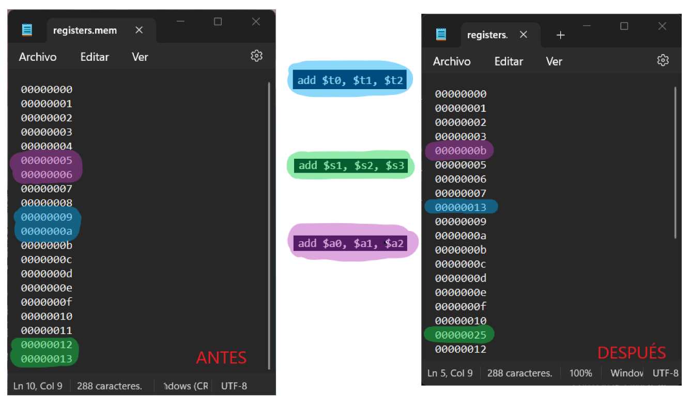

    

***TRABAJO PRACTICO 3***

**Titulo:** PIPELINE - PROCESADOR DLX - (Familia MIPS)

**Asignatura:** Arquitectura de Computadoras

**Integrantes:**
   - Gil Cernich, Manuel 
   - Cabrera, Augusto Gabriel 

---

# Enunciado

**Implementar el pipeline del procesador MIPS.**

## Instrucciones de Implementación

### Instrucciones tipo R (R-type):
- **Operaciones de desplazamiento:** `SLL`, `SRL`, `SRA`, `SLLV`, `SRLV`, `SRAV`
- **Operaciones aritméticas:** `ADDU`, `SUBU`
- **Operaciones lógicas:** `AND`, `OR`, `XOR`, `NOR`
- **Operaciones de comparación:** `SLT`, `SLTU`

### Instrucciones tipo I (I-type):
- **Carga y almacenamiento de datos:** `LB`, `LH`, `LW`, `LWU`, `LBU`, `LHU`, `SB`, `SH`, `SW`
- **Operaciones aritméticas y lógicas:** `ADDI`, `ADDIU`, `ANDI`, `ORI`, `XORI`, `LUI`
- **Comparación y saltos condicionales:** `SLTI`, `SLTIU`, `BEQ`, `BNE`

### Instrucciones tipo J (J-type):
- **Saltos:** `J`, `JAL`, `JR`, `JALR`

## Otros Requerimientos

| Requerimiento                    | Descripción                                                                                                                                                       |
|----------------------------------|-------------------------------------------------------------------------------------------------------------------------------------------------------------------|
| **Memoria de datos e instrucciones** | La memoria de datos debe estar separada de la memoria de instrucciones; ambas deben implementarse mediante IP Cores.                                          |
| **Carga del programa**           | El programa a ejecutar debe cargarse en la memoria de instrucciones mediante un archivo `.coe`.                                                                   |
| **Unidad de depuración**         | Debe incluirse una unidad de debug para enviar información a la PC a través de UART.                                                                              |
| **Segmentación**                 | Hacer en un mismo ciclo escritura y lectura (1 con cada flanco)                                                                                                   |

### Información de Depuración a Enviar por UART

- Contenido de los 32 registros.
- Contenido de los latches intermedios.
- Contenido de la memoria de datos utilizada.

## Modos de Operación

- **Modo Continuo:** En este modo, al enviar un comando a la FPGA a través de UART, se inicia la ejecución del programa hasta completarlo, mostrando todos los valores requeridos al final.
- **Modo Paso a Paso:** Cada comando enviado por UART ejecuta un ciclo de reloj, y se muestran los valores requeridos en cada paso.

## Pipeline Final

    

## Bibliografía

- **Instrucciones:**
  - *MIPS IV Instruction Set*

- **Pipeline:**
  - *Computer Organization and Design*, 3rd Edition. Capítulo 6. Hennessy y Patterson

---

# Marco Teorico

## Etapas

- **IF (Instruction Fetch)**: Búsqueda de la instrucción en la memoria de programa.
- **ID (Instruction Decode)**: Decodificación de la instrucción y lectura de registros.
- **EX (Execute)**: Ejecución de la instrucción propiamente dicha.
- **MEM (Memory Access)**: Lectura o escritura desde/hacia la memoria de datos.
- **WB (Write Back)**: Escritura de resultados en los registros.

## DATAPATH

    

## SEGMENTACIÓN

    

## Unidad de control

    

    

## Riesgos

### Tipos:
- **Estructurales**: Se producen cuando dos instrucciones tratan de utilizar el mismo recurso en el mismo ciclo.
- **De datos**: Se intenta utilizar un dato antes de que esté preparado. Mantenimiento del orden estricto de lecturas y escrituras.
- **De control**: Intentar tomar una decisión sobre una condición todavía no evaluada.

## Riesgos de datos
### Dependencias de registros

    

#### Solución

    

### Unidad de cortocircuito

    

---

## Riesgos de datos
### Dependencias de datos

    

#### Solución

    

### Unidad de detección de riesgos

    

---

## Riesgos de control

    

    

## Tipo de Instrucciones

### Tipo R
- Son operaciones aritméticas y lógicas.
- **OP Code**: `000000`
- La operación se indica en los 6 bits menos significativos.

    

### Tipo I
- Operaciones con un registro y un valor inmediato.
- En operaciones lógicas y aritméticas, se opera con `rs` y se almacena el resultado en `rt`.
- En operaciones de **load** y **store**, `rs` es la base y el inmediato es el desplazamiento (offset).

    

### Tipo J
- Operaciones de salto incondicional.
- La dirección de salto se almacena en el registro `rs`.

    

---

# Implementación

    

## Construcción de un camino de datos

La memoria de instrucciones
es solo de lectura, ya que el camino de datos nunca escribe instrucciones, y se trata como un elemento de
lógica combinacional. La salida en cualquier instante refleja el contenido de la localización especificada por
la dirección de entrada, y no se necesita ninguna señal de control de lectura (sólo se necesitará escribir en la
memoria de las instrucciones cuando se cargue el programa). El contador de programa es un registro de 32 bits que se modifica al final de cada ciclo de
reloj y, de esta manera, no necesita ninguna señal de control de escritura. El sumador es una ALU cableada
para que sume siempre dos entradas de 32 bits y dé el resultado en su salida.

    

### Program Counter

Todas las
instrucciones comienzan utilizando el contador de programa (PC) para proporcionar la dirección de la
instrucción en la memoria de instrucciones. Los saltos condicionales requieren el uso de la salida de la
ALU para determinar la dirección de la siguiente instrucción, que proviene de la ALU (donde se suma el PC y
el desplazamiento) o desde un sumador que incrementa el valor actual del PC en 4. El valor
escrito en el PC puede provenir de cualquiera de los dos sumadores, el dato
escrito en el banco de registros puede provenir de la ALU o de la memoria de
datos, y la segunda entrada de la ALU proviene de un registro o del campo inmediato
de la instrucción. En la práctica, estas líneas de datos no pueden conectarse
directamente

    

### Memoria de Instrucciones

La memoria de instrucciones
es solo de lectura, ya que el camino de datos nunca escribe instrucciones, y se trata como un elemento de
lógica combinacional. La salida en cualquier instante refleja el contenido de la localización especificada por
la dirección de entrada, y no se necesita ninguna señal de control de lectura (sólo se necesitará escribir en la
memoria de las instrucciones cuando se cargue el programa; esto no es difícil de añadir, por lo que se ignora
para simplificar). El contador de programa es un registro de 32 bits que se modifica al final de cada ciclo de
reloj y, de esta manera, no necesita ninguna señal de control de escritura. El sumador es una ALU cableada
para que sume siempre dos entradas de 32 bits y dé el resultado en su salida.

    

El módulo implementa una memoria de instrucciones con capacidad para escribir, leer y gestionar su estado (vacía o llena).

Cuando **`i_reset`** o **`i_clear`** están activos, la memoria y el puntero se reinician, dejando la memoria en un estado limpio.

Si **`i_inst_write`** está activo, la instrucción proporcionada en **`i_instruction`** se escribe en la memoria en la posición indicada por **`pointer`**, y el puntero incrementa su valor en 4 bytes (una instrucción).

La instrucción almacenada en la posición especificada por **`i_pc`** se envía como salida a través de **`o_instruction`**.

- **`o_full_mem`**: Indica que la memoria está llena cuando el puntero alcanza la dirección máxima.
- **`o_empty_mem`**: Indica que la memoria está vacía cuando el puntero está en 0.

--- 
#### Ejemplo práctico

    

Supongamos que estamos trabajando con una memoria de 10 palabras y queremos cargar y leer algunas instrucciones.

#### Paso 1: Escribir una instrucción

#### Condiciones iniciales:
- `i_reset = 1`: Se reinicia la memoria, por lo que `memory = 0` y `pointer = 0`.

#### Primera instrucción:
- `i_inst_write = 1`: Habilitamos la escritura.
- `i_instruction = 32'b10101010101010101010101010101010`: Queremos escribir esta instrucción.
- En el siguiente flanco positivo del reloj (`posedge i_clk`), la instrucción se almacena en los bits `[0:31]` de `memory`, y el `pointer` se incrementa a 4.

#### Paso 2: Escribir otra instrucción

#### Segunda instrucción:
- `i_instruction = 32'b11110000111100001111000011110000`: Queremos escribir esta instrucción.
- En el siguiente flanco del reloj, se escribe en los bits `[32:63]` de `memory`, y el `pointer` ahora es 8.

#### Paso 3: Leer una instrucción

- Supongamos que `i_pc = 1` (en bytes, equivale a la dirección 4).
- La instrucción leída será la que está almacenada en los bits `[32:63]`, es decir, `32'b11110000111100001111000011110000`.

#### Paso 4: Indicadores

- Si escribimos 10 palabras (320 bits), el `pointer` alcanzará 40 bytes (`MAX_POINTER_DIR`) y `o_full_mem` será `1`.
- Si el `pointer` está en `0`, `o_empty_mem` será `1`.

## Multiplexor

    
    

        El valor escrito en el PC puede provenir de cualquiera de los dos sumadores, el dato
        escrito en el banco de registros puede provenir de la ALU o de la memoria de
        datos, y la segunda entrada de la ALU proviene de un registro o del campo inmediato
        de la instrucción. En la práctica, estas líneas de datos no pueden conectarse
        directamente; debe añadirse un elemento que seleccione entre los múltiples orígenes
        y dirija una de estas fuentes al destino. Esta selección se realiza comúnmente
        mediante un dispositivo denominado multiplexor.
    

## Sumador

 
    

        Se necesita un sumador encargado de incrementar el PC
        para que apunte a la dirección de la siguiente instrucción. Este sumador, que es
        combinacional, se puede construir a partir de la ALU.
    

   

## 

---

# Constraints

---

# Test Bench Baud Rate

---

# ANEXO: Video
