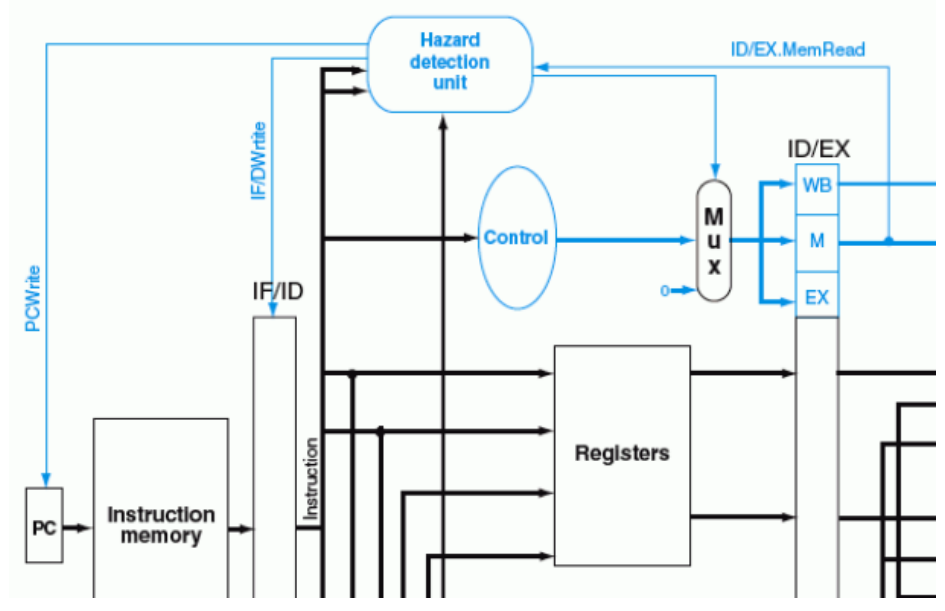

<p align="center">
    
</p>

***TRABAJO PRACTICO 3***

**Titulo:** PIPELINE - PROCESADOR DLX - (Familia MIPS)

**Asignatura:** Arquitectura de Computadoras

**Integrantes:**
   - Gil Cernich, Manuel 
   - Cabrera, Augusto Gabriel 

---

# Enunciado

**Implementar el pipeline del procesador MIPS.**

## Instrucciones de Implementación

### Instrucciones tipo R (R-type):
- **Operaciones de desplazamiento:** `SLL`, `SRL`, `SRA`, `SLLV`, `SRLV`, `SRAV`
- **Operaciones aritméticas:** `ADDU`, `SUBU`
- **Operaciones lógicas:** `AND`, `OR`, `XOR`, `NOR`
- **Operaciones de comparación:** `SLT`, `SLTU`

### Instrucciones tipo I (I-type):
- **Carga y almacenamiento de datos:** `LB`, `LH`, `LW`, `LWU`, `LBU`, `LHU`, `SB`, `SH`, `SW`
- **Operaciones aritméticas y lógicas:** `ADDI`, `ADDIU`, `ANDI`, `ORI`, `XORI`, `LUI`
- **Comparación y saltos condicionales:** `SLTI`, `SLTIU`, `BEQ`, `BNE`

### Instrucciones tipo J (J-type):
- **Saltos:** `J`, `JAL`, `JR`, `JALR`


## Otros Requerimientos

| Requerimiento                    | Descripción                                                                                                                                                       |
|----------------------------------|-------------------------------------------------------------------------------------------------------------------------------------------------------------------|
| **Memoria de datos e instrucciones** | La memoria de datos debe estar separada de la memoria de instrucciones; ambas deben implementarse mediante IP Cores.                                          |
| **Carga del programa**           | El programa a ejecutar debe cargarse en la memoria de instrucciones mediante un archivo `.coe`.                                                                   |
| **Unidad de depuración**         | Debe incluirse una unidad de debug para enviar información a la PC a través de UART.                                                                              |
| **Segmentación**                 | Hacer en un mismo ciclo escritura y lectura (1 con cada flanco)                                                                                                   |


### Información de Depuración a Enviar por UART

- Contenido de los 32 registros.
- Contenido de los latches intermedios.
- Contenido de la memoria de datos utilizada.


## Modos de Operación

- **Modo Continuo:** En este modo, al enviar un comando a la FPGA a través de UART, se inicia la ejecución del programa hasta completarlo, mostrando todos los valores requeridos al final.
- **Modo Paso a Paso:** Cada comando enviado por UART ejecuta un ciclo de reloj, y se muestran los valores requeridos en cada paso.


## Pipeline Final

<p align="center">
    
</p>


## Bibliografía

- **Instrucciones:**
  - *MIPS IV Instruction Set*

- **Pipeline:**
  - *Computer Organization and Design*, 3rd Edition. Capítulo 6. Hennessy y Patterson


---

# Marco Teorico

## Etapas

- **IF (Instruction Fetch)**: Búsqueda de la instrucción en la memoria de programa.
- **ID (Instruction Decode)**: Decodificación de la instrucción y lectura de registros.
- **EX (Execute)**: Ejecución de la instrucción propiamente dicha.
- **MEM (Memory Access)**: Lectura o escritura desde/hacia la memoria de datos.
- **WB (Write Back)**: Escritura de resultados en los registros.


## DATAPATH

<p align="center">
    
</p>

## SEGMENTACIÓN


<p align="center">
    
</p>

## Unidad de control

<p align="center">
    
</p>


<p align="center">
    
</p>

## Riesgos

### Tipos:
- **Estructurales**: Se producen cuando dos instrucciones tratan de utilizar el mismo recurso en el mismo ciclo.
- **De datos**: Se intenta utilizar un dato antes de que esté preparado. Mantenimiento del orden estricto de lecturas y escrituras.
- **De control**: Intentar tomar una decisión sobre una condición todavía no evaluada.

## Riesgos de datos
### Dependencias de registros
<p align="center">
    
</p>

#### Solución
<p align="center">
    
</p>

### Unidad de cortocircuito
<p align="center">
    
</p>

---

## Riesgos de datos
### Dependencias de datos
<p align="center">
    
</p>

#### Solución
<p align="center">
    
</p>

### Unidad de detección de riesgos
<p align="center">
    
</p>

---

## Riesgos de control
<p align="center">
    
</p>

<p align="center">
    
</p>

## Tipo de Instrucciones

### Tipo R
- Son operaciones aritméticas y lógicas.
- **OP Code**: `000000`
- La operación se indica en los 6 bits menos significativos.

<p align="center">
    
</p>

### Tipo I
- Operaciones con un registro y un valor inmediato.
- En operaciones lógicas y aritméticas, se opera con `rs` y se almacena el resultado en `rt`.
- En operaciones de **load** y **store**, `rs` es la base y el inmediato es el desplazamiento (offset).

<p align="center">
    
</p>

### Tipo J
- Operaciones de salto incondicional.
- La dirección de salto se almacena en el registro `rs`.

<p align="center">
    
</p>

# Implementación

El diseño principal de este desarrollo sigue un enfoque incremental. Cada avance significativo se traduce en una rama (branch) que depende de una rama anterior y contribuye de manera progresiva al desarrollo del MIPS hasta su finalización.

## Avance I: MIPS Only Adder

El objetivo principal del Avance I es desarrollar un MIPS extremadamente básico con las siguientes características:

- Capacidad para procesar únicamente una instrucción de suma: `add $t1, $t2, $t3`.
- Sin manejo de *hazards*.
- Sin soporte para saltos de ningún tipo.

La finalidad de este avance es establecer los módulos fundamentales que conformarán laestructura base (esqueleto) del MIPS, sirviendo como punto de partida y facilitando la integración de funcionalidades en los avances posteriores.

### Resultados


<p align="center">
    
</p>


Se observa cómo el MIPS realiza la operación `add $t1, $t2, $t3`, que consiste en sumar los valores almacenados en los registros 10 (`$t2`) y 11 (`$t3`) y guardar el resultado en el registro 9 (`$t1`).


---

## Avance II: Hazard without jumps

El objetivo principal del Avance II es integrar y mejorar el Avance I, incorporando la capacidad de resolver los riesgos. Esto permitirá procesar las instrucciones de manera adecuada, evitando resultados indeseados debido a condiciones de carrera u otros problemas relacionados.

Teniendo en cuenta los registros como estan distribuidos en el MIPS (ver `Doc\REGISTERS.md`). Planteamos los siguientes casos:


### Caso A: Sin riesgos, multiples instrucciones


```assembly 
add $t0, $t1, $t2 # 000000 01001 01010 01000 00000 100000  -> 0x012A4020 -> 19546144, Registro 08h (08d) = 13h
add $s1, $s2, $s3 # 000000 10010 10011 10001 00000 100000  -> 0x2538820  -> 39028768, Registro 11h (17d) = 25h
add $a0, $a1, $a2 # 000000 00101 00110 00100 00000 100000  -> 0xA62020   -> 10887200, Registro 04h (04d) = 0bh
```

En este caso específico, las tres instrucciones add no presentan riesgos de datos, control ni estructurales directos.

El estado inicial de los registros es el siguiente:

<p align="center">  </p>
Los registros están alineados de la siguiente manera: el primer valor hexadecimal corresponde a $zero, el segundo a $at, y así sucesivamente.

Al realizar las pruebas con el archivo `tb_MIPS_II.v`, se obtienen los siguientes resultados:


<p align="center">  </p>


### Caso B: STORE

**NOTA:** Consulta `OPERATIONS.md` para entender cómo funcionan las instrucciones.

<p align="center">  </p>


```assembly 
sw  $s0 , 14($s1) -> 101011  10001 10000 0000 0000 0000 1110 = 2922381326d

      Address: 18H = 24d = 10d + 14d (offset) = 000110   00 (Descartado)
```

Este valor se encuentra almacenado en el elemento 6 (6x4) de la memoria, como se observa a continuación:

<p align="center">  </p> 


### Caso C: LOAD


<p align="center">  </p> 

```assembly 
lw  $s2 , 16 ($s3) -> 100011   10011  10010  0000 0000 0001 0000 -> 2389835792
```

<p align="center">  </p> 

### Caso D: Riesgos de Datos

Los **riesgos de datos** ocurren cuando, debido a la segmentación, el orden de lectura de los operandos y la escritura de resultados se modifica respecto al especificado por el programa. 

Se produce un riesgo si existe **dependencia entre instrucciones** que se ejecutan concurrentemente. Dependiendo del tipo de segmentación, el riesgo puede ocurrir o no. Existen tres tipos diferentes de riesgos de datos:

- **Lectura después de escritura (LDE):**  
  Se produce un riesgo si un registro se lee antes de que se complete la escritura de dicho registro por una instrucción anterior.

- **Escritura después de lectura (EDL):**  
  Se produce un riesgo si un registro se escribe antes de que se complete la lectura de dicho registro por una instrucción anterior.

- **Escritura después de escritura (EDE):**  
  Se produce un riesgo si un registro se escribe antes de que se complete la escritura de dicho registro por una instrucción anterior.

---

#### Ejemplos de Riesgos de Datos

| Tipo | Código                 | Descripción                               |
|------|------------------------|-------------------------------------------|
| LDE  | `ADD $t1, $t2, $t3`       | $t1 se lee antes de que lo escriba         |
|      | `ADD $t4, $t1, $t2`       |                                           |
| EDL  | `ADD $t1, $t4, $t3`       | $t4 se escribe antes de que lo lea         |
|      | `ADD $t4, $t1, $t2`       |                                           |
| EDE  | `ADD $t4, $t2, $t3`       | Si la 2ª instrucción ocurre primero       |
|      | `ADD $t4, $t1, $t2`       |                                           |

<p align="center">  </p> 


### Análisis del problema

#### Primera instrucción: `ADD $t1, $t2, $t3`
- Escribe el resultado en `$t1` al final de la etapa WB (C5).

#### Segunda instrucción: `ADD $t4, $t1, $t2`
- Intenta leer `$t1` durante la etapa ID (C3), pero `$t1` aún no está disponible porque no se ha escrito en el registro.

---

### Soluciones para evitar este riesgo

#### Técnica de forwarding (reenvío)
1. **Descripción**:  
   Utilizar bypass o forwarding en el hardware para reenviar el resultado de la etapa EX de la primera instrucción directamente a la etapa ID o EX de la segunda, sin esperar a que el resultado sea escrito en el registro.

2. **Implementación en este caso**:  
   - El resultado de la etapa EX de la primera instrucción (C3) puede ser enviado directamente como entrada para la etapa EX de la segunda instrucción (C4).

#### Ventajas
- La técnica de forwarding es la más eficiente, ya que evita la pérdida de ciclos de reloj innecesarios.
- Sin embargo, **requiere soporte en el hardware de la segmentación**.

### Implementación

NOTA: Cada registro tiene su valor igual al index: 

```assembly 
add $s1, $s2, $s3 -> 000000 10010 10011 10001 00000 100000  -> 0x02538820 -> 39028768
add $a0, $a1, $a2 -> 000000 00101 00110 00100 00000 100000  -> 0x00A62020 -> 10887200
add $t1, $t2, $t3 -> 000000 01010 01011 01001 00000 100000  -> 0X014B4820 -> 21710880
add $t4, $t1, $t2 -> 000000 01001 01010 01100 00000 100000  -> 0X012A6020 -> 19554336 
add $t0, $t1, $t2 -> 000000 01001 01010 01000 00000 100000  -> 0x012A4020 -> 19546144
add $t0, $t1, $t2 -> 000000 01001 01010 01000 00000 100000  -> 0x012A4020 -> 19546144
add $t0, $t1, $t2 -> 000000 01001 01010 01000 00000 100000  -> 0x012A4020 -> 19546144
add $t0, $t1, $t2 -> 000000 01001 01010 01000 00000 100000  -> 0x012A4020 -> 19546144
add $t1, $t2, $t3 -> 000000 01010 01011 01001 00000 100000  -> 0X014B4820 -> 21710880
add $t2, $t0, $t3 -> 000000 01000 01011 01010 00000 100000  -> 0x010B5020 -> 17518624
add $t4, $t1, $t2 -> 000000 01001 01010 01100 00000 100000  -> 0X012A6020 -> 19554336 
```

#### Desglose


| Instrucción           | Registro final (Decimal) | Calculo                              |
|------------------------|-------|------------------------------------------|
| add $s1, $s2, $s3     | (08)  | s1 = 18d + 19d = 37d = 25h              |
| add $a0, $a1, $a2     | (04)  | a0 = 05d + 06d = 11d = 0bh              |
| add $t1, $t2, $t3     | (09)  | t1 = 10d + 11d = 21d = 15h              |
| add $t4, $t1, $t2     | (12)  | t4 = 21d + 10d = 31d = 1Fh              |
| add $t0, $t1, $t2     | (08)  | t0 = 21d + 10d = 31d = 1Fh              |
| add $t0, $t1, $t2     | (08)  | t0 = 21d + 10d = 31d = 1Fh              |
| add $t0, $t1, $t2     | (08)  | t0 = 21d + 10d = 31d = 1Fh              |
| add $t0, $t1, $t2     | (08)  | t0 = 21d + 10d = 31d = 1Fh              |
| add $t1, $t2, $t3     | (09)  | t1 = 10d + 11d = 21d = 15h              |
| add $t2, $t0, $t3     | (10)  | t2 = 31d + 11d = 42d = 2Ah              |
| add $t4, $t1, $t2     | (12)  | t4 = 21d + 42d = 63d = 3Fh              |

<p align="center">  </p>

#### Interpretación temporal del hazard

<p align="center">  </p>


### Caso E: Load-Use Hazard

Cuando una instrucción `LW` es seguida por una instrucción de tipo `R`, es necesario cortocircuitar la salida de la memoria (de la instrucción `LW`) con la entrada de la ALU (de la segunda instrucción).

Para realizar este control, la Unidad de Cortocircuito (FORWARD) necesita la siguiente información, que se almacena en los registros de segmento hasta la etapa `EX`:

- El registro que se escribe en la instrucción anterior (`rd` en el tipo `R`, y `rt` en el tipo `I`).
- Los registros que se leen en la nueva instrucción (`rs` y `rt`).
- La señal de control `Write_Reg`, que indica si la instrucción va a escribir en un registro (es decir, si es de tipo `R` o tipo `I` como `LW`).

Como se puede observar, incluso adelantando el resultado mediante la anticipación de resultados (*forwarding*), existe una dependencia hacia atrás en el tiempo entre la primera y la segunda instrucción.

En el caso de la instrucción `LW r1, 0(r2)`, el valor de `r1` no estará disponible hasta la cuarta etapa (`MEM`), ya que el dato se obtiene de la memoria. Sin embargo, la segunda instrucción, que depende de ese dato, lo necesitará en su segunda etapa (`EX`).

Este tipo de dependencia no puede ser resuelto por la Unidad de Cortocircuito, ya que el dato aún no ha sido recuperado de la memoria cuando la segunda instrucción lo requiere. Como resultado, la segunda instrucción deberá *ESPERAR* un ciclo de reloj antes de poder continuar su ejecución. Esta espera se conoce como **stall** o **burbuja**, y es necesaria para evitar la lectura de datos incorrectos.

### Solución

Además de una unidad de anticipación de datos (*FORWARD*), es necesaria una **Unidad de Detección de Riesgos** (*HAZARD*). 

Esta unidad debe operar durante la etapa `ID`, de manera que pueda insertar un bloqueo entre una instrucción de tipo `load` y la instrucción que dependa de su resultado.

El control para la detección de riesgos en el caso de una instrucción `load` se realiza evaluando las siguientes condiciones:

1. La señal de control `memRead` de la instrucción anterior.
2. El registro `rt` de la instrucción anterior, que indica dónde se almacena el resultado de la instrucción `load`.
3. Los registros `rs` y `rt` de la instrucción actual (en la etapa `ID`).


             


### Implementación


```assembly 
lw s2, 16(s3)  -> 0x8E520010 -> 10001110011100100000000000010000 -> 2389835792  -> s2 = 10d (16d nivel 5)
add v1,s2,v0   -> 0x02421820 -> 00100100001000011000001000000000 -> 37885984    -> v1 = 12d (v0 = 2h)
```

<p align="center">  </p>


<p align="center">  </p>


<p align="center">  </p>


### Caso F: Riesgos, LOAD y STORE

Con $v0=2d y $t0=8d (inicial)

```assembly 
add s3 , v0 , v0    -> 0x00429820 -> 00000000010000101001100000100000 -> 4364320     -> s3 = 2d + 2d = 4d
lw  s2 , 16(s3)     -> 0x8E520010 -> 10001110011100100000000000010000 -> 2389835792  -> s2 = 10d (16d nivel 5)
sw  s3 , 14(s2)     -> 0xAE53000E -> 10101110010100110000000000001110 -> 2924675086  -> nivel 6 = 4d 
lw  $t1 , 16($t0)   -> 0x8D090010 -> 10001101000010010000000000010000 -> 2366177296  -> t1 = 8d 
add $v0 , $s3 , $s2 -> 0x02721020 -> 00000010011100100001000000100000 -> 41029664    -> v0 = 14d
add $t2 , $t1 , $v0 -> 0x1225020  -> 00000001001000100101000000100000 -> 19025952    -> t2 = 22d = 16h
```
#### Interpretación

<p align="center">  </p>

#### Resultado

<p align="center">  </p>


