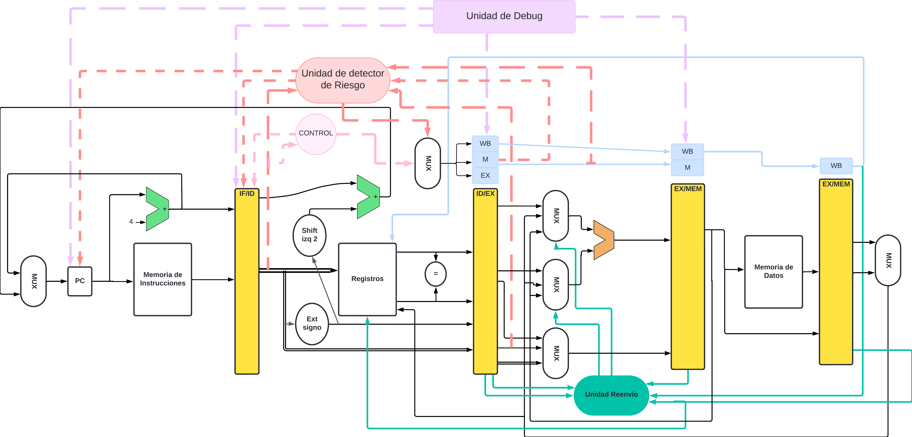
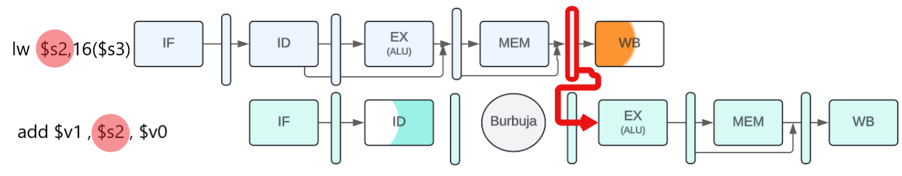

# Implementación

    

# Etapa de Decodificación (ID) en MIPS

En los procesadores MIPS, la etapa de decodificación (ID) se encarga de interpretar la instrucción obtenida en la etapa de *fetch* (IF). Durante esta etapa, se generan las señales de control necesarias y se preparan los operandos para su ejecución. A continuación, se describen las operaciones clave:

    

## 1. Lectura de registros
- Los campos de la instrucción se utilizan para identificar qué registros deben ser leídos.
- El banco de registros lee los valores de los registros fuente especificados en la instrucción.

    

El banco de registros contiene todos los registros y posee dos puertos de lectura y un puerto de escritura. Su funcionamiento se detalla a continuación:

- **Lectura**: 
  - Siempre devuelve en las salidas el contenido de los registros correspondientes a los identificadores presentes en las entradas de los registros a leer.
  - Obtiene el valor escrito en un ciclo anterior.

- **Escritura**: 
  - Debe indicarse explícitamente mediante la activación de la **señal de control de escritura**.
  - El valor escrito estará disponible en ciclos siguientes.

- **Especificaciones Técnicas**:
  - Las entradas que indican el número de registro al banco tienen un ancho de **5 bits**.
  - Las líneas de datos tienen un ancho de **32 bits**.

### Funcionamiento

El módulo `registers` implementa un banco de registros configurable, permitiendo realizar operaciones de lectura, escritura y reinicio (reset/flush). A continuación, se describe cómo funciona:

#### Escritura en Registros
- La escritura está controlada por la señal `i_enable_wr`.
- Para escribir un valor en un registro:
  - Indicas la dirección del registro con `i_wr`.
  - Especificas el dato a escribir con `i_data_wr`.
- Ejemplo:
  - Si `i_wr = 3` e `i_data_wr = 16'hA5A5`, se almacenará el valor `A5A5` en el registro **3**.
- ****NOTA:** El registro 0 no puede ser modificado; siempre permanecerá en 0.**

####  Lectura de Registros
- Puedes leer dos registros simultáneamente:
  - Indica las direcciones de los registros que deseas leer con `i_A` y `i_B`.
  - Los valores de los registros seleccionados estarán disponibles en las salidas `o_data_A` y `o_data_B`.
- Ejemplo:
  - Si `i_A = 3`, `o_data_A` mostrará el valor almacenado en el registro **3**.
  - Si `i_B = 5`, `o_data_B` mostrará el valor almacenado en el registro **5**.

#### Limpieza de Registros (Flush)
- Activando la señal `i_flush`, todos los registros (excepto el registro 0) se limpian automáticamente y se colocan en **0**.
- Esta operación es útil para reiniciar el estado del banco de registros sin realizar un reinicio completo (`i_reset`).

#### Depuración (Debugging)
- El bus de salida `o_Debugging` permite inspeccionar el contenido de **todos los registros** en cualquier momento.
- Es útil para pruebas y simulaciones, ya que proporciona una vista completa del estado interno del banco.

#### Secuencia Típica de Operación
1. **Inicio:** Activa la señal `i_reset` para inicializar los registros.
2. **Escritura:**
   - Activa `i_enable_wr`.
   - Especifica la dirección (`i_wr`) y el dato (`i_data_wr`) para escribir en un registro.
3. **Lectura:**
   - Especifica las direcciones de los registros a leer con `i_A` y `i_B`.
   - Observa los valores en `o_data_A` y `o_data_B`.
4. **Limpieza:** Activa `i_flush` para limpiar todos los registros (excepto el registro 0).
5. **Depuración:** Inspecciona el estado completo del banco de registros a través de `o_Debugging`.

#### Ejemplo de Operaciones

1. **Escribir un valor:**
   - Dirección: `i_wr = 3`
   - Valor: `i_data_wr = 16'hA5A5`
   - Resultado: El registro 3 contendrá el valor `A5A5`.

2. **Leer registros:**
   - Dirección de lectura: `i_A = 3`, `i_B = 5`
   - Salidas: `o_data_A` mostrará el valor del registro 3, y `o_data_B` el del registro 5.

3. **Aplicar un flush:**
   - Activar `i_flush`.
   - Resultado: Todos los registros, excepto el registro 0, se limpian a **0**.

## 2. Extensión de signo
- Si la instrucción utiliza un operando inmediato (como en las instrucciones de tipo I), el valor inmediato se extiende a 32 bits.
- La extensión mantiene el signo del operando para operaciones aritméticas correctas.

    

 - Convierte un valor de **16 bits** del campo de desplazamiento de una instrucción en un valor con signo de **32 bits**.
  - Posee una entrada de **16 bits** y una salida de **32 bits**.

### Funcionamiento

El módulo `sign_extension` realiza la extensión de un valor de entrada, que puede ser **extensión de signo** o **extensión con ceros**, dependiendo de una señal de control. A continuación, se detalla cómo funciona:

### Funcionalidad Principal
- **Extensión de Signo**:  
  - Si la señal de control `i_flag_signed` es **1**, el módulo realiza una extensión de signo. Esto significa que el bit más significativo (MSB) del valor original se replica en los bits adicionales del valor extendido.  
  - Esto es útil para preservar el valor correcto en representaciones de números negativos en complemento a dos.

- **Extensión con Ceros**:  
  - Si `i_flag_signed` es **0**, el módulo realiza una extensión con ceros. En este caso, los bits adicionales del valor extendido se rellenan con **0**.

### Entradas y Salidas
#### Entradas:
1. **`i_data`**:  
   - Valor original que se desea extender.
   - Tamaño configurable mediante el parámetro `DATA_ORIGINAL_SIZE`.
2. **`i_flag_signed`**:  
   - Señal de control:
     - **1**: Realiza extensión de signo.
     - **0**: Realiza extensión con ceros.

#### Salida:
1. **`o_ext_data`**:  
   - Valor extendido resultante.
   - Tamaño configurable mediante el parámetro `DATA_EXTENDED_SIZE`.

### Lógica del Módulo
- La extensión se realiza utilizando un operador ternario:
  - Si `i_flag_signed` es **1**:
    - Los bits adicionales se rellenan replicando el MSB de `i_data` (extensión de signo).
  - Si `i_flag_signed` es **0**:
    - Los bits adicionales se rellenan con ceros (extensión con ceros).

### Parámetros Configurables
1. **`DATA_ORIGINAL_SIZE`**:  
   - Define el tamaño del valor de entrada (`i_data`).
   - Por defecto: **16 bits**.
2. **`DATA_EXTENDED_SIZE`**:  
   - Define el tamaño del valor extendido (`o_ext_data`).
   - Por defecto: **32 bits**.

### Ejemplo de Operación
#### Caso 1: Extensión de Signo (`i_flag_signed = 1`)
- **Valor original (`i_data`)**: `8'b10011001` (negativo en complemento a dos).
- **Extensión de signo**:  
  - El MSB (`1`) se replica en los bits adicionales.
  - Salida (`o_ext_data`): `32'b111111111111111110011001`.

#### Caso 2: Extensión con Ceros (`i_flag_signed = 0`)
- **Valor original (`i_data`)**: `8'b10011001`.
- **Extensión con ceros**:  
  - Los bits adicionales se rellenan con `0`.
  - Salida (`o_ext_data`): `32'b000000000000000010011001`.

### Flujo de Operación
1. **Proporcionar Entradas**:
   - Configura `i_data` con el valor a extender.
   - Ajusta `i_flag_signed` según el tipo de extensión deseada:
     - **1** para extensión de signo.
     - **0** para extensión con ceros.

2. **Observar la Salida**:
   - El resultado extendido estará disponible en `o_ext_data`.

3. **Modificar Parámetros (Opcional)**:
   - Ajusta `DATA_ORIGINAL_SIZE` y `DATA_EXTENDED_SIZE` según los requisitos del sistema.

## 3. Shift a la izquierda por 2

- Para instrucciones de salto (como `beq` o `bne`), el offset se desplaza 2 bits a la izquierda.
- Este desplazamiento asegura que la dirección esté alineada a palabras (múltiplos de 4 bytes).
La arquitectura también impone que el campo de desplazamiento se desplace
hacia la izquierda 2 bits para que este desplazamiento corresponda a
una palabra; de forma que se incrementa el rango efectivo de dicho campo
en un factor de 4.

    

### Funcionamiento

El módulo `shift_left_2` realiza un **desplazamiento lógico a la izquierda** de un valor de entrada. El número de posiciones a desplazar se configura mediante un parámetro, y por defecto se establece en 2 posiciones. A continuación, se explica cómo funciona:

- **Desplazamiento Lógico a la Izquierda**:  
  El módulo toma un valor de entrada (`i_noshift`) y lo desplaza hacia la izquierda un número fijo de posiciones (`SHIFT`). El desplazamiento lógico significa que los bits a la izquierda se mueven hacia posiciones de mayor valor, mientras que los bits de menor peso se llenan con **ceros**.

####  Entradas y Salidas

1. **`i_noshift`**:  
   - Valor de entrada a ser desplazado.
   - Tiene un tamaño configurable mediante el parámetro `SIZE`.
   
1. **`o_shift`**:  
   - Valor desplazado a la izquierda.
   - El tamaño del valor desplazado es el mismo que el de `i_noshift` (configurado con `SIZE`).

####  Lógica del Módulo
- El módulo utiliza la operación de desplazamiento a la izquierda (`<<`) para desplazar el valor de entrada (`i_noshift`) el número de posiciones configurado en `SHIFT`.
  - Si `SHIFT = 2`, por ejemplo, el valor de entrada se desplazará 2 posiciones a la izquierda, y los bits más pequeños se llenarán con **ceros**.

####  Parámetros Configurables
1. **`SIZE`**:  
   - Longitud del valor de entrada y salida (en bits).
   - Por defecto: **32 bits**.

2. **`SHIFT`**:  
   - Número de posiciones a desplazar el valor de entrada.
   - Por defecto: **2**.

####  Ejemplo de Operación
##### Caso 1: Desplazamiento de 2 posiciones (`SHIFT = 2`)
- **Valor original (`i_noshift`)**: `32'b00000000000000000000000000001101` (13 en decimal).
- **Resultado del desplazamiento**:  
  El valor de entrada se desplaza 2 posiciones a la izquierda:
  - Salida (`o_shift`): `32'b00000000000000000000000000110100` (52 en decimal).

##### Caso 2: Desplazamiento de 1 posición (`SHIFT = 1`)
- **Valor original (`i_noshift`)**: `32'b00000000000000000000000000001101` (13 en decimal).
- **Resultado del desplazamiento**:  
  El valor de entrada se desplaza 1 posición a la izquierda:
  - Salida (`o_shift`): `32'b00000000000000000000000000011010` (26 en decimal).

#### Flujo de Operación
1. **Proporcionar Entrada**:
   - Configura `i_noshift` con el valor que deseas desplazar.

2. **Ajustar Parámetros**:
   - Puedes configurar `SIZE` y `SHIFT` según las necesidades de tu diseño:
     - **`SIZE`** define el tamaño del valor de entrada y salida.
     - **`SHIFT`** define cuántas posiciones se desplaza el valor.

3. **Observar la Salida**:
   - El valor desplazado estará disponible en `o_shift`.

## 4. Cálculo de la dirección de salto (branch)

En instrucciones condicionales, se deben realizar las siguientes operaciones:

- **Cálculo de la dirección objetivo**:
  - Se suma el valor desplazado del offset al contador de programa (**PC**) para obtener la dirección destino del salto.

- **Determinación de la instrucción siguiente**:
  - Si la condición se cumple (es decir, los operandos son iguales):
    - La dirección calculada pasa a ser el nuevo **PC**.
    - Se dice que el salto condicional **se ha tomado**.
  - Si los operandos son diferentes:
    - El **PC incrementado** reemplaza al **PC actual** (como ocurre en cualquier otra instrucción).
    - En este caso, se dice que el salto **no se ha tomado**.

#### Resumen

El camino de datos para saltos condicionales debe realizar dos operaciones principales:

1. Calcular la dirección destino del salto.
2. Comparar el contenido de los registros.

**Nota**: Los saltos condicionales también requieren modificaciones en la parte de carga de instrucciones del camino de datos, como se describirá más adelante.

- **Salto tomado**:  
  Ocurre cuando se cumple la condición de salto. En este caso:  
  - El contador de programa (**PC**) es cargado con la dirección destino.  
  - **Nota**: Todos los saltos incondicionales son considerados saltos tomados.

- **Salto no tomado**:  
  Ocurre cuando la condición de salto es falsa. En este caso:  
  - El **PC** se carga con la dirección de la instrucción que sigue al salto.

## 5. Diseño de la unidad de control principal

Una vez que ya se ha descrito como diseñar una ALU que utiliza el código de fun
ción
y una señal de dos bits como entradas de control, podemos centrarnos en el
resto del control. Para iniciar este proceso se deben identificar los campos de las ins
trucciones
y las líneas de control necesarias para la construcción del camino de
datos mostrado

    

**NOTA:** La instrucción de salto incondicional hace uso de otro formato.

### Formato para las instrucciones tipo R
Este formato tiene el campo de tipo de operación configurado a `0`. Las instrucciones tipo R disponen de tres operandos registros:

- **rs**: Registro fuente.
- **rt**: Registro fuente.
- **rd**: Registro destino.

La función que se realiza en la ALU está definida en el código de función (campo `funct`), el cual es decodificado por la unidad de control de la ALU, tal como se explicó en la sección anterior. Ejemplos de instrucciones tipo R incluyen:

- `add`
- `sub`
- `and`
- `or`
- `slt`

El campo de desplazamiento (`shamt`) solo se utiliza para operaciones de desplazamiento y no se trata en este capítulo.

---

### Formato para las instrucciones de carga y almacenamiento
Estas instrucciones tienen los siguientes códigos de operación:

- **Cargar**: Código de operación `35` (decimal).
- **Almacenar**: Código de operación `43` (decimal).

En este formato:

- El registro **rs** actúa como base y se le suma el campo de dirección de 16 bits para obtener la dirección de memoria.
- En las instrucciones de carga:
  - **rt** es el registro destino del valor cargado desde la memoria.
- En las instrucciones de almacenamiento:
  - **rt** es el registro fuente del valor que se debe almacenar en memoria.

### Formato para las instrucciones de salto condicional (saltar si igual)
Estas instrucciones tienen el código de operación `4` (decimal).

- Los registros **rs** y **rt** son los registros fuente que se compararán.
- El campo de dirección de 16 bits se extiende con signo, se desplaza y se suma al contador de programa (**PC**) para calcular la dirección de destino del salto.

### Observaciones sobre el formato de las instrucciones

Existen varias observaciones importantes a tener en cuenta respecto al formato de las instrucciones. Estas se supondrán siempre ciertas:

1. **Código de operación (opcode):**
   - El campo de código de operación estará siempre contenido en los bits **31-26**.
   - Este campo se referenciará como `Op[5-0]`.

2. **Registros de lectura:**
   - Los dos registros de lectura están siempre especificados en los campos **rs** y **rt**:
     - **rs**: Posiciones **25-21**.
     - **rt**: Posiciones **20-16**.
   - Esto aplica a las instrucciones tipo R, `beq` y almacenamiento.

3. **Registro base en instrucciones de acceso a memoria:**
   - Para este tipo de instrucciones, el registro base se encuentra siempre en **rs** (bits **25-21**).

4. **Desplazamiento relativo de 16 bits:**
   - Para las instrucciones de salto condicional (`beq`), cargas y almacenamientos, el desplazamiento relativo de 16 bits está siempre en las posiciones **15-0**.

5. **Registro destino:**
   - El registro destino puede estar en dos ubicaciones:
     - **Instrucciones de carga:** En las posiciones **20-16** (`rt`).
     - **Instrucciones aritmético-lógicas:** En los bits **15-11** (`rd`).
   - Debido a esto, es necesario un multiplexor para seleccionar cuál de estos dos campos de la instrucción será utilizado en el momento de escribir en el registro destino.

**Opcode:** Campo que denota la operación y el formato de una instrucción.

### Señales de control y sus efectos

| **Señal de Control** | **Efecto cuando no está activa** | **Efecto cuando está activa** |
|-----------------------|----------------------------------|--------------------------------|
| **RegDst**            | El identificador del registro destino viene determinado por el campo `rt` (bits 20-16). | El identificador del registro destino viene determinado por el campo `rd` (bits 15-11). |
| **RegWrite**          | Ninguno. | El registro destino se actualiza con el valor a escribir. |
| **ALUSrc**            | El segundo operando de la ALU proviene del segundo registro leído del banco de registros. | El segundo operando de la ALU son los 16 bits de menor peso de la instrucción con el signo extendido. |
| **PCSrc**             | El PC es reemplazado por su valor anterior más 4 (`PC + 4`). | El PC es reemplazado por la salida del sumador que calcula la dirección destino del salto. |
| **MemRead**           | Ninguno. | El valor de la posición de memoria designada por la dirección se coloca en la salida de lectura. |
| **MemWrite**          | Ninguno. | El valor de la posición de memoria designada por la dirección se reemplaza por el valor de la entrada de datos. |
| **MemtoReg**          | El valor de entrada del banco de registros proviene de la ALU. | El valor de entrada del banco de registros proviene de la memoria. |

    

## 6. Comparación para instrucciones de rama
- En instrucciones como `beq` (branch if equal), los valores de los registros fuente se comparan.
- Si son iguales, se toma la rama (branch).

