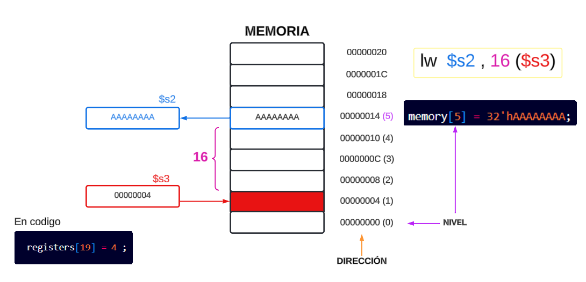

# ETAPAS

La figura a continuacion muestra el camino de datos segmentado en la que se han resaltado
los registros de segmentación (**ETAPAS**). Durante cada *ciclo de reloj* todas las instrucciones
avanzan de un registro de segmentación al siguiente. Los registros tienen el nombre
de las dos etapas que separan. Por ejemplo, el registro de segmentación entre las etapas IF e ID se llama IF/ID.

    

Los registros de segmentación (*ETAPAS*), en color amarillo, separan cada una
de las etapas. Los registros han de ser suficientemente anchos para almacenar todos los datos que corresponden con las líneas
que pasan a través de ellos. 

    

- *Búsqueda de instrucción:* se lee la
instrucción de memoria usando la dirección del PC y después se coloca en el
registro de segmentación IF/ID. La dirección del PC se incrementa en 4 y se
escribe de nuevo en el PC para prepararse para el siguiente ciclo de reloj. Esta
dirección incrementada se guarda también en el registro IF/ID por si alguna instrucción, como por ejemplo beq, la necesita con posterioridad. El computador
no puede conocer el tipo de instrucción que se está buscando hasta que ésta es
descodificada, por lo que debe estar preparado ante cualquier posible instrucción,
pasando la información que sea potencialmente necesaria a lo largo del pipeline.

- *Descodificación de instrucción y lectura del banco de registros*: el registro de segmentación IF/ID donde está
guardada la instrucción. Este registro proporciona el campo inmediato de
16 bits, que es extendido a 32 bits con signo, y los dos identificadores de los
registros que se deben leer. Los tres valores se guardan, junto con la dirección
del PC incrementada, en el registro ID/EX. Una vez más se transfiere todo lo
que pueda necesitar cualquier instrucción durante los ciclos posteriores.